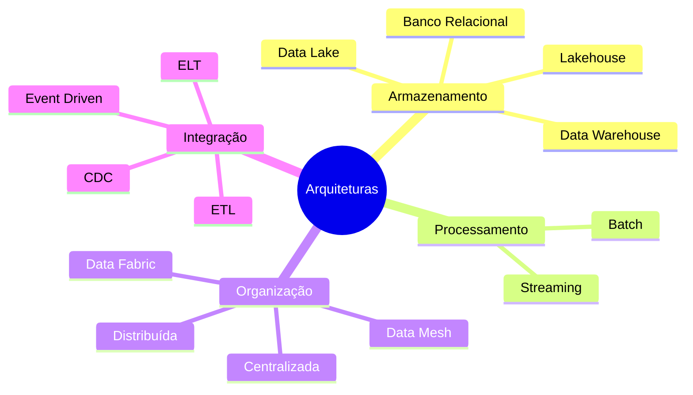

# Arquiteturas de Dados

> [!quote]
> "Uma arquitetura de dados não é definida pelas ferramentas utilizadas, mas pelas decisões tomadas para resolver problemas de negócio."

---

## 📖 Objetivo

Este documento apresenta uma visão integrada das principais arquiteturas utilizadas na Engenharia de Dados.

Seu propósito é servir como um mapa de referência para toda a Academia.

Ao longo dos volumes, retornaremos continuamente a este documento para compreender como cada tecnologia se encaixa na arquitetura geral.

---

## 🗺️ Mapa Geral


Cada arquitetura surgiu para resolver limitações da anterior.

Nenhuma substitui completamente as demais.

---

## Linha do Tempo

| Década | Arquitetura predominante |
|----------|--------------------------|
| 1970 | Bancos Relacionais |
| 1980 | Data Warehouse |
| 2005 | Big Data / Hadoop |
| 2010 | Data Lake |
| 2018 | Lakehouse |
| Atualidade | Data Mesh / Data Fabric |

---

## Famílias Arquiteturais



---

## Arquiteturas Fundamentais

### Banco Relacional

#### Objetivo

Suportar sistemas transacionais.

#### Exemplos

- PostgreSQL
- SQL Server
- Oracle
- MySQL

#### Melhor utilização

- ERP
- CRM
- Sistemas Financeiros
- Sistemas Operacionais

#### Limitações

- Escalabilidade horizontal limitada
- Pouco adequado para grandes volumes analíticos

---

### [[Data-Warehouse|Data Warehouse]]

#### Objetivo

Centralizar dados para análises corporativas.

#### Características

- Dados estruturados
- Alta qualidade
- Histórico
- Modelagem dimensional

#### Melhor utilização

- BI
- Dashboards
- Indicadores
- Relatórios

---

### [[Data-Lake|Data Lake]]

#### Objetivo

Armazenar dados em larga escala com flexibilidade.

#### Tipos de dados

- CSV
- JSON
- XML
- Imagens
- Vídeos
- Logs
- Eventos

#### Vantagens

- Escalabilidade
- Baixo custo
- Flexibilidade

#### Riscos

- Data Swamp
- Falta de governança

---

### [[Lakehouse]]

#### Objetivo

Combinar as vantagens do Data Lake com o Data Warehouse.

#### Tecnologias

- [[Apache-Iceberg|Apache Iceberg]]
- Delta Lake
- Apache Hudi

#### Recursos

- ACID
- Time Travel
- Evolução de esquema
- SQL
- Escalabilidade

---

### Data Mesh

#### Objetivo

Distribuir responsabilidade sobre os dados para os domínios de negócio.

#### Princípios

- Dados como produto
- Domínio responsável
- Plataforma self-service
- Governança federada

---

### Data Fabric

#### Objetivo

Conectar diferentes plataformas através de automação, metadados e integração inteligente.

#### Características

- Integração entre ambientes
- Catálogo unificado
- Governança distribuída
- Automação

---

## Arquiteturas de Processamento

### Batch

#### Características

- Processamento periódico
- Baixa complexidade
- Menor custo
- Maior latência

Exemplos:

- fechamento financeiro;
- consolidação diária;
- faturamento.

---

### [[100-Volumes/14-Streaming/README|Streaming]]

#### Características

- Processamento contínuo
- Baixa latência
- Alta complexidade

Exemplos:

- PIX
- IoT
- Fraude
- Monitoramento

---

## Arquiteturas de Integração

### [[ETL]]

```text
Extrair

↓

Transformar

↓

Carregar
```

---

### [[ELT]]

```text
Extrair

↓

Carregar

↓

Transformar
```

---

### CDC

Capture apenas alterações.

Muito utilizado para replicação de bancos de dados.

---

### Event Driven

Integração baseada em eventos.

Muito utilizada em microsserviços.

---

## Comparativo Geral

| Arquitetura | Estruturado | Não Estruturado | Escalabilidade | Governança |
|-------------|-------------|-----------------|----------------|------------|
| Relacional | ⭐⭐⭐⭐⭐ | ⭐ | ⭐⭐ | ⭐⭐⭐⭐⭐ |
| Data Warehouse | ⭐⭐⭐⭐⭐ | ⭐ | ⭐⭐⭐ | ⭐⭐⭐⭐⭐ |
| Data Lake | ⭐⭐⭐ | ⭐⭐⭐⭐⭐ | ⭐⭐⭐⭐⭐ | ⭐⭐ |
| Lakehouse | ⭐⭐⭐⭐⭐ | ⭐⭐⭐⭐⭐ | ⭐⭐⭐⭐⭐ | ⭐⭐⭐⭐ |
| Data Mesh | ⭐⭐⭐⭐ | ⭐⭐⭐⭐ | ⭐⭐⭐⭐⭐ | ⭐⭐⭐⭐ |

---

## Tecnologias por Arquitetura

| Arquitetura | Tecnologias |
|-------------|-------------|
| Relacional | PostgreSQL, SQL Server, Oracle |
| Data Warehouse | Snowflake, Redshift, BigQuery |
| Data Lake | Hadoop, S3, MinIO |
| Lakehouse | Iceberg, Delta Lake, Hudi |
| Processamento | Spark, Flink |
| Consulta | Trino, DuckDB |
| Orquestração | Airflow |
| Streaming | Kafka, Pulsar |

---

## 🏗️ Como escolher uma arquitetura?

Não existe uma resposta universal.

A decisão depende de fatores como:

- volume de dados;
- velocidade de processamento;
- orçamento;
- equipe;
- requisitos regulatórios;
- maturidade tecnológica;
- objetivos do negócio.

> [!important]
> A melhor arquitetura é aquela que resolve o problema com o menor custo e a menor complexidade possível.

---

## Relação com os Volumes da Academia

| Volume | Arquiteturas abordadas |
|---------|------------------------|
| 00 | Visão geral |
| 01 | Fundamentos |
| 07 | Processamento distribuído |
| 09 | Lakehouse |
| 10 | Consulta distribuída |
| 14 | Streaming |
| 17 | Arquiteturas Avançadas |

---

## 🔗 Veja Também

### Atlas

- [[MOC]]
- [[Roadmap]]
- [[Tecnologias]]
- [[Timeline]]

### Conceitos

- [[Data-Warehouse|Data Warehouse]]
- [[Data-Lake|Data Lake]]
- [[Lakehouse]]
- Data Mesh
- Data Fabric
- Batch
- [[100-Volumes/14-Streaming/README|Streaming]]
- [[ETL]]
- [[ELT]]
- CDC

### Tecnologias

- [[Apache-Spark|Apache Spark]]
- [[Apache-Airflow|Apache Airflow]]
- [[Apache-Iceberg|Apache Iceberg]]
- [[Trino]]
- [[100-Volumes/08-PostgreSQL/README|PostgreSQL]]

---

## 📖 Resumo

As arquiteturas de dados evoluíram continuamente para responder ao crescimento do volume, da variedade e da velocidade dos dados.

Cada arquitetura representa um conjunto de decisões técnicas voltadas para resolver problemas específicos.

Compreender essas arquiteturas é essencial para selecionar tecnologias adequadas, projetar plataformas sustentáveis e tomar decisões de engenharia fundamentadas.

> [!success]
> Este documento será atualizado continuamente conforme novos volumes forem adicionados à Academia.
