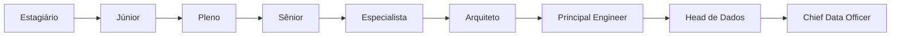

# Carreira em Engenharia de Dados

> [!quote]
> "A carreira de um Engenheiro de Dados é construída pelo equilíbrio entre fundamentos sólidos, experiência prática e capacidade de resolver problemas."

---

# 📖 Objetivo

Este documento apresenta a evolução profissional típica de um Engenheiro de Dados.

Mais do que uma sequência de cargos, ele mostra:

- competências;
- responsabilidades;
- conhecimentos esperados;
- objetivos de desenvolvimento.

Cada organização possui sua própria estrutura, mas a progressão apresentada representa um caminho comum no mercado.

---

# 🗺️ Visão Geral

---

# Evolução da carreira

A carreira não depende apenas do tempo de experiência.

Ela depende principalmente da capacidade de assumir problemas cada vez maiores.

Quanto maior o nível, menor a preocupação com tarefas específicas e maior a responsabilidade por decisões.

---

# 👨‍🎓 Estagiário

## Objetivo

Aprender os fundamentos.

### Responsabilidades

- acompanhar profissionais experientes;
- executar atividades supervisionadas;
- aprender SQL;
- aprender Python;
- compreender pipelines.

### Competências esperadas

- lógica;
- curiosidade;
- organização;
- vontade de aprender.

---

# 👨‍💻 Engenheiro de Dados Júnior

## Objetivo

Executar tarefas com supervisão.

### Responsabilidades

- manutenção de pipelines;
- consultas SQL;
- pequenas automações;
- documentação.

### Conhecimentos

- SQL;
- Git;
- Linux;
- Python;
- ETL.

### Foco principal

Aprender.

---

# 👨‍🔧 Engenheiro de Dados Pleno

## Objetivo

Implementar soluções completas.

### Responsabilidades

- desenvolver pipelines;
- revisar código;
- otimizar consultas;
- resolver incidentes.

### Conhecimentos

- Spark;
- PostgreSQL;
- Airflow;
- Lakehouse;
- modelagem.

### Foco principal

Autonomia.

---

# 👨‍🏭 Engenheiro de Dados Sênior

## Objetivo

Resolver problemas complexos.

### Responsabilidades

- definir padrões;
- liderar iniciativas técnicas;
- apoiar equipes;
- orientar profissionais.

### Conhecimentos

- arquitetura;
- performance;
- observabilidade;
- governança;
- cloud.

### Foco principal

Tomada de decisão.

---

# 🎓 Especialista

O Especialista é referência técnica.

Sua atuação normalmente envolve:

- pesquisas;
- novas arquiteturas;
- provas de conceito;
- tecnologias emergentes;
- otimização.

Nem sempre possui gestão de pessoas.

---

# 🏛️ Arquiteto de Dados

O Arquiteto responde perguntas como:

- Qual arquitetura utilizar?
- Como reduzir custos?
- Como escalar?
- Como integrar plataformas?

Seu foco deixa de ser implementar.

Passa a ser projetar.

---

# ⭐ Principal Engineer

Normalmente atua em toda a organização.

Responsabilidades:

- definir padrões corporativos;
- orientar arquiteturas;
- mentorar especialistas;
- revisar decisões críticas.

---

# 👥 Head de Dados

Passa a possuir responsabilidades gerenciais.

Exemplos:

- orçamento;
- contratação;
- estratégia;
- planejamento;
- liderança.

---

# 🏢 Chief Data Officer (CDO)

Responsável pela estratégia de dados da organização.

Seu foco é:

- inovação;
- governança;
- monetização dos dados;
- alinhamento estratégico.

---

# Competências por nível

| Competência | Júnior | Pleno | Sênior | Especialista |
|------------|:------:|:------:|:-------:|:------------:|
| SQL | ⭐⭐⭐ | ⭐⭐⭐⭐⭐ | ⭐⭐⭐⭐⭐ | ⭐⭐⭐⭐⭐ |
| Python | ⭐⭐ | ⭐⭐⭐⭐ | ⭐⭐⭐⭐⭐ | ⭐⭐⭐⭐⭐ |
| Spark | ⭐ | ⭐⭐⭐ | ⭐⭐⭐⭐⭐ | ⭐⭐⭐⭐⭐ |
| Arquitetura | ⭐ | ⭐⭐ | ⭐⭐⭐⭐ | ⭐⭐⭐⭐⭐ |
| Comunicação | ⭐⭐ | ⭐⭐⭐ | ⭐⭐⭐⭐ | ⭐⭐⭐⭐⭐ |
| Liderança Técnica | ⭐ | ⭐ | ⭐⭐⭐ | ⭐⭐⭐⭐⭐ |

---

# Competências Técnicas

Ao longo da carreira espera-se evolução em:

- SQL
- Python
- Linux
- Spark
- PostgreSQL
- Airflow
- Trino
- Cloud
- Lakehouse
- Segurança
- Observabilidade
- DataOps

---

# Competências Comportamentais

Tão importantes quanto as competências técnicas.

- comunicação;
- colaboração;
- pensamento analítico;
- aprendizado contínuo;
- responsabilidade;
- liderança;
- negociação;
- organização.

---

# 📚 Livros recomendados

## Iniciante

- Fundamentals of Data Engineering
- Designing Data-Intensive Applications

## Intermediário

- Streaming Systems
- Data Pipelines Pocket Reference

## Avançado

- Building Evolutionary Architectures
- Site Reliability Engineering

---

# 🎓 Certificações

## Iniciante

- AWS Cloud Practitioner
- Azure Fundamentals
- GCP Digital Leader

---

## Intermediário

- Databricks Data Engineer Associate
- AWS Data Engineer
- SnowPro Core

---

## Avançado

- Databricks Professional
- Google Professional Data Engineer
- Azure Data Engineer

---

# Como utilizar a Academia

## Estou começando

Volumes recomendados:

00 → 01 → 02 → 03 → 04 → 06

---

## Já sou desenvolvedor

Volumes:

04 → 06 → 07 → 09 → 10 → 11

---

## Trabalho com BI

Volumes:

04 → 05 → 08 → 09 → 10

---

## Quero migrar para Engenharia de Dados

Estude todos os volumes na sequência.

Execute todos os laboratórios.

Construa o Projeto Integrador.

---

# Relação com o Projeto Integrador

Cada novo nível de carreira permitirá assumir responsabilidades diferentes no projeto.

| Nível | Papel no Projeto |
|--------|------------------|
| Júnior | Implementação |
| Pleno | Desenvolvimento completo |
| Sênior | Arquitetura |
| Especialista | Otimização |
| Arquiteto | Decisões estratégicas |

---

# Indicadores de evolução

Você está evoluindo quando:

- resolve problemas sem depender constantemente de ajuda;
- compreende arquiteturas e não apenas ferramentas;
- documenta soluções;
- orienta outros profissionais;
- toma decisões fundamentadas;
- entende o impacto das escolhas técnicas no negócio.

> [!success]
> O objetivo da Academia é formar profissionais capazes de atuar como Engenheiros de Dados completos, preparados para evoluir até posições de liderança técnica.

---

# 🔗 Veja Também

- [[Roadmap]]
- [[Tecnologias]]
- [[Arquiteturas]]
- [[Projeto Integrador]]
- [[Engenheiro de Dados]]
- [[DataOps]]

---

# 📖 Resumo

A carreira em Engenharia de Dados é uma jornada de evolução contínua.

O domínio de tecnologias é importante, mas o diferencial está na capacidade de compreender problemas, projetar soluções sustentáveis e tomar decisões arquiteturais.

Ao longo da Academia, cada volume contribuirá para essa evolução, preparando o aluno não apenas para utilizar ferramentas, mas para construir plataformas modernas de dados e liderar iniciativas técnicas.