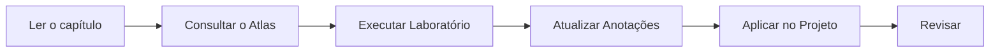
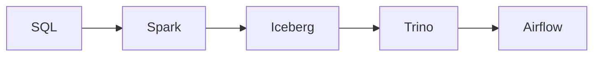
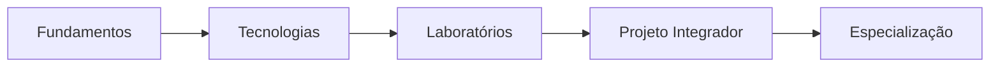

# Como Usar a Academia

> [!quote]
> "A Academia de Engenharia de Dados foi construída para ser uma plataforma de conhecimento permanente, e não apenas um curso."

---

# Bem-vindo!

Parabéns!

Você acaba de entrar em uma Academia projetada para formar Engenheiros de Dados completos.

Mais do que ensinar ferramentas, nosso objetivo é desenvolver profissionais capazes de compreender, projetar, implementar e operar plataformas modernas de dados.

Todo o conteúdo foi desenvolvido para funcionar de forma integrada no **Obsidian**, utilizando uma base de conhecimento navegável e interligada.

---

# Objetivos da Academia

Ao concluir todos os volumes você será capaz de:

- compreender arquiteturas modernas de dados;
- desenvolver pipelines de dados;
- projetar plataformas escaláveis;
- trabalhar com tecnologias amplamente utilizadas pelo mercado;
- construir soluções completas de Engenharia de Dados;
- tomar decisões arquiteturais fundamentadas.

---

# Estrutura da Academia

A Academia está organizada em áreas especializadas.

```text
000-Atlas
001-Dashboard
005-Wiki
010-Biblioteca
020-Laboratorios
030-Projetos
040-Certificacoes
050-Templates
060-Assets
070-Anotacoes
080-Inbox
090-Arquivados
100-Volumes
tools
```

Cada pasta possui um objetivo específico.

---

# O que existe em cada pasta?

## 000-Atlas

É o coração da Academia.

Contém:

- [[MOC]]
- [[Roadmap]]
- [[Arquiteturas]]
- [[Tecnologias]]
- [[Timeline]]
- [[Carreira]]
- Glossário
- Diagramas

Sempre que surgir uma dúvida conceitual, consulte primeiro o Atlas.

---

## 001-Dashboard

Página inicial da Academia.

Aqui estarão disponíveis:

- progresso dos estudos;
- estatísticas;
- últimos conteúdos;
- acesso rápido aos volumes.

---

## 005-Wiki

Páginas institucionais.

Exemplos:

- Home
- FAQ
- Como Pesquisar
- Como Contribuir

---

## 010-Biblioteca

Reúne as melhores referências externas.

Inclui:

- livros;
- artigos científicos;
- RFCs;
- documentações oficiais;
- estudos de caso;
- cheat sheets.

---

## 020-Laboratorios

Todos os exercícios práticos da Academia.

Cada laboratório complementa um ou mais capítulos.

Sempre execute os laboratórios antes de avançar para o próximo assunto.

---

## 030-Projetos

Contém os projetos completos desenvolvidos durante a jornada.

O principal projeto é:

**DataRetail Platform**

Ao longo dos volumes essa plataforma evoluirá continuamente.

---

## 040-Certificacoes

Material complementar para certificações.

Exemplos:

- Databricks
- AWS
- Azure
- Google Cloud
- Snowflake

---

## 050-Templates

Modelos reutilizados pela Academia.

Inclui:

- capítulos;
- laboratórios;
- estudos de caso;
- tecnologias;
- glossário.

---

## 060-Assets

Arquivos utilizados em toda a documentação.

Exemplos:

- imagens;
- diagramas;
- SVG;
- datasets;
- ícones.

---

## 070-Anotacoes

Espaço reservado para suas anotações pessoais.

Recomendação:

Nunca altere o conteúdo oficial da Academia.

Crie notas próprias nesta pasta e conecte-as utilizando Wikilinks.

---

## 080-Inbox

Área temporária.

Utilize para:

- ideias;
- links;
- pesquisas rápidas;
- conteúdo ainda não organizado.

Revise essa pasta periodicamente.

---

## 090-Arquivados

Conteúdo antigo ou descontinuado.

Não excluímos conhecimento.

Apenas o arquivamos.

---

## 100-Volumes

Contém todo o conteúdo didático.

Cada volume representa uma etapa da jornada.

---

## tools

Ferramentas utilizadas para administrar a Academia.

Exemplos:

- geração automática;
- validações;
- exportações;
- organização do Vault.

---

# Como estudar

Recomendamos seguir sempre este fluxo.



---

# Como utilizar os Wikilinks

Sempre que encontrar algo assim:

```markdown
[[Apache-Spark|Apache Spark]]
```

Clique no link.

Você será levado ao conteúdo correspondente.

Caso a nota ainda não exista, ela será criada futuramente.

---

# Como utilizar o Graph View

O Graph View permite visualizar toda a rede de conhecimento da Academia.

Recomendação:

- utilize filtros;
- observe grupos de conhecimento;
- identifique conceitos centrais;
- descubra relações entre tecnologias.

---

# Como utilizar o Backlinks

Sempre consulte os backlinks.

Eles mostram onde um conceito é utilizado.

Exemplo:

[[Apache-Spark|Apache Spark]]

Pode aparecer em:

- Lakehouse
- Airflow
- Trino
- Projeto Integrador
- Laboratórios

Isso ajuda a compreender o contexto de utilização.

---

# Como utilizar o Atlas

O Atlas funciona como uma enciclopédia.

Sempre que encontrar um conceito novo:

1. Consulte o capítulo.
2. Leia a definição no Glossário.
3. Consulte a tecnologia correspondente.
4. Retorne ao capítulo.

Esse processo reforça o aprendizado.

---

# Como utilizar a Biblioteca

A Biblioteca reúne referências externas de alta qualidade.

Sempre que desejar aprofundar um tema:

- leia o resumo;
- consulte a documentação oficial;
- explore os estudos de caso.

---

# Como utilizar os Laboratórios

Os laboratórios foram projetados para serem executados em sequência.

Nunca pule um laboratório importante.

Cada um reforça os conceitos apresentados nos capítulos.

---

# Como utilizar o Projeto Integrador

Todo novo conhecimento será aplicado na **DataRetail Platform**.

Ao concluir a Academia você terá desenvolvido uma plataforma moderna contendo:

- PostgreSQL;
- Apache Spark;
- Apache Iceberg;
- Trino;
- Airflow;
- Observabilidade;
- Qualidade de Dados;
- Cloud.

---

# Convenções utilizadas

## Arquivos

```text
01 - Introdução.md
02 - Conceitos.md
03 - Exemplo.md
```

---

## Laboratórios

```text
Lab 001
Lab 002
Lab 003
```

---

## Estudos de Caso

Sempre utilizarão a empresa fictícia:

**DataRetail S.A.**

Isso garante continuidade entre os volumes.

---

# Recursos do Obsidian utilizados

Esta Academia utiliza intensivamente os recursos do Obsidian.

## Wikilinks

```markdown
[[Apache-Spark|Apache Spark]]
```

---

## Backlinks

Permitem descobrir onde um conceito é utilizado.

---

## Mermaid

Diagramas são escritos diretamente em Markdown.

Exemplo:



---

## Callouts

Utilizamos os seguintes padrões:

```markdown
> [!info]
```

```markdown
> [!tip]
```

```markdown
> [!important]
```

```markdown
> [!warning]
```

```markdown
> [!example]
```

```markdown
> [!summary]
```

---

# Boas práticas

✔ Estude na sequência dos volumes.

✔ Faça todos os laboratórios.

✔ Utilize o Atlas constantemente.

✔ Crie anotações próprias.

✔ Consulte a Biblioteca.

✔ Atualize seus conhecimentos regularmente.

---

# O que evitar

❌ Estudar apenas tecnologias.

❌ Ignorar os fundamentos.

❌ Pular laboratórios.

❌ Decorar comandos sem compreender conceitos.

❌ Alterar o conteúdo oficial da Academia.

---

# Jornada de Evolução



---

# Quando terminar a Academia

Você terá construído:

- uma base sólida de Engenharia de Dados;
- um portfólio prático;
- uma biblioteca técnica pessoal;
- uma plataforma completa de dados;
- uma documentação navegável no Obsidian.

Mais importante: terá desenvolvido a capacidade de aprender continuamente, acompanhar novas tecnologias e tomar decisões arquiteturais fundamentadas.

---

# Veja Também

- [[MOC]]
- [[Guia-Editorial|Guia Editorial]]
- [[Roadmap]]
- [[Arquiteturas]]
- [[Tecnologias]]
- [[Carreira]]
- [[Timeline]]
- [[Biblioteca]]
- [[Dashboard]]

---

> [!success]
> A Academia de Engenharia de Dados foi concebida para acompanhar toda a sua carreira. Continue expandindo este Vault com novas anotações, laboratórios e referências. O conhecimento é um ativo vivo, e esta plataforma crescerá junto com você.