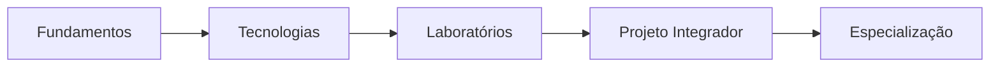

# Mapa de Conteúdo da Academia de Engenharia de Dados

> [!quote]
> "O conhecimento cresce quando conseguimos conectar conceitos."

---

## 📖 Bem-vindo à Academia

Este é o ponto central de navegação da Academia de Engenharia de Dados.

A partir desta página você poderá acessar:

- todos os volumes;
- todas as tecnologias;
- laboratórios;
- projeto integrador;
- roadmap;
- carreira;
- glossário.

Sempre que estiver perdido, volte para este mapa.

---

## 🧭 Como utilizar a Academia

A Academia foi organizada em quatro grandes áreas.

```text
Fundamentos

↓

Tecnologias

↓

Prática

↓

Especialização
```

O estudo deve seguir essa ordem.

---

## 📚 Volumes da Academia

### Volume 00

#### Introdução

- [[100-Volumes/00-Introducao/00-Apresentacao/README|Apresentação]]

- [[100-Volumes/00-Introducao/01-O-que-e-Engenharia-de-Dados/README|O que é Engenharia de Dados]]

- [[100-Volumes/00-Introducao/02-Ecossistema-de-Dados/README|Ecossistema de Dados]]

- [[100-Volumes/00-Introducao/03-Arquiteturas-Modernas/README|Arquiteturas Modernas]]

- [[100-Volumes/00-Introducao/04-Projeto-Integrador/README|Projeto Integrador]]

- [[100-Volumes/00-Introducao/05-Ambiente-da-Academia/README|Ambiente da Academia]]

- [[100-Volumes/00-Introducao/06-Como-Estudar/README|Como Estudar]]

- [[100-Volumes/00-Introducao/07-Roadmap/README|Roadmap]]

- [[100-Volumes/00-Introducao/08-Preparacao-do-Ambiente/README|Preparação do Ambiente]]

- [[100-Volumes/00-Introducao/09-Encerramento/README|Encerramento]]

---

### Volume 01

[[01-Fundamentos/README]]

---

### Volume 02

[[02-Linux/README]]

---

### Volume 03

[[03-Git-e-GitHub/README]]

---

### Volume 04

[[04-SQL/README]]

---

### Volume 05

[[05-Modelagem-de-Dados/README]]

---

### Volume 06

[[06-Python/README]]

---

### Volume 07

[[07-Apache-Spark/README]]

---

### Volume 08

[[08-PostgreSQL/README]]

---

### Volume 09

[[09-Lakehouse/README]]

---

### Volume 10

[[10-Trino/README]]

---

### Volume 11

[[11-Apache-Airflow/README]]

---

### Volume 12

[[12-Qualidade-de-Dados/README]]

---

### Volume 13

[[13-Observabilidade/README]]

---

### Volume 14

[[14-Streaming/README]]

---

### Volume 15

[[15-Cloud/README]]

---

### Volume 16

[[16-DataOps-e-DevOps/README]]

---

### Volume 17

[[17-Arquiteturas-Avancadas/README]]

---

### Volume 18

[[18-Projeto-Integrador/README]]

---

## 🏛️ Arquiteturas

- [[Arquiteturas]]

- [[Data-Warehouse|Data Warehouse]]

- [[Data-Lake|Data Lake]]

- [[Lakehouse]]

- Data Mesh

- Data Fabric

- Lambda Architecture

- Kappa Architecture

---

## 💻 Tecnologias

### Linguagens

- [[100-Volumes/04-SQL/README|SQL]]

- [[100-Volumes/06-Python/README|Python]]

- Scala

- Java

---

### Bancos de Dados

- [[100-Volumes/08-PostgreSQL/README|PostgreSQL]]

- SQL Server

- Oracle Database

- MySQL

---

### Processamento

- [[Apache-Spark|Apache Spark]]

- Apache Flink

- dbt

---

### Consulta

- [[Trino]]

- DuckDB

---

### Orquestração

- [[Apache-Airflow|Apache Airflow]]

---

### Armazenamento

- [[Apache-Iceberg|Apache Iceberg]]

- Apache Parquet

- Apache Avro

- ORC

---

### Cloud

- AWS

- Microsoft Azure

- Google Cloud Platform

---

## 🧠 Conceitos Fundamentais

- [[Engenharia-de-Dados|Engenharia de Dados]]

- [[Engenheiro-de-Dados|Engenheiro de Dados]]

- [[Pipeline-de-Dados|Pipeline de Dados]]

- [[ETL]]

- [[ELT]]

- DataOps

- [[Data-Lake|Data Lake]]

- [[Lakehouse]]

- [[Qualidade-de-Dados|Qualidade de Dados]]

- Governança de Dados

- Observabilidade de Dados

- Produto de Dados

---

## 🔬 Laboratórios

Todos os laboratórios ficam em:

```text
020-Laboratorios/
```

Principais categorias:

- Linux

- SQL

- Python

- Spark

- PostgreSQL

- Trino

- Airflow

- Lakehouse

- Cloud

---

## 🏢 Projeto Integrador

Projeto oficial da Academia.

[[030-Projetos/DataRetail Platform/README|DataRetail Platform]]

Localização:

```text
030-Projetos/
```

---

## 🎓 Certificações

Material complementar.

```text
040-Certificacoes/
```

Inclui:

- Databricks

- AWS

- Azure

- GCP

- Snowflake

- dbt

---

## 📈 Roadmaps

- [[Roadmap]]

- [[Carreira]]

- [[Timeline]]

---

## 📖 Guias

- [[Guia-Editorial|Guia Editorial]]

---

## 📚 Glossário

Todos os conceitos estão em:

```text
000-Atlas/Glossario/
```

---

## 🔎 Navegação por Perfil

### Estou começando

1. [[100-Volumes/00-Introducao/00-Apresentacao/README]]

2. [[100-Volumes/00-Introducao/01-O-que-e-Engenharia-de-Dados/README]]

3. [[Roadmap]]

---

### Sou Desenvolvedor

- [[100-Volumes/04-SQL/README|SQL]]

- [[100-Volumes/06-Python/README|Python]]

- [[Apache-Spark|Apache Spark]]

- [[Apache-Airflow|Apache Airflow]]

---

### Trabalho com BI

- [[Data-Warehouse|Data Warehouse]]

- Modelagem Dimensional

- [[Trino]]

---

### Quero trabalhar com Big Data

- [[Apache-Spark|Apache Spark]]

- [[Lakehouse]]

- [[Apache-Iceberg|Apache Iceberg]]

---

### Quero trabalhar com IA

- [[Pipeline-de-Dados|Pipeline de Dados]]

- [[Lakehouse]]

- [[Qualidade-de-Dados|Qualidade de Dados]]

- Feature Store

---

## 🚀 Evolução na Academia



---

## 📊 Progresso

> [!info]
>
> Conforme novos volumes forem publicados, este MOC será atualizado automaticamente, tornando-se o principal ponto de entrada da Academia.

---

## 📌 Veja Também

- [[Guia-Editorial|Guia Editorial]]

- [[Roadmap]]

- [[Arquiteturas]]

- [[Tecnologias]]

- [[Carreira]]

- [[Timeline]]
