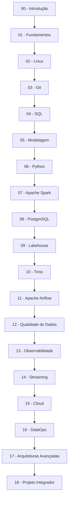
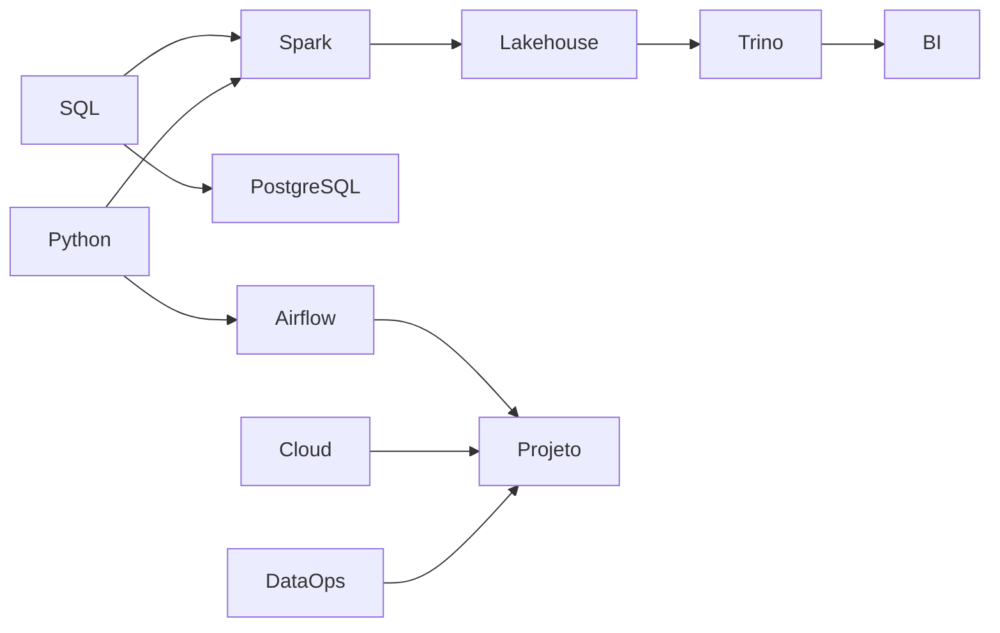
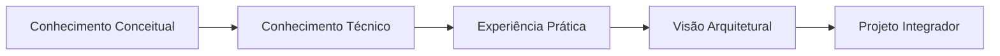

# Roadmap da Academia de Engenharia de Dados

> [!quote]
> "A melhor forma de aprender Engenharia de Dados é construir conhecimento em camadas, assim como construímos plataformas de dados."

---

## 📖 Objetivo

Este roadmap apresenta toda a trilha de aprendizagem da Academia.

Cada volume depende dos conhecimentos adquiridos anteriormente.

O objetivo não é apenas ensinar tecnologias, mas desenvolver a capacidade de projetar, implementar e operar plataformas modernas de dados.

---

## 🗺️ Visão Geral da Jornada

---

## 📚 Volume 00 — Introdução

### Objetivo

Apresentar a Engenharia de Dados como disciplina, profissão e ecossistema.

### Você aprenderá

- O que é Engenharia de Dados
- Evolução histórica
- Papel do Engenheiro de Dados
- Ecossistema de Dados
- Arquiteturas Modernas
- Projeto Integrador
- Como estudar
- Preparação do ambiente

#### Resultado esperado

Ao final deste volume, você compreenderá o panorama completo da área e estará preparado para iniciar os estudos técnicos.

---

## 📚 Volume 01 — Fundamentos

### Objetivo

Construir a base conceitual da Engenharia de Dados.

#### Principais temas

- Dados
- Informação
- Metadados
- Bancos de Dados
- ETL e ELT
- Pipelines
- Batch
- Streaming
- Arquiteturas de Dados

#### Projeto Integrador

Modelagem inicial da plataforma da DataRetail.

---

## 📚 Volume 02 — Linux

### Objetivo

Aprender a operar ambientes Linux utilizados em plataformas de dados.

#### Principais temas

- Shell
- Bash
- Permissões
- Processos
- Serviços
- SSH
- Cron
- Logs

#### Projeto Integrador

Preparação do servidor Linux.

---

## 📚 Volume 03 — Git e GitHub

### Objetivo

Versionar código, pipelines e documentação.

#### Principais temas

- Git
- Branches
- Merge
- Pull Request
- GitHub
- GitFlow

#### Projeto Integrador

Criação do repositório oficial da plataforma.

---

## 📚 Volume 04 — SQL

### Objetivo

Dominar SQL para Engenharia de Dados.

#### Principais temas

- SELECT
- JOIN
- Window Functions
- CTE
- Views
- Performance
- Otimização

#### Projeto Integrador

Primeiros pipelines SQL.

---

## 📚 Volume 05 — Modelagem de Dados

### Objetivo

Projetar modelos eficientes para armazenamento e análise.

#### Principais temas

- Modelagem Relacional
- Modelo Dimensional
- Star Schema
- Snowflake
- Chaves
- Normalização

---

## 📚 Volume 06 — Python

### Objetivo

Automatizar processos e construir pipelines.

#### Principais temas

- Python
- Pandas
- APIs
- Arquivos
- Logging
- Testes

---

## 📚 Volume 07 — Apache Spark

### Objetivo

Processamento distribuído em larga escala.

#### Principais temas

- DataFrames
- Spark SQL
- PySpark
- Particionamento
- Otimização
- Streaming

---

## 📚 Volume 08 — PostgreSQL

### Objetivo

Administrar e otimizar bancos relacionais modernos.

#### Principais temas

- Administração
- Índices
- Particionamento
- Performance
- Backup

---

## 📚 Volume 09 — Lakehouse

### Objetivo

Construir plataformas modernas utilizando tabelas transacionais.

#### Principais temas

- Apache Iceberg
- Parquet
- Time Travel
- ACID
- Evolução de Esquema

---

## 📚 Volume 10 — Trino

### Objetivo

Consultar dados distribuídos utilizando SQL.

#### Principais temas

- Catálogo
- Conectores
- Otimização
- Federação de Dados

---

## 📚 Volume 11 — Apache Airflow

### Objetivo

Orquestrar pipelines de dados.

#### Principais temas

- DAGs
- Operators
- Scheduling
- Retry
- Monitoramento

---

## 📚 Volume 12 — Qualidade de Dados

### Temas

- Great Expectations
- Regras de Qualidade
- Validações
- Testes

---

## 📚 Volume 13 — Observabilidade

### Temas

- Logs
- Métricas
- Alertas
- Linhagem
- SLAs

---

## 📚 Volume 14 — Streaming

### Temas

- Kafka
- Spark Structured Streaming
- Event Streaming

---

## 📚 Volume 15 — Cloud

### Temas

- AWS
- Azure
- GCP
- Object Storage
- IAM

---

## 📚 Volume 16 — DataOps

### Temas

- CI/CD
- Docker
- Kubernetes
- Terraform
- Automação

---

## 📚 Volume 17 — Arquiteturas Avançadas

### Temas

- Data Mesh
- Data Fabric
- Multi-cloud
- Event-Driven Architecture

---

## 📚 Volume 18 — Projeto Integrador

Todo o conhecimento adquirido será consolidado em uma plataforma completa.

Você implementará uma solução contendo:

- PostgreSQL
- Spark
- Iceberg
- Trino
- Airflow
- Qualidade
- Observabilidade
- Dashboards
- APIs

---

## 🏗️ Dependências entre os Volumes

---

## 🎯 Marcos da Jornada

| Marco | Resultado |
|--------|-----------|
| Volume 00 | Visão geral da Engenharia de Dados |
| Volume 04 | Primeiro pipeline SQL |
| Volume 06 | Primeira automação em Python |
| Volume 07 | Primeiro processamento distribuído |
| Volume 11 | Primeiro pipeline orquestrado |
| Volume 15 | Primeira plataforma em Cloud |
| Volume 18 | Plataforma completa em produção |

---

## 🧭 Como estudar

Recomenda-se seguir esta sequência para cada volume:

1. Ler os capítulos.
2. Consultar o Atlas para aprofundar conceitos.
3. Executar todos os laboratórios.
4. Aplicar os conhecimentos no Projeto Integrador.
5. Revisar os conceitos-chave.
6. Responder às perguntas de entrevista.
7. Prosseguir para o próximo volume.

---

## 📈 A evolução esperada

---

## 🔗 Veja Também

- [[MOC]]
- [[Guia-Editorial|Guia Editorial]]
- [[Arquiteturas]]
- [[Tecnologias]]
- [[Carreira]]
- [[Timeline]]
- Projeto Integrador

---

## 📖 Resumo

A Academia foi planejada para desenvolver competências de forma progressiva.

Cada volume amplia os conhecimentos adquiridos anteriormente e adiciona novos elementos ao Projeto Integrador.

Ao concluir a jornada, o aluno terá construído uma plataforma moderna de Engenharia de Dados e desenvolvido uma visão arquitetural capaz de ser aplicada em projetos reais.
