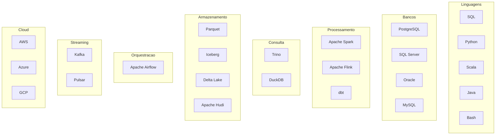
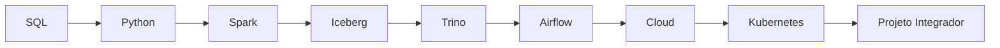

# Tecnologias da Academia

> [!quote]
> "Ferramentas mudam. Fundamentos permanecem. Conheça as tecnologias, mas domine os princípios."

---

# 📖 Objetivo

Este documento apresenta todas as tecnologias estudadas na Academia.

Seu objetivo é responder quatro perguntas para cada tecnologia:

- O que é?
- Para que serve?
- Onde se encaixa na arquitetura?
- Em qual volume será estudada?

Este documento funciona como um catálogo central da plataforma de conhecimento.

---

# 🗺️ Mapa Geral

---

# Linguagens

## [[SQL]]

### Categoria

Linguagem de consulta.

### Função

Consultar, transformar e manipular dados.

### Onde aparece

- PostgreSQL
- Trino
- Spark SQL
- Data Warehouse

### Volume

**04 — SQL**

---

## [[Python]]

### Categoria

Linguagem de programação.

### Função

Automação, processamento e integração.

### Volume

**06 — Python**

---

## [[Scala]]

Utilizada principalmente em ambientes Spark.

Volume complementar.

---

## [[Java]]

Muito utilizada em aplicações distribuídas e algumas ferramentas do ecossistema Hadoop.

---

## [[Bash]]

Automação em Linux.

Volume 02.

---

# Bancos de Dados

## [[PostgreSQL]]

### Categoria

Banco Relacional.

### Utilização

- OLTP
- Data Warehouse
- Metadados
- Catálogos

### Volume

**08 — PostgreSQL**

---

## [[SQL Server]]

Banco relacional corporativo.

---

## [[Oracle Database]]

Muito utilizado em grandes empresas.

---

## [[MySQL]]

Bastante presente em aplicações web.

---

# Processamento

## [[Apache-Spark|Apache Spark]]

### Categoria

Processamento distribuído.

### Utilização

- ETL
- ELT
- Batch
- Streaming
- Machine Learning

### Volume

**07 — Apache Spark**

---

## [[Apache Flink]]

Especializado em Streaming.

---

## [[dbt]]

Ferramenta para transformação de dados utilizando SQL.

---

# Consulta Distribuída

## [[Trino]]

### Categoria

Motor SQL distribuído.

### Função

Consultar dados em múltiplas fontes.

### Volume

**10 — Trino**

---

## [[DuckDB]]

Banco analítico embarcado.

Muito útil para análises locais.

---

# Armazenamento

## [[Apache Parquet]]

Formato colunar.

Ideal para Analytics.

---

## [[Apache-Iceberg|Apache Iceberg]]

Formato de tabela para Lakehouse.

Recursos:

- ACID
- Time Travel
- Evolução de esquema

### Volume

**09 — Lakehouse**

---

## [[Delta Lake]]

Alternativa ao Iceberg.

---

## [[Apache Hudi]]

Outra tecnologia para Lakehouse.

---

# Orquestração

## [[Apache-Airflow|Apache Airflow]]

### Categoria

Orquestrador.

### Função

Gerenciar pipelines.

### Volume

**11 — Apache Airflow**

---

# Streaming

## [[Apache Kafka]]

Broker de eventos.

Utilizado para Streaming.

### Volume

**14 — Streaming**

---

## [[Apache Pulsar]]

Alternativa ao Kafka.

---

# Cloud

## [[AWS]]

Principais serviços:

- S3
- Glue
- EMR
- Athena
- IAM

---

## [[Microsoft Azure]]

Principais serviços:

- ADLS
- Synapse
- Data Factory

---

## [[Google Cloud Platform]]

Principais serviços:

- BigQuery
- Dataproc
- Cloud Storage

---

# Ferramentas de Qualidade

## [[Great Expectations]]

Validação de qualidade de dados.

---

## [[Soda]]

Monitoramento de qualidade.

---

# Observabilidade

## [[OpenLineage]]

Linhagem de dados.

---

## [[Prometheus]]

Métricas.

---

## [[Grafana]]

Dashboards operacionais.

---

# Containers

## [[Docker]]

Empacotamento de aplicações.

Volume 16.

---

## [[Kubernetes]]

Orquestração de containers.

Volume 16.

---

# Infraestrutura

## [[Terraform]]

Infraestrutura como Código.

---

## [[Ansible]]

Automação de servidores.

---

# Organização por Camada

| Camada | Tecnologias |
|---------|-------------|
| Fontes | PostgreSQL, SQL Server, Oracle, APIs |
| Ingestão | Python, Bash, Kafka |
| Processamento | Spark, Flink, dbt |
| Armazenamento | Iceberg, Delta, Parquet |
| Consulta | Trino, DuckDB |
| Orquestração | Airflow |
| Qualidade | Great Expectations |
| Observabilidade | Grafana, Prometheus |
| Cloud | AWS, Azure, GCP |

---

# Relação com os Volumes

| Volume | Tecnologias |
|---------|-------------|
| 02 | Linux, Bash |
| 03 | Git |
| 04 | SQL |
| 06 | Python |
| 07 | Spark |
| 08 | PostgreSQL |
| 09 | Iceberg |
| 10 | Trino |
| 11 | Airflow |
| 12 | Great Expectations |
| 13 | Grafana, Prometheus |
| 14 | Kafka |
| 15 | AWS, Azure, GCP |
| 16 | Docker, Kubernetes, Terraform |

---

# Critérios para inclusão

Uma tecnologia somente fará parte da Academia quando atender a pelo menos um dos critérios:

- amplamente utilizada no mercado;
- relevante para plataformas modernas de dados;
- importante para entrevistas;
- utilizada no Projeto Integrador;
- possuir documentação oficial de qualidade.

---

# Evolução da Plataforma

---

# 🔗 Veja Também

## Atlas

- [[MOC]]
- [[Arquiteturas]]
- [[Roadmap]]
- [[Carreira]]
- [[Timeline]]

## Conceitos

- [[Pipeline-de-Dados|Pipeline de Dados]]
- [[Data-Lake|Data Lake]]
- [[Lakehouse]]
- [[DataOps]]

---

# 📖 Resumo

A Engenharia de Dados utiliza um ecossistema amplo de tecnologias.

Nenhuma ferramenta resolve todos os problemas.

O objetivo da Academia é ensinar **como essas tecnologias trabalham juntas**, quando utilizá-las e quais problemas elas resolvem, sempre priorizando fundamentos em vez de conhecimento superficial de ferramentas.