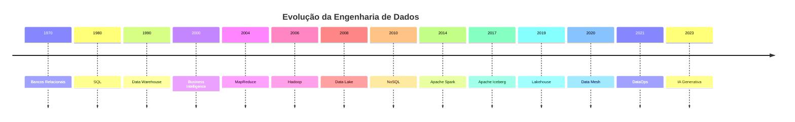

# Timeline da Engenharia de Dados

> [!quote]
> "A Engenharia de Dados não surgiu de uma única tecnologia. Ela é resultado de décadas de evolução da computação."

---

# 📖 Objetivo

Este documento apresenta uma visão histórica da evolução da Engenharia de Dados.

Seu objetivo é ajudar o leitor a compreender:

- por que novas tecnologias surgiram;
- quais problemas elas resolveram;
- como as arquiteturas evoluíram;
- quais tendências moldam o futuro da área.

---

# 🕰️ Linha do Tempo Geral

---

# Década de 1970

## Bancos Relacionais

A publicação do modelo relacional por **Edgar F. Codd** revolucionou o armazenamento de dados.

Principais marcos:

- modelo relacional;
- tabelas;
- chaves;
- álgebra relacional.

Tecnologias:

- IBM System R
- Oracle
- Ingres

> [!info]
> Grande parte dos bancos de dados modernos ainda utiliza conceitos definidos nessa época.

---

# Década de 1980

## SQL

O SQL tornou-se o padrão para acesso a bancos relacionais.

Características:

- linguagem declarativa;
- padronização ANSI;
- ampla adoção pela indústria.

Tecnologias populares:

- Oracle Database
- DB2
- Sybase

---

# Década de 1990

## Data Warehouse

Com o crescimento dos sistemas corporativos surgiu a necessidade de consolidar informações.

Conceitos importantes:

- OLAP;
- Modelagem Dimensional;
- Star Schema;
- ETL.

Autores de referência:

- Ralph Kimball
- Bill Inmon

---

# Década de 2000

## Business Intelligence

As empresas passaram a utilizar dados para apoiar decisões.

Ferramentas populares:

- Cognos
- Business Objects
- MicroStrategy
- SAS
- Tableau (anos depois)

---

# 2004

## MapReduce

O Google publicou um artigo descrevendo uma nova abordagem para processamento distribuído.

Esse trabalho inspirou diversas tecnologias posteriores.

---

# 2006

## Hadoop

O ecossistema Hadoop permitiu processar grandes volumes de dados utilizando hardware comum.

Componentes clássicos:

- HDFS;
- MapReduce;
- Hive;
- Pig.

---

# 2008

## Data Lake

Organizações passaram a armazenar dados em larga escala sem exigir modelagem prévia.

Características:

- baixo custo;
- flexibilidade;
- armazenamento massivo.

---

# Década de 2010

## NoSQL

Novos modelos de armazenamento surgiram para atender aplicações distribuídas.

Exemplos:

- MongoDB;
- Cassandra;
- Redis;
- HBase.

---

# 2014

## Apache Spark

Spark tornou o processamento distribuído muito mais acessível.

Principais recursos:

- DataFrames;
- Spark SQL;
- Streaming;
- Machine Learning.

> [!success]
> O Apache Spark tornou-se uma das tecnologias mais importantes da Engenharia de Dados moderna.

---

# 2017

## Apache Iceberg

Introduziu tabelas transacionais para Data Lakes.

Recursos:

- ACID;
- Time Travel;
- Evolução de esquema;
- Versionamento.

---

# 2019

## Lakehouse

A arquitetura Lakehouse passou a combinar características do Data Lake e do Data Warehouse.

Principais tecnologias:

- Apache Iceberg;
- Delta Lake;
- Apache Hudi.

---

# Década de 2020

## Data Mesh

Mudança de paradigma organizacional.

Dados passam a ser tratados como produtos de domínio.

---

## DataOps

Aplicação de princípios DevOps às plataformas de dados.

Características:

- automação;
- testes;
- CI/CD;
- observabilidade.

---

## Inteligência Artificial Generativa

O crescimento dos Grandes Modelos de Linguagem (LLMs) aumentou significativamente a demanda por plataformas de dados de alta qualidade.

A Engenharia de Dados tornou-se ainda mais estratégica.

---

# Evolução das Arquiteturas

---

# Evolução das Ferramentas

| Período | Tecnologias predominantes |
|----------|---------------------------|
| 1970 | Bancos Relacionais |
| 1980 | SQL |
| 1990 | Data Warehouse |
| 2000 | BI |
| 2010 | Hadoop, Spark |
| 2020 | Lakehouse, Airflow, Trino |
| Atualidade | IA Generativa, Data Products |

---

# Grandes Personalidades

| Nome | Contribuição |
|------|--------------|
| Edgar F. Codd | Modelo Relacional |
| Ralph Kimball | Modelagem Dimensional |
| Bill Inmon | Data Warehouse |
| Martin Kleppmann | Sistemas Distribuídos |
| Zhamak Dehghani | Data Mesh |
| Joe Reis | Fundamentals of Data Engineering |

---

# Tendências

Nos próximos anos espera-se crescimento de:

- Data Products;
- IA Generativa;
- Engenharia para IA;
- Data Contracts;
- Data Fabric;
- Governança Automatizada;
- Catálogos Inteligentes;
- Data Observability.

---

# Relação com a Academia

| Volume | Período histórico relacionado |
|---------|-------------------------------|
| 00 | História Geral |
| 01 | Fundamentos |
| 07 | Spark |
| 09 | Lakehouse |
| 11 | Airflow |
| 14 | Streaming |
| 17 | Arquiteturas Modernas |

---

# 🔗 Veja Também

- [[Arquiteturas]]
- [[Tecnologias]]
- [[Roadmap]]
- [[Carreira]]
- [[Apache-Spark|Apache Spark]]
- [[Apache-Iceberg|Apache Iceberg]]
- [[Data Mesh]]

---

# 📖 Resumo

A Engenharia de Dados é resultado da evolução contínua das arquiteturas, das necessidades de negócio e das tecnologias de processamento de dados.

Compreender essa linha do tempo ajuda a entender que nenhuma tecnologia surge por acaso: cada uma representa uma resposta aos desafios da geração anterior.

A capacidade de reconhecer essa evolução é essencial para tomar decisões arquiteturais fundamentadas e acompanhar as tendências da área.