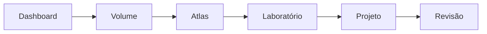

# Academia de Engenharia de Dados

> [!quote]
> "Uma plataforma de conhecimento para formar Engenheiros de Dados completos."

---

# 👋 Bem-vindo!

Esta Academia foi desenvolvida para ensinar Engenharia de Dados de forma progressiva, prática e baseada em projetos reais.

Aqui você encontrará:

- 📚 19 volumes
- 🧪 Laboratórios
- 🏗 Projeto Integrador
- 📖 Atlas Técnico
- 📚 Biblioteca
- 🎯 Preparação para certificações
- 📝 Espaço para anotações

---

# 🚀 Comece por aqui

## Primeira vez?

Siga esta ordem.

1. [[000-Atlas/Como Usar a Academia]]

2. [[000-Atlas/Roadmap]]

3. [[100-Volumes/00-Introducao/README]]

---

# 📊 Progresso da Academia

| Área | Status |
|------|:------:|
| Infraestrutura | ✅ |
| Atlas | ✅ |
| Biblioteca | ✅ |
| Dashboard | ✅ |
| Volume 00 | 🚧 |
| Volume 01 | ⏳ |
| Projeto Integrador | ⏳ |
| Certificações | ⏳ |

---

# 📚 Volumes

| Volume | Tema | Status |
|---------|------|:------:|
| [[100-Volumes/00-Introducao/README\|00 - Introdução]] | Introdução | 🚧 |
| [[100-Volumes/01-Fundamentos/README\|01 - Fundamentos]] | Fundamentos | ⏳ |
| [[100-Volumes/02-Linux/README\|02 - Linux]] | Linux | ⏳ |
| [[100-Volumes/03-Git-e-GitHub/README\|03 - Git e GitHub]] | Git | ⏳ |
| [[100-Volumes/04-SQL/README\|04 - SQL]] | SQL | ⏳ |
| [[100-Volumes/05-Modelagem-de-Dados/README\|05 - Modelagem]] | Modelagem | ⏳ |
| [[100-Volumes/06-Python/README\|06 - Python]] | Python | ⏳ |
| [[100-Volumes/07-Apache-Spark/README\|07 - Apache Spark]] | Spark | ⏳ |
| [[100-Volumes/08-PostgreSQL/README\|08 - PostgreSQL]] | PostgreSQL | ⏳ |
| [[100-Volumes/09-Lakehouse/README\|09 - Lakehouse]] | Lakehouse | ⏳ |
| [[100-Volumes/10-Trino/README\|10 - Trino]] | Trino | ⏳ |
| [[100-Volumes/11-Apache-Airflow/README\|11 - Airflow]] | Airflow | ⏳ |
| [[100-Volumes/12-Qualidade-de-Dados/README\|12 - Qualidade]] | Qualidade | ⏳ |
| [[100-Volumes/13-Observabilidade/README\|13 - Observabilidade]] | Observabilidade | ⏳ |
| [[100-Volumes/14-Streaming/README\|14 - Streaming]] | Streaming | ⏳ |
| [[100-Volumes/15-Cloud/README\|15 - Cloud]] | Cloud | ⏳ |
| [[100-Volumes/16-DataOps-e-DevOps/README\|16 - DataOps]] | DataOps | ⏳ |
| [[100-Volumes/17-Arquiteturas-Avancadas/README\|17 - Arquiteturas Avançadas]] | Arquiteturas | ⏳ |
| [[100-Volumes/18-Projeto-Integrador/README\|18 - Projeto Integrador]] | Projeto | ⏳ |

---

# 🏛 Atlas

## Navegação rápida

- [[000-Atlas/MOC]]
- [[000-Atlas/Roadmap]]
- [[000-Atlas/Arquiteturas]]
- [[000-Atlas/Tecnologias]]
- [[000-Atlas/Timeline]]
- [[000-Atlas/Carreira]]
- [[000-Atlas/Guia Editorial]]

---

# 📖 Biblioteca

- [[010-Biblioteca/README]]

---

# 🧪 Laboratórios

- [[020-Laboratorios/Fundamentos]]
- [[020-Laboratorios/Linux]]
- [[020-Laboratorios/SQL]]
- [[020-Laboratorios/Python]]
- [[020-Laboratorios/Apache-Spark]]
- [[020-Laboratorios/PostgreSQL]]
- [[020-Laboratorios/Lakehouse]]
- [[020-Laboratorios/Trino]]
- [[020-Laboratorios/Apache-Airflow]]

---

# 🏗 Projeto Integrador

Projeto oficial da Academia

**DataRetail Platform**

Localização

```text
030-Projetos/
```

---

# 🎓 Certificações

- Databricks

- AWS

- Azure

- GCP

- Snowflake

---

# 📈 Estatísticas

> [!info]

Estas estatísticas serão atualizadas automaticamente pela CLI da Academia.

| Indicador | Valor |
|-----------|------:|
| Volumes | 19 |
| Capítulos | 0 |
| Laboratórios | 0 |
| Diagramas | 0 |
| Tecnologias | 0 |
| Glossário | 0 |
| Estudos de Caso | 0 |

---

# 📝 Minha Área de Estudos

Utilize esta seção para registrar seu progresso.

## Estou estudando

-

## Próximo capítulo

-

## Dificuldades

-

## Revisar

-

---

# 📅 Sessão Atual

Data:

Objetivo:

Tempo de estudo:

Conclusão:

---

# 🎯 Objetivos da Semana

- [ ]

- [ ]

- [ ]

- [ ]

- [ ]

---

# 📌 Tarefas Pendentes

- [ ]

- [ ]

- [ ]

- [ ]

---

# 🧠 Conceitos Recentes

Adicione aqui os conceitos aprendidos durante a semana.

-

-

-

---

# ⭐ Favoritos

Coloque aqui os links mais utilizados.

-

-

-

---

# 🔥 Graph View

Abra o Graph View regularmente.

Ele mostrará como os conceitos da Academia estão conectados.

---

# 🚀 Fluxo recomendado



---

# 📚 Acesso Rápido

## Atlas

[[000-Atlas/MOC]]

---

## Roadmap

[[000-Atlas/Roadmap]]

---

## Projeto

[[030-Projetos/DataRetail Platform/README]]

---

## Biblioteca

[[010-Biblioteca/README]]

---

## Laboratórios

[[020-Laboratorios]]

---

## Certificações

[[040-Certificacoes]]

---

# 🏁 Missão

Construir conhecimento sólido em Engenharia de Dados por meio de fundamentos, prática, projetos reais e aprendizado contínuo.

---

> [!success]
> Este Dashboard é a página inicial recomendada para abrir diariamente a Academia de Engenharia de Dados.