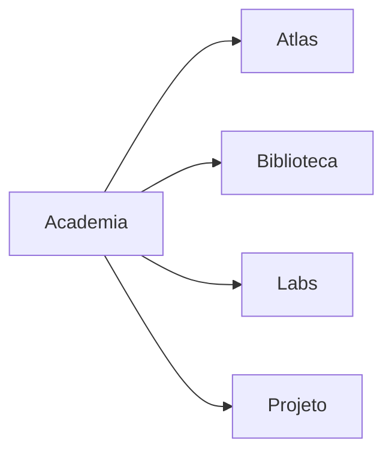

# Biblioteca da Academia de Engenharia de Dados

> [!quote]
> "Quem domina Engenharia de Dados nunca para de estudar."

---

# 📖 Objetivo

A Biblioteca reúne as principais referências utilizadas durante toda a Academia.

Ela não substitui livros nem documentações oficiais.

Seu objetivo é organizar, resumir e conectar as melhores fontes de conhecimento.

Cada nota da Biblioteca possui:

- resumo;
- conceitos importantes;
- capítulos relacionados;
- tecnologias relacionadas;
- links oficiais;
- observações do autor.

---

# Estrutura

```text
010-Biblioteca/

├── README.md
│
├── Livros/
│
├── Papers/
│
├── RFCs/
│
├── Documentacao Oficial/
│
├── Cheat Sheets/
│
├── Casos Reais/
│
├── Empresas/
│
└── Videos/
```

---

# 📚 Livros

## Engenharia de Dados

- [[Fundamentals of Data Engineering]]

- [[Designing Data-Intensive Applications]]

- [[Streaming Systems]]

- [[Data Pipelines Pocket Reference]]

- [[Building Evolutionary Architectures]]

---

## SQL

- [[SQL Performance Explained]]

- [[The Art of SQL]]

---

## PostgreSQL

- [[PostgreSQL Internals]]

---

## Arquitetura

- [[Clean Architecture]]

- [[Domain Driven Design]]

---

# 📄 Papers

Os artigos científicos que mudaram a Engenharia de Dados.

- [[MapReduce]]

- [[Google File System]]

- [[BigTable]]

- [[Spanner]]

- [[The Log]]

- [[Delta Lake Paper]]

- [[Apache Iceberg Specification]]

---

# 📖 Documentação Oficial

## Apache

- [[Apache Spark Docs]]

- [[Apache Airflow Docs]]

- [[Apache Iceberg Docs]]

- [[Apache Kafka Docs]]

- [[Apache Flink Docs]]

---

## PostgreSQL

- [[PostgreSQL Documentation]]

---

## Trino

- [[Trino Documentation]]

---

## Cloud

- [[AWS Documentation]]

- [[Azure Learn]]

- [[Google Cloud Documentation]]

---

# 📝 Cheat Sheets

Material de consulta rápida.

- [[SQL Cheat Sheet]]

- [[Linux Cheat Sheet]]

- [[Git Cheat Sheet]]

- [[Python Cheat Sheet]]

- [[Spark Cheat Sheet]]

- [[Trino Cheat Sheet]]

---

# 🏢 Casos Reais

Arquiteturas publicadas por empresas.

- [[Netflix]]

- [[Uber]]

- [[Airbnb]]

- [[LinkedIn]]

- [[Spotify]]

- [[Mercado Livre]]

- [[Nubank]]

- [[Google]]

- [[Amazon]]

---

# 🏛️ Empresas

Empresas importantes no ecossistema.

- [[Apache Software Foundation]]

- [[Databricks]]

- [[Snowflake]]

- [[Confluent]]

- [[Microsoft]]

- [[Google]]

- [[AWS]]

---

# 🎥 Vídeos

Material complementar.

- Conferências
- Keynotes
- Cursos Oficiais
- Webinars

---

# Como utilizar

Sempre que um capítulo recomendar uma leitura adicional, ela será referenciada por meio desta Biblioteca.

Exemplo:

```markdown
Leitura complementar:

[[Designing Data-Intensive Applications]]
```

Assim todo conhecimento permanece conectado.

---

# Relação com a Academia



---

# Objetivo Final

Ao concluir a Academia você terá construído uma biblioteca técnica pessoal contendo:

- livros resumidos;
- documentação comentada;
- artigos científicos;
- arquiteturas reais;
- estudos de caso;
- cheatsheets;
- referências cruzadas.

Ela continuará sendo útil muito depois do término do curso.

---

# Veja Também

- [[MOC]]
- [[Roadmap]]
- [[Tecnologias]]
- [[Arquiteturas]]