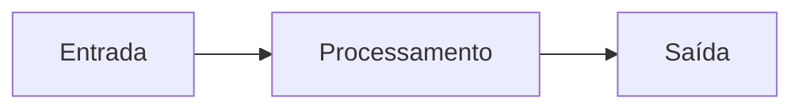

# {{title}}

> [!info] Navegação
> Inclua Wikilinks para o README do módulo, o capítulo anterior e o próximo capítulo.

## Objetivos

Ao concluir este capítulo, você será capaz de:

- compreender o conceito central apresentado;
- explicar por que ele existe e qual problema resolve;
- analisar seu funcionamento interno;
- aplicar o conceito em um cenário de Engenharia de Dados.

## Introdução

Apresente o problema antes da definição. Explique por que o tema existe, onde é utilizado e como se relaciona com conteúdos anteriores.

## Motivação

Descreva as limitações ou necessidades que levaram ao surgimento do conceito.

## Conceitos fundamentais

Defina a terminologia essencial do capítulo, do simples para o complexo.

## Como funciona

Explique o funcionamento interno, as etapas e os componentes envolvidos.



## Exemplo simples

Apresente um exemplo mínimo, válido e executável.

```python
print("Substitua por um exemplo executável")
```

## Aplicação na DataRetail

Contextualize o conceito no cenário permanente da [[DataRetail S.A.]].

## Boas práticas

- Registre práticas recomendadas e explique suas justificativas.
- Diferencie requisitos universais de decisões dependentes de contexto.

## Erros comuns

> [!warning]
> Descreva um erro frequente, sua consequência e como evitá-lo.

## Limitações e alternativas

Explique quando não utilizar a abordagem e quais alternativas devem ser consideradas.

## Resumo

Sintetize os conceitos e decisões mais importantes do capítulo.

## Próximo capítulo

Indique, por meio de Wikilink, qual assunto dá continuidade à progressão didática.

## Referências

- Adicione documentação oficial, RFCs, livros, white papers ou artigos técnicos reconhecidos.
