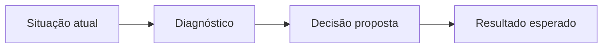

# {{title}}

## Objetivo

Explique quais conceitos do módulo serão analisados e quais decisões o leitor deverá ser capaz de justificar.

## Contexto da DataRetail

Apresente a área de negócio, os sistemas envolvidos, o volume de dados e as restrições relevantes da [[DataRetail S.A.]].

## Problema

Descreva o problema de negócio e seus impactos técnicos, operacionais e financeiros.

> [!warning]
> Destaque a principal consequência de manter o cenário atual sem intervenção.

## Evidências disponíveis

| Evidência | Origem | Interpretação |
| --------- | ------ | ------------ |
| Exemplo | Sistema de origem | O que a evidência demonstra |

## Análise

Relacione as evidências aos fundamentos apresentados no módulo.

## Alternativas consideradas

| Alternativa | Benefícios | Limitações | Decisão |
| ----------- | ---------- | ---------- | ------- |
| Alternativa A | Benefício principal | Restrição principal | Adotar ou rejeitar |

## Solução recomendada

Apresente a recomendação, seus fundamentos e os compromissos assumidos.

## Plano de implementação

1. Preparar o ambiente e validar os pré-requisitos.
2. Implementar uma prova de conceito.
3. Validar resultados técnicos e de negócio.
4. Planejar a adoção gradual.

## Critérios de sucesso

- Defina métricas objetivas e verificáveis.
- Relacione cada métrica ao problema original.

## Lições aprendidas

Conecte as decisões do caso aos conceitos permanentes de Engenharia de Dados.

## Referências

- Adicione as fontes técnicas utilizadas para fundamentar a análise.
