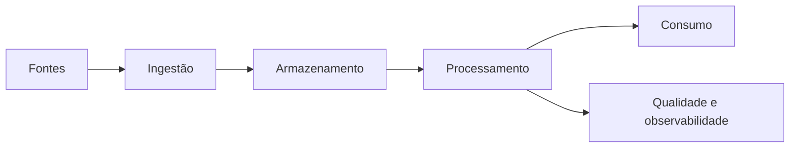

# {{title}}

## Visão geral

Resuma o problema, a solução proposta e o valor esperado para a [[030-Projetos/DataRetail Platform/README|DataRetail S.A.]].

## Objetivos

- Defina resultados técnicos mensuráveis.
- Defina resultados de negócio mensuráveis.

## Escopo

### Incluído

- Entrega que faz parte do projeto.

### Não incluído

- Entrega explicitamente fora do projeto.

## Requisitos

### Funcionais

- Descreva o comportamento esperado.

### Não funcionais

- Disponibilidade, desempenho, segurança, qualidade e observabilidade.

## Arquitetura

## Dados

| Conjunto | Origem | Formato | Frequência | Responsável |
| -------- | ------ | ------- | ---------- | ----------- |
| Exemplo | Sistema | Parquet | Diária | Equipe |

## Plano de implementação

| Fase | Entregas | Critério de conclusão |
| ---- | -------- | --------------------- |
| 1 | Fundação | Ambiente validado |
| 2 | Pipeline mínimo | Fluxo ponta a ponta executado |
| 3 | Operação | Monitoramento e documentação concluídos |

## Segurança e governança

Descreva classificação, acesso, retenção, linhagem e responsabilidades sobre os dados.

## Qualidade e observabilidade

Defina testes, métricas, alertas, SLIs e SLOs relevantes.

## Riscos

| Risco | Probabilidade | Impacto | Mitigação |
| ----- | ------------- | ------- | --------- |
| Exemplo | Média | Alto | Ação preventiva |

## Validação

Liste testes de aceitação técnicos e de negócio.

## Operação

Documente implantação, recuperação, escalabilidade, custos e responsabilidades.

## Referências

- Adicione decisões arquiteturais, documentação oficial e capítulos relacionados.
