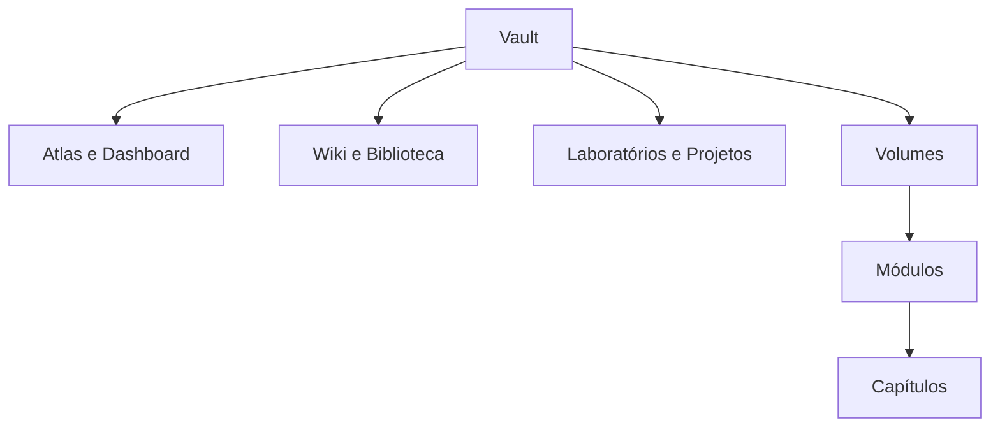

# Estrutura do Vault e Navegação

Os diretórios numerados expressam função e ordem. `100-Volumes` contém a formação; `020-Laboratorios` reúne práticas transversais; `030-Projetos` concentra entregas; Atlas, Wiki e Biblioteca apoiam descoberta.

Cada volume possui README, sumário e changelog. Cada módulo possui navegação própria e componentes padronizados. Wikilinks conectam conceitos sem acoplar a navegação a caminhos externos.

Use busca, backlinks e grafo como apoio; o sumário continua sendo a fonte da sequência pedagógica.
