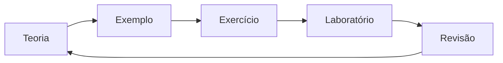

# Metodologia de Aprendizagem Progressiva

A sequência editorial prioriza conceitos, fundamentos, funcionamento interno, aplicações e ferramentas. Exercícios começam por recordação e avançam para análise e projeto. Laboratórios transformam conhecimento em evidência executável.

Estudo ativo inclui explicar com palavras próprias, prever saída antes de executar, registrar erros e revisar em intervalos. Copiar soluções sem formular hipótese reduz aprendizado.

> [!tip]
> Termine cada sessão escrevendo o que aprendeu, o que ainda não consegue explicar e qual evidência produzirá em seguida.
