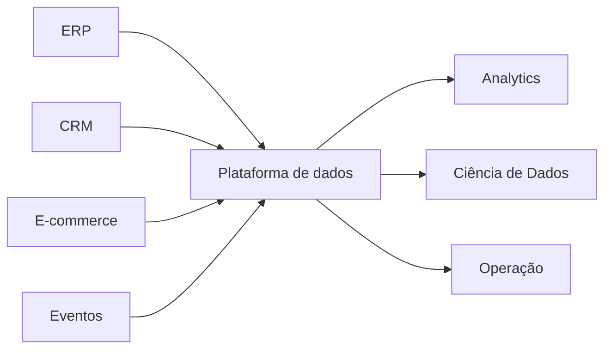

# Projeto Integrador DataRetail

A DataRetail S.A. é uma varejista fictícia com lojas, e-commerce, clientes, pedidos, estoque, pagamentos e logística. O cenário fornece continuidade sem depender de dados empresariais reais.

Ao longo dos volumes, a empresa evolui de arquivos e banco transacional para pipelines, Lakehouse, consumo analítico, qualidade e observabilidade.

Cada estudo de caso deve declarar requisito, decisão, trade-off e validação. A empresa é um fio pedagógico, não uma desculpa para exemplos irreais.
