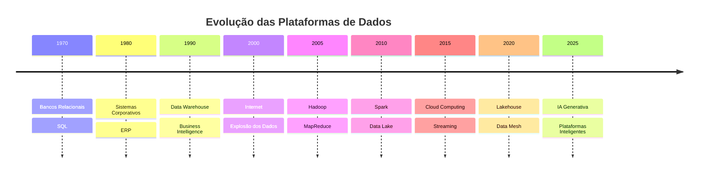

← [[03-A-Era-dos-Dados|A Era dos Dados]] | ↑ [[100-Volumes/00-Introducao/01-O-que-e-Engenharia-de-Dados/README|Índice do capítulo]] | → [[05-O-Nascimento-da-Engenharia-de-Dados|O Nascimento da Engenharia de Dados]]

# 04 - Evolução Histórica

> [!quote]
> "A história da Engenharia de Dados é, na verdade, a história da evolução da própria computação voltada ao tratamento da informação."

---

## 📖 Introdução

A Engenharia de Dados não surgiu de forma repentina.

Ela é resultado de mais de cinquenta anos de evolução tecnológica.

Cada nova geração de sistemas resolveu um problema importante, mas também criou novos desafios que impulsionaram a criação da próxima geração de tecnologias.

Entender essa evolução é fundamental para compreender por que utilizamos hoje ferramentas como [[Apache-Spark|Apache Spark]], [[Apache-Airflow|Apache Airflow]], [[Trino]], [[Apache-Iceberg|Apache Iceberg]] e [[100-Volumes/08-PostgreSQL/README|PostgreSQL]].

> [!tip]
> Um bom Engenheiro de Dados não aprende apenas ferramentas. Ele entende quais problemas motivaram o surgimento de cada tecnologia.

---

## 🕰️ Linha do Tempo

Cada uma dessas fases transformou completamente a forma como armazenamos, processamos e utilizamos informações.

---

## 🖥️ Primeira Era — Bancos Relacionais

Na década de 1970, o modelo relacional revolucionou a computação.

Antes dele, os dados eram armazenados em estruturas hierárquicas ou em arquivos sequenciais, dificultando consultas complexas e aumentando a dependência entre aplicações e armazenamento.

O modelo relacional introduziu conceitos que permanecem fundamentais até hoje:

- tabelas;
- linhas e colunas;
- chaves primárias;
- chaves estrangeiras;
- integridade referencial;
- linguagem SQL.

> [!info]
> Mesmo após décadas de evolução tecnológica, os bancos relacionais continuam sendo componentes essenciais em praticamente todas as arquiteturas modernas de dados.

---

## 🏢 Segunda Era — Sistemas Corporativos

Nas décadas de 1980 e 1990, as empresas passaram a informatizar seus processos internos.

Surgiram sistemas especializados para diferentes áreas, como:

- financeiro;
- recursos humanos;
- logística;
- vendas;
- estoque;
- manufatura.

Esses sistemas, posteriormente conhecidos como [[ERP]] e [[CRM]], passaram a gerar grandes volumes de informações.

O problema era que cada sistema armazenava seus próprios dados de maneira independente.

Como consequência:

- havia redundância de informações;
- surgiam inconsistências;
- integrar dados tornou-se complexo;
- produzir relatórios corporativos exigia grande esforço.

---

## 📊 Terceira Era — Data Warehouse

Para resolver o problema da fragmentação dos dados surgiu o conceito de [[Data-Warehouse|Data Warehouse]].

A ideia era consolidar informações provenientes de diversos sistemas operacionais em um único ambiente voltado para análise.

Essa abordagem trouxe benefícios importantes:

- padronização;
- histórico de informações;
- indicadores corporativos;
- apoio à tomada de decisão.

Foi nesse período que o processo de [[ETL]] ganhou destaque.

Extrair.

Transformar.

Carregar.

Durante muitos anos essa foi a principal atividade dos profissionais de dados.

---

## 🌐 Quarta Era — Big Data

Com a popularização da internet, do comércio eletrônico e das redes sociais, o crescimento do volume de dados tornou-se exponencial.

Os Data Warehouses tradicionais começaram a enfrentar limitações.

Novos desafios surgiram:

- bilhões de registros;
- dados sem estrutura definida;
- processamento distribuído;
- redução de custos de armazenamento.

Foi nesse contexto que surgiu o ecossistema Hadoop.

Embora revolucionário para a época, o modelo baseado em [[MapReduce]] apresentava limitações de desempenho para cargas analíticas complexas.

---

## ⚡ Quinta Era — Apache Spark

Em resposta às limitações do Hadoop, surgiu o [[Apache-Spark|Apache Spark]].

O Spark introduziu um modelo muito mais eficiente baseado em processamento em memória.

Isso permitiu:

- processamento significativamente mais rápido;
- APIs modernas;
- suporte a SQL;
- Machine Learning;
- Streaming;
- processamento gráfico.

Atualmente o Spark é uma das principais plataformas utilizadas em Engenharia de Dados.

---

## 🪣 Sexta Era — Data Lakes

À medida que o custo do armazenamento diminuiu, surgiu uma nova estratégia.

Em vez de transformar todos os dados antes de armazená-los, passou-se a guardar os dados praticamente em seu formato original.

Nasciam os Data Lakes.

Eles permitiram armazenar:

- arquivos CSV;
- JSON;
- XML;
- imagens;
- vídeos;
- logs;
- documentos;
- dados semiestruturados.

Essa abordagem aumentou a flexibilidade, mas trouxe novos desafios relacionados à governança e qualidade.

---

## 🏛️ Sétima Era — Lakehouse

Os Lakehouses representam uma evolução dos Data Lakes.

Seu objetivo é combinar:

- a flexibilidade dos Data Lakes;
- a confiabilidade dos Data Warehouses.

Tecnologias como:

- [[Apache-Iceberg|Apache Iceberg]];
- Delta Lake;
- Apache Hudi;

foram criadas para fornecer recursos como:

- transações ACID;
- versionamento;
- evolução de esquema;
- time travel;
- maior confiabilidade.

---

## ☁️ O Presente e o Futuro

Hoje as plataformas de dados evoluem rapidamente.

As principais tendências incluem:

- processamento em tempo real;
- arquiteturas orientadas a eventos;
- computação em nuvem;
- plataformas serverless;
- Inteligência Artificial Generativa;
- Data Mesh;
- Data Products.

A Engenharia de Dados deixou de ser apenas uma área de suporte.

Ela tornou-se um componente estratégico para praticamente todas as organizações digitais.

---

## 🏢 Estudo de Caso — DataRetail S.A.

Imagine que a DataRetail nasceu em 1995.

Sua evolução acompanhou a própria história da tecnologia:

| Ano | Plataforma |
|------|------------|
| 1995 | Banco relacional único |
| 2002 | ERP |
| 2008 | Data Warehouse |
| 2015 | Hadoop |
| 2018 | Apache Spark |
| 2021 | Data Lake |
| 2024 | Lakehouse |
| Atual | Plataforma moderna baseada em eventos |

Cada mudança ocorreu porque a plataforma anterior já não atendia às necessidades do negócio.

Esse comportamento é observado em milhares de empresas ao redor do mundo.

---

> [!warning]
> Nenhuma tecnologia resolve todos os problemas.
>
> Cada nova geração surge para solucionar limitações da anterior, mas também introduz novos desafios.
>
> Um bom Engenheiro de Dados precisa compreender esses trade-offs para tomar decisões arquiteturais conscientes.

---

## 🔗 Veja Também

- [[Engenharia-de-Dados|Engenharia de Dados]]
- [[Engenheiro-de-Dados|Engenheiro de Dados]]
- [[Data-Warehouse|Data Warehouse]]
- [[Data-Lake|Data Lake]]
- [[Lakehouse]]
- [[Apache-Spark|Apache Spark]]
- [[Apache-Iceberg|Apache Iceberg]]
- [[Trino]]
- [[ETL]]
- [[ELT]]

---

> [!summary]
>
> ## Resumo
>
> A Engenharia de Dados é resultado de décadas de evolução tecnológica.
>
> Bancos relacionais, sistemas corporativos, Data Warehouses, Big Data, Spark, Data Lakes e Lakehouses representam etapas sucessivas dessa evolução.
>
> Conhecer essa história permite compreender por que utilizamos as tecnologias atuais e como elas continuarão evoluindo.

---

### Navegação

← [[03-A-Era-dos-Dados|A Era dos Dados]]

↑ [[100-Volumes/00-Introducao/01-O-que-e-Engenharia-de-Dados/README|Índice do capítulo]]

→ [[05-O-Nascimento-da-Engenharia-de-Dados|O Nascimento da Engenharia de Dados]]
