← [[04-Evolucao-Historica|04 - Evolucao-Historica]]
↑ [[100-Volumes/00-Introducao/01-O-que-e-Engenharia-de-Dados/README|README]]
→ [[06-O-Papel-do-Engenheiro-de-Dados|06 - O Papel do Engenheiro de Dados]]

# 05 - O Nascimento da Engenharia de Dados

> [!quote]
> "As profissões surgem quando os problemas deixam de poder ser resolvidos pelas abordagens existentes."

---

# Introdução

Ao estudar a história da tecnologia é comum imaginar que novas profissões surgem a partir da criação de uma ferramenta inovadora.

Na realidade, acontece exatamente o contrário.

Primeiro surgem novos problemas.

Depois surgem soluções.

Somente então nasce uma nova especialização.

A Engenharia de Dados é um excelente exemplo desse processo.

Ela não surgiu porque alguém criou o [[Apache-Spark|Apache Spark]].

Também não nasceu com o Hadoop, o [[Data-Lake|Data Lake]] ou a computação em nuvem.

Essas tecnologias apareceram **porque já existiam problemas que não podiam mais ser resolvidos utilizando apenas bancos relacionais, processos tradicionais de ETL e ferramentas de Business Intelligence**.

---

# Antes da Engenharia de Dados

Durante muitos anos as organizações possuíam poucos sistemas.

Uma empresa típica possuía:

- ERP
- Sistema Financeiro
- RH
- Estoque
- Faturamento

Cada aplicação possuía seu próprio banco de dados.

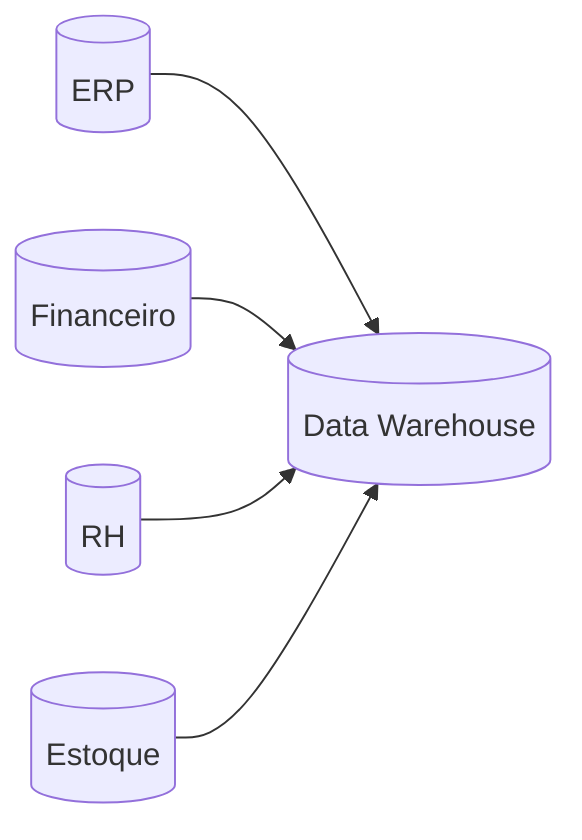

Esse modelo funcionava relativamente bem.

Os dados cresciam lentamente.

Os relatórios eram produzidos diariamente.

As integrações eram poucas.

O volume de dados era administrável.

Durante muitos anos isso foi suficiente.

---

# O crescimento começou a acelerar

A internet mudou completamente esse cenário.

Novas aplicações passaram a produzir dados continuamente.

Entre elas:

- sites;
- e-commerce;
- aplicativos móveis;
- sensores;
- GPS;
- redes sociais;
- sistemas de monitoramento;
- logs;
- dispositivos IoT.

Agora uma empresa não produzia apenas registros de vendas.

Ela produzia milhões de eventos por hora.

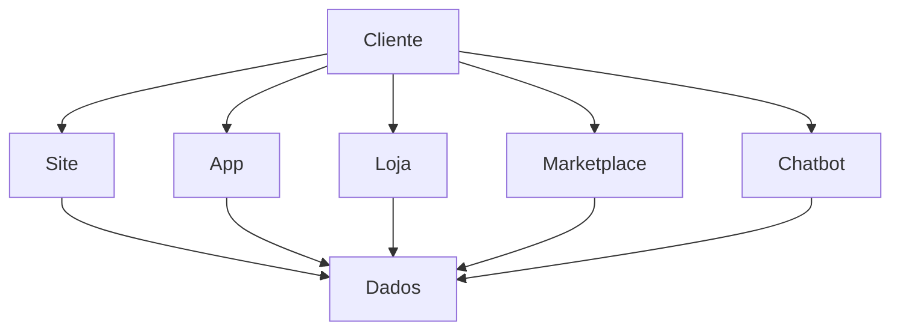

A quantidade de informações crescia exponencialmente.

Mas o maior problema não era apenas o volume.

---

# O verdadeiro problema

As empresas passaram a enfrentar diversos desafios simultaneamente.

## Integração

Os dados estavam espalhados em dezenas de sistemas.

Cada um utilizava:

- formatos diferentes;
- regras diferentes;
- identificadores diferentes;
- horários diferentes;
- tecnologias diferentes.

---

## Escalabilidade

Processos que executavam durante 30 minutos passaram a levar:

- 4 horas;
- 8 horas;
- 15 horas.

Alguns sequer conseguiam terminar antes do início do próximo processamento.

---

## Disponibilidade

O negócio deixou de aceitar respostas apenas no dia seguinte.

Passou a exigir:

- dashboards atualizados;
- alertas;
- monitoramento;
- processamento quase em tempo real.

---

## Qualidade

Outro problema começou a aparecer.

Os mesmos dados apresentavam resultados diferentes dependendo do relatório consultado.

Clientes duplicados.

Produtos inconsistentes.

Valores diferentes entre áreas.

A confiança nas informações começou a diminuir.

---

## Custos

Servidores maiores significavam custos maiores.

Em determinado momento simplesmente não era mais viável resolver o problema comprando máquinas mais potentes.

Era necessário mudar completamente a arquitetura.

---

# A mudança de paradigma

Até então o foco era o banco de dados.

A partir desse momento o foco passou a ser o fluxo dos dados.

As organizações perceberam que precisavam controlar todo o ciclo de vida da informação.

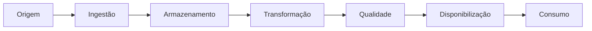

Os dados deixaram de ser responsabilidade exclusiva dos administradores de banco de dados.

Passaram a exigir profissionais capazes de projetar todo esse fluxo.

---

# O nascimento da profissão

Foi nesse contexto que começou a surgir aquilo que hoje chamamos de **Engenharia de Dados**.

Não houve um anúncio oficial.

Não houve uma certificação.

Não houve uma data específica.

A profissão foi sendo construída naturalmente conforme as empresas precisavam de profissionais capazes de:

- integrar sistemas;
- construir pipelines;
- automatizar cargas;
- garantir qualidade;
- escalar processamento;
- reduzir custos;
- documentar processos;
- monitorar execuções.

O profissional deixou de trabalhar apenas com tabelas.

Passou a trabalhar com plataformas completas.

---

# De Analista de BI para Engenheiro de Dados

Muitos dos primeiros Engenheiros de Dados vieram de áreas como:

- Administração de Banco de Dados (DBA);
- Business Intelligence;
- Desenvolvimento de Software;
- Infraestrutura;
- Big Data;
- ETL.

Cada uma dessas áreas contribuiu para formar a nova profissão.

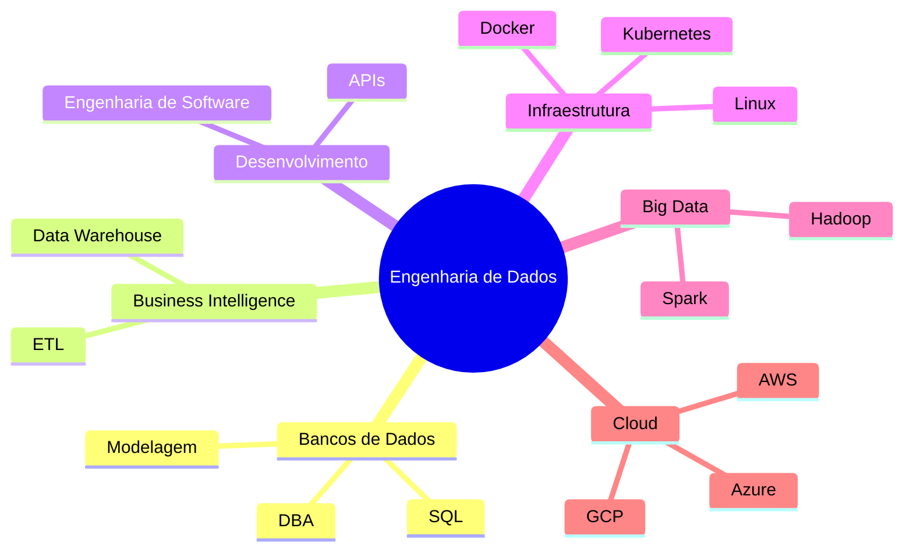

Até hoje é comum encontrar excelentes Engenheiros de Dados com formações bastante diferentes.

Isso acontece porque a profissão é naturalmente multidisciplinar.

---

# Muito além do ETL

Durante muitos anos acreditou-se que Engenharia de Dados era apenas desenvolver processos de ETL.

Hoje sabemos que isso representa apenas uma pequena parte do trabalho.

Um Engenheiro de Dados moderno também precisa pensar em:

- arquitetura;
- automação;
- testes;
- observabilidade;
- governança;
- segurança;
- versionamento;
- performance;
- confiabilidade.

Ele deixa de desenvolver apenas programas.

Passa a construir plataformas.

---

> [!tip]
> A principal diferença entre um desenvolvedor de ETL e um Engenheiro de Dados está na visão sistêmica.
>
> Enquanto o primeiro normalmente está preocupado em mover dados entre sistemas, o segundo projeta, implementa e evolui toda a plataforma responsável por esse fluxo.

---
# A consolidação da Engenharia de Dados

O crescimento dos dados explica por que novas tecnologias foram necessárias, mas não explica sozinho a consolidação da Engenharia de Dados como uma disciplina própria.

A profissão ganhou identidade quando as organizações perceberam que não bastava desenvolver processos isolados de integração. Era necessário construir sistemas de dados com os mesmos princípios aplicados a outros produtos de software:

- código versionado;
- testes automatizados;
- ambientes separados;
- implantação controlada;
- monitoramento;
- tratamento de falhas;
- documentação;
- segurança;
- manutenção contínua.

Essa mudança aproximou definitivamente a [[Engenharia-de-Dados|Engenharia de Dados]] da [[Engenharia de Software]].

> [!important]
> Um pipeline não deixa de ser software apenas porque seu principal resultado é uma tabela, um arquivo ou um evento.

---

# A influência da Engenharia de Software

Durante muito tempo, processos de dados foram desenvolvidos como scripts independentes.

Era comum encontrar soluções com as seguintes características:

- parâmetros escritos diretamente no código;
- regras de negócio duplicadas;
- ausência de testes;
- execução manual;
- pouca documentação;
- dependência do desenvolvedor original;
- inexistência de controle de versão;
- tratamento insuficiente de erros.

Essas soluções podiam funcionar durante meses ou anos, mas tornavam-se frágeis à medida que o ambiente crescia.

A Engenharia de Dados passou a incorporar práticas consolidadas da Engenharia de Software.

| Engenharia de Software | Engenharia de Dados |
|---|---|
| Código-fonte versionado | Pipelines e transformações versionados |
| Testes unitários | Testes de regras e transformações |
| Testes de integração | Validação entre origem e destino |
| Integração contínua | Validação automática de alterações |
| Implantação automatizada | Publicação controlada de pipelines |
| Monitoramento de aplicações | Observabilidade de dados e processos |
| Gestão de configuração | Parâmetros por ambiente |
| Tratamento de exceções | Retentativas, alertas e reprocessamento |

Essa aproximação mudou a forma de desenvolver soluções de dados.

O objetivo deixou de ser apenas fazer o processamento funcionar.

Passou a ser construir uma solução:

- confiável;
- testável;
- reproduzível;
- observável;
- manutenível;
- segura.

---

# O surgimento do DataOps

Com a expansão das plataformas de dados, tornou-se necessário aplicar práticas de automação e operação contínua ao ciclo de vida dos pipelines.

Nesse contexto surgiu o conceito de [[DataOps]].

O DataOps combina ideias provenientes de:

- [[DevOps]];
- métodos ágeis;
- qualidade de dados;
- automação;
- observabilidade;
- colaboração entre equipes.

Seu objetivo é reduzir o tempo entre uma necessidade do negócio e a disponibilização de dados confiáveis.

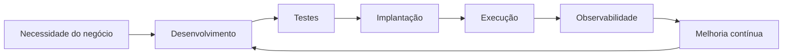

> [!abstract] DataOps
> DataOps é uma abordagem para desenvolver, entregar e operar produtos e pipelines de dados de forma colaborativa, automatizada, observável e orientada à qualidade.

O DataOps não é uma ferramenta específica.

Ele representa uma forma de trabalho.

Uma equipe pode aplicar seus princípios utilizando diferentes tecnologias.

---

# A computação em nuvem

Outro fator decisivo para a consolidação da Engenharia de Dados foi a expansão da [[Computação em Nuvem]].

Antes da nuvem, aumentar a capacidade de processamento exigia normalmente:

1. estimar a demanda futura;
2. adquirir servidores;
3. preparar o data center;
4. configurar redes e armazenamento;
5. instalar sistemas e aplicações;
6. manter toda a infraestrutura.

Esse processo podia levar semanas ou meses.

A nuvem tornou possível provisionar recursos de forma programável e sob demanda.

Essa transformação trouxe benefícios importantes:

- armazenamento praticamente elástico;
- processamento sob demanda;
- criação rápida de ambientes;
- serviços gerenciados;
- automação da infraestrutura;
- pagamento conforme o uso;
- expansão internacional.

Entretanto, também trouxe novos desafios:

- controle de custos;
- segurança;
- identidade e acesso;
- governança;
- arquitetura distribuída;
- dependência de fornecedores;
- gestão de múltiplos ambientes.

O Engenheiro de Dados passou a precisar compreender não apenas o processamento, mas também a infraestrutura que o sustenta.

---

# A separação entre armazenamento e processamento

Em arquiteturas tradicionais, o banco de dados armazenava e processava as informações.

Essas duas responsabilidades estavam fortemente conectadas.

Com o crescimento dos [[Data Lakes]] e do armazenamento de objetos, tornou-se comum separar armazenamento e processamento.

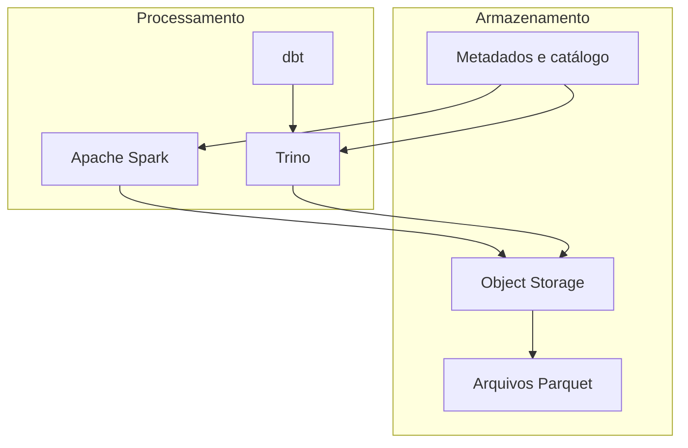

Essa separação permitiu que diferentes mecanismos utilizassem os mesmos dados.

Por exemplo:

- o [[Apache-Spark|Apache Spark]] pode processar grandes volumes;
- o [[Trino]] pode executar consultas SQL;
- o [[dbt]] pode organizar transformações;
- ferramentas de qualidade podem validar os resultados;
- aplicações analíticas podem consumir as tabelas produzidas.

Essa arquitetura também facilita escalar processamento e armazenamento de maneira independente.

---

# Apache Spark e o processamento distribuído moderno

O [[Apache-Spark|Apache Spark]] teve papel importante na consolidação da Engenharia de Dados moderna.

Ele tornou o processamento distribuído mais acessível por meio de APIs para diferentes linguagens e abstrações de alto nível.

Com o Spark, tornou-se possível trabalhar com:

- processamento em lote;
- consultas SQL;
- streaming;
- Machine Learning;
- grandes volumes de arquivos;
- diferentes fontes de dados.

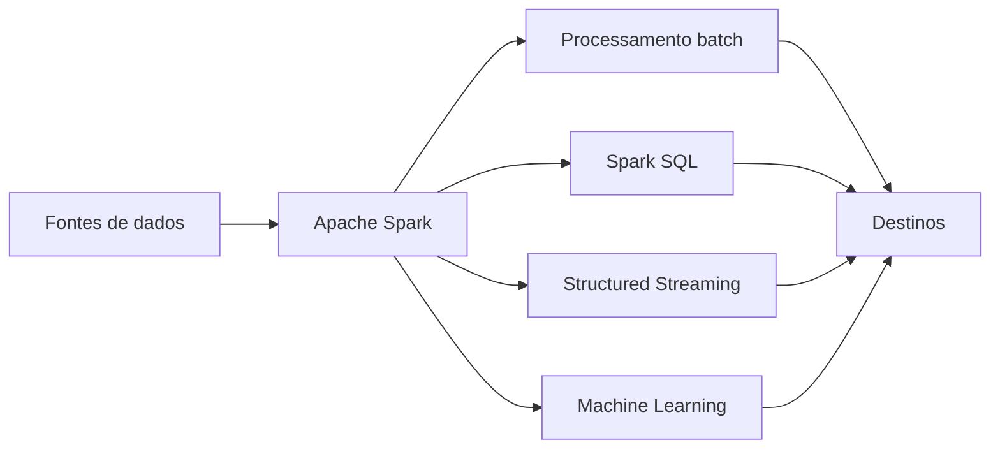

Entretanto, utilizar Spark não transforma automaticamente uma solução em Engenharia de Dados.

A tecnologia precisa fazer parte de uma arquitetura que considere:

- particionamento;
- qualidade;
- catalogação;
- segurança;
- orquestração;
- observabilidade;
- custos;
- recuperação após falhas.

> [!warning]
> Ferramentas resolvem partes do problema. A Engenharia de Dados é responsável por integrar essas partes em uma solução coerente.

---

# Do Data Lake ao Lakehouse

Os Data Lakes tornaram possível armazenar grandes volumes de dados em formatos diversos e com custo reduzido.

Entretanto, muitos ambientes passaram a enfrentar problemas como:

- arquivos sem documentação;
- duplicidade;
- dificuldade para controlar esquemas;
- ausência de transações;
- baixa confiabilidade;
- dados abandonados;
- dificuldade de rastreamento.

Quando um Data Lake perde governança e organização, ele pode se transformar em um **Data Swamp**, ou pântano de dados.

Para reduzir essas limitações, surgiram arquiteturas de [[Lakehouse]].

O objetivo do Lakehouse é combinar características do [[Data-Warehouse|Data Warehouse]] com a flexibilidade do Data Lake.

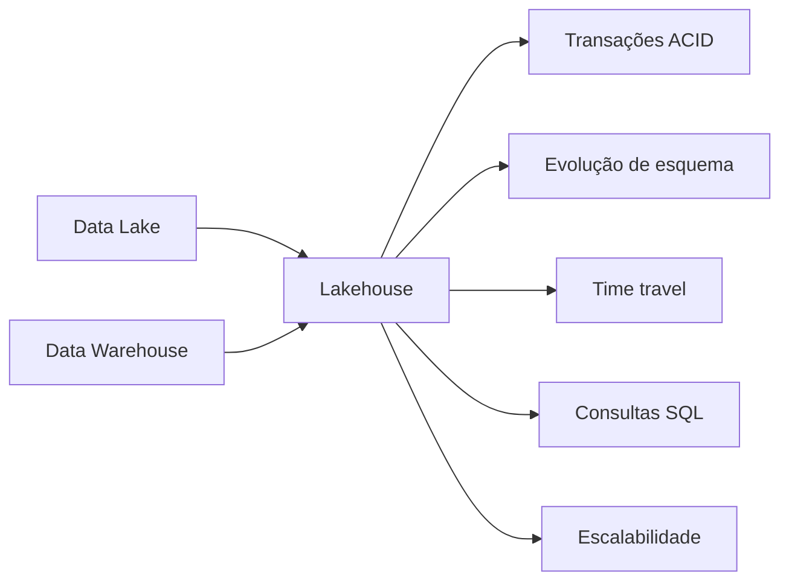

Tecnologias como [[Apache-Iceberg|Apache Iceberg]], Delta Lake e Apache Hudi passaram a fornecer recursos de gerenciamento de tabelas sobre armazenamento de objetos.

Esses recursos ampliaram novamente o campo de atuação do Engenheiro de Dados.

---

# O crescimento da orquestração

À medida que os pipelines cresceram, tornou-se impraticável executar processos manualmente ou apenas com agendamentos isolados.

Uma plataforma podia possuir centenas de tarefas interdependentes.

Por exemplo:

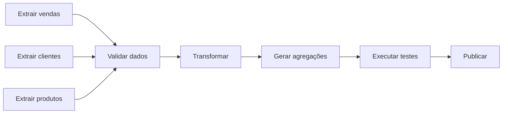

Ferramentas de orquestração, como o [[Apache-Airflow|Apache Airflow]], passaram a controlar:

- agendamentos;
- dependências;
- retentativas;
- parâmetros;
- registros de execução;
- alertas;
- reprocessamentos.

A orquestração transformou conjuntos de scripts em fluxos operacionais controlados.

---

# Observabilidade de dados

O monitoramento tradicional verifica se servidores, aplicações e processos estão funcionando.

Entretanto, um pipeline pode terminar com sucesso e ainda produzir dados incorretos.

Por exemplo:

- a origem enviou menos registros;
- uma coluna ficou completamente nula;
- a quantidade de clientes duplicados aumentou;
- os dados chegaram atrasados;
- uma regra de negócio produziu valores inesperados.

Por isso, a Engenharia de Dados passou a adotar a [[Observabilidade de Dados]].

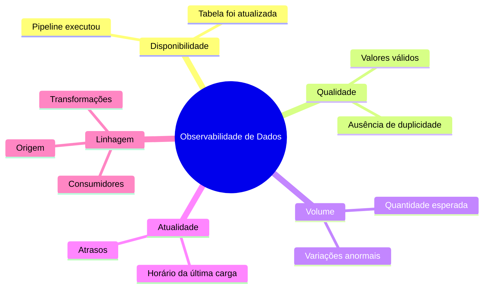

A observabilidade procura responder não apenas se o pipeline executou, mas se os dados continuam confiáveis.

---

# Qualidade como responsabilidade contínua

Em arquiteturas antigas, a qualidade dos dados era frequentemente tratada somente ao final do processo.

Essa abordagem permitia que erros se propagassem por várias etapas.

A Engenharia de Dados moderna procura validar os dados continuamente.

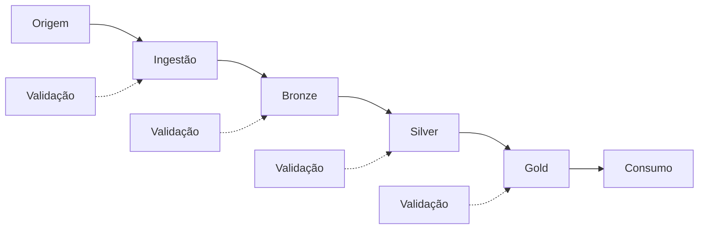

A [[Qualidade-de-Dados|Qualidade de Dados]] pode envolver dimensões como:

- completude;
- unicidade;
- validade;
- consistência;
- atualidade;
- integridade;
- precisão.

> [!tip]
> Quanto mais cedo um problema é identificado, menor tende a ser seu custo de correção.

---

# A ascensão dos produtos de dados

Outra mudança importante foi tratar conjuntos de dados como produtos internos.

Um produto de dados não é apenas uma tabela.

Ele possui:

- consumidores definidos;
- propósito;
- responsável;
- documentação;
- regras de qualidade;
- disponibilidade esperada;
- política de evolução;
- suporte.

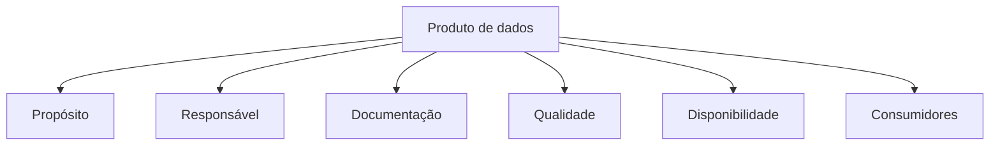

Essa abordagem aumenta a responsabilidade sobre o dado e reduz a criação de ativos sem uso ou manutenção.

---

# A Inteligência Artificial ampliou a demanda

O crescimento de [[Machine Learning]] e [[Inteligência Artificial]] ampliou ainda mais a necessidade de Engenharia de Dados.

Modelos dependem de dados durante todo o seu ciclo de vida.

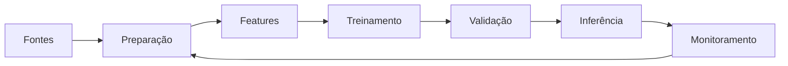

Os dados precisam ser:

- representativos;
- rastreáveis;
- atualizados;
- consistentes;
- protegidos;
- reproduzíveis.

Sem uma base confiável, modelos sofisticados podem produzir resultados incorretos, enviesados ou impossíveis de reproduzir.

> [!important]
> A qualidade de uma solução de Inteligência Artificial não depende apenas do modelo. Ela depende também da qualidade da plataforma de dados que o alimenta.

---

# A disciplina moderna

A Engenharia de Dados moderna pode ser entendida como a convergência de várias áreas.

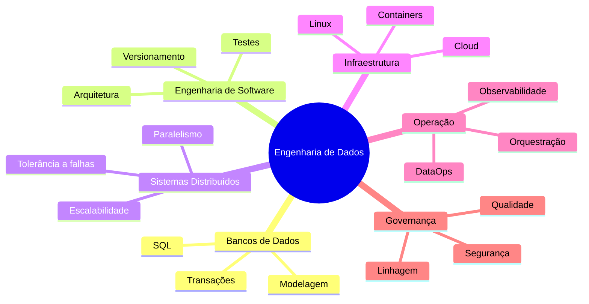

Essa natureza multidisciplinar explica por que profissionais podem chegar à área por diferentes caminhos.

Alguns vêm de bancos de dados.

Outros vêm de desenvolvimento, BI, infraestrutura, análise ou Ciência de Dados.

O que os une é a responsabilidade de construir e manter o fluxo confiável dos dados.

---

# Como reconhecer uma solução de Engenharia de Dados

Uma solução madura apresenta, em diferentes níveis, as seguintes características:

## Automatização

Os processos não dependem de execução manual frequente.

## Reprodutibilidade

A mesma entrada e as mesmas regras devem produzir resultados previsíveis.

## Idempotência

A repetição controlada de uma execução não deve gerar duplicidade ou corrupção.

## Observabilidade

A equipe consegue identificar falhas técnicas e problemas nos dados.

## Escalabilidade

A solução consegue acompanhar o crescimento do volume ou da demanda.

## Segurança

Acesso, armazenamento e transmissão são controlados.

## Qualidade

Existem regras explícitas e verificáveis sobre o dado.

## Documentação

Origem, regras, responsáveis e consumidores são conhecidos.

## Manutenibilidade

Alterações podem ser realizadas sem depender exclusivamente do autor original.

---

# Engenharia de Dados não é uma ferramenta

É comum definir profissionais com base nas tecnologias que utilizam:

- Engenheiro Spark;
- Engenheiro Databricks;
- Engenheiro AWS;
- Engenheiro Airflow.

Essas especializações podem existir, mas nenhuma ferramenta define toda a disciplina.

As tecnologias mudam.

Os problemas fundamentais permanecem:

- integrar;
- armazenar;
- transformar;
- disponibilizar;
- proteger;
- monitorar;
- governar.

> [!quote]
> Um profissional preparado para apenas uma ferramenta conhece uma implementação. Um Engenheiro de Dados compreende o problema, os princípios e os trade-offs.

---

# Estudo de caso — A transformação da DataRetail S.A.

A [[DataRetail S.A.]] começou com uma arquitetura simples.

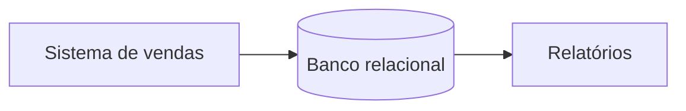

Com a expansão, foram adicionados:

- ERP;
- CRM;
- e-commerce;
- aplicativo;
- marketplace;
- logística;
- programa de fidelidade.

A arquitetura tornou-se fragmentada.

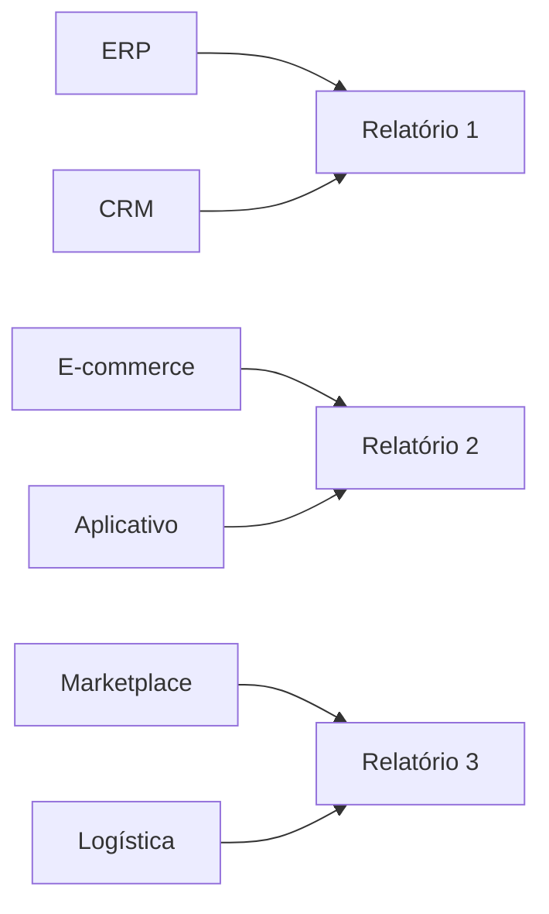

Cada área desenvolvia suas próprias integrações.

Como consequência:

- os números divergiam;
- regras eram duplicadas;
- cargas falhavam sem alertas;
- o histórico era incompleto;
- novas análises levavam semanas;
- cientistas de dados gastavam tempo preparando informações.

A empresa decidiu criar uma plataforma central.

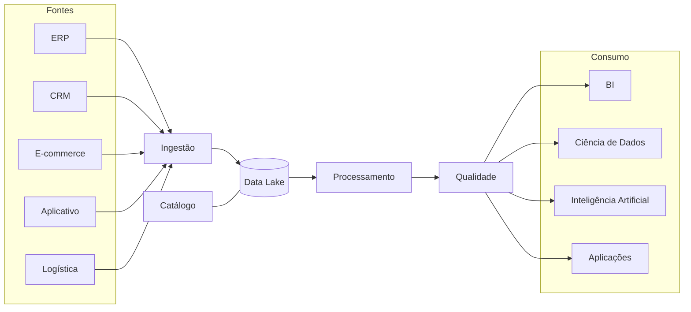

A equipe de Engenharia de Dados passou a ser responsável por:

1. criar padrões de ingestão;
2. centralizar o armazenamento;
3. implementar transformações reutilizáveis;
4. versionar código;
5. validar qualidade;
6. orquestrar dependências;
7. monitorar pipelines;
8. documentar os dados;
9. controlar o acesso;
10. apoiar os consumidores.

A profissão nasceu, dentro da DataRetail, porque os dados se tornaram essenciais demais para dependerem de processos improvisados.

---

# A Engenharia de Dados como função estratégica

Inicialmente, muitas empresas enxergavam a equipe de dados como uma área de suporte responsável por relatórios e cargas.

Essa percepção mudou.

Atualmente, produtos e decisões dependem diretamente da plataforma de dados.

Uma indisponibilidade pode afetar:

- concessão de crédito;
- recomendação de produtos;
- detecção de fraude;
- cálculo de preços;
- previsão de demanda;
- logística;
- obrigações regulatórias;
- atendimento ao cliente.

A Engenharia de Dados tornou-se estratégica porque os dados passaram a fazer parte da operação central das empresas.

---

# Veja também

- [[Engenharia-de-Dados|Engenharia de Dados]]
- [[Engenheiro-de-Dados|Engenheiro de Dados]]
- [[Engenharia de Software]]
- [[DataOps]]
- [[DevOps]]
- [[Computação em Nuvem]]
- [[Apache-Spark|Apache Spark]]
- [[Apache-Airflow|Apache Airflow]]
- [[Data-Lake|Data Lake]]
- [[Lakehouse]]
- [[Apache-Iceberg|Apache Iceberg]]
- [[Trino]]
- [[Observabilidade de Dados]]
- [[Qualidade-de-Dados|Qualidade de Dados]]
- [[Produto de Dados]]
- [[Machine Learning]]
- [[Inteligência Artificial]]
- [[DataRetail S.A.]]

---

> [!summary] Resumo
> A Engenharia de Dados consolidou-se quando as organizações perceberam que processos isolados de ETL não eram suficientes para sustentar plataformas modernas.
>
> A profissão incorporou práticas de Engenharia de Software, DevOps, sistemas distribuídos, computação em nuvem, observabilidade, qualidade e governança.
>
> Tecnologias como Spark, Airflow, Data Lakes e Lakehouses ampliaram suas possibilidades, mas não definem sozinhas a disciplina.
>
> O Engenheiro de Dados é responsável por transformar fluxos fragmentados em sistemas confiáveis, automatizados, escaláveis e operáveis.

# Verifique sua compreensão

1. Como a Engenharia de Software influenciou a Engenharia de Dados?
2. O que é DataOps e qual problema procura resolver?
3. Como a computação em nuvem contribuiu para a expansão da área?
4. Por que separar armazenamento e processamento?
5. Qual foi a importância do Apache Spark?
6. Quais limitações dos Data Lakes contribuíram para o surgimento dos Lakehouses?
7. Qual é a diferença entre monitorar um pipeline e observar os dados?
8. O que transforma uma tabela em um produto de dados?
9. Por que a Inteligência Artificial depende da Engenharia de Dados?
10. Quais características indicam que uma solução está preparada para produção?

---

## Navegação

← [[04-Evolucao-Historica|Evolução histórica]]

↑ [[100-Volumes/00-Introducao/01-O-que-e-Engenharia-de-Dados/README|Índice do capítulo]]

→ [[06-O-Papel-do-Engenheiro-de-Dados|O papel do Engenheiro de Dados]]
## Continuação

Na próxima parte deste capítulo veremos como conceitos como [[DataOps]], [[Computação em Nuvem]], [[Apache-Spark|Apache Spark]], [[Lakehouse]] e [[Inteligência Artificial]] consolidaram definitivamente a Engenharia de Dados como uma disciplina própria da computação.

---

## Navegação

← [[04-Evolucao-Historica|Evolução Histórica]]

↑ [[100-Volumes/00-Introducao/01-O-que-e-Engenharia-de-Dados/README|Índice do Capítulo]]

→ [[06-O-Papel-do-Engenheiro-de-Dados|06 - O Papel do Engenheiro de Dados]]