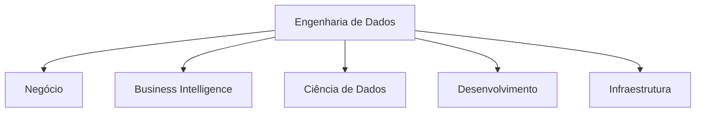
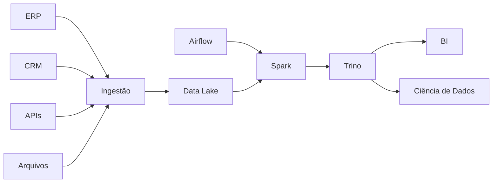
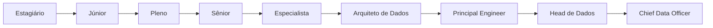

← [[05-O-Nascimento-da-Engenharia-de-Dados|O Nascimento da Engenharia de Dados]]

↑ [[100-Volumes/00-Introducao/01-O-que-e-Engenharia-de-Dados/README|Índice do Capítulo]]

→ [[07-O-Ecossistema-de-Dados|07 - O Ecossistema de Dados]]

# 06 - O Papel do Engenheiro de Dados

> [!quote]
> "Os dados movem as organizações modernas, mas somente chegam ao destino correto porque alguém projetou o caminho."

---

# 📖 Visão Geral

Depois de compreender como surgiu a Engenharia de Dados, é natural surgir uma pergunta:

> **O que realmente faz um Engenheiro de Dados?**

Essa é uma das profissões mais estratégicas da tecnologia moderna.

Entretanto, também é uma das mais mal compreendidas.

Algumas empresas acreditam que o Engenheiro de Dados é apenas um desenvolvedor de ETL.

Outras imaginam que ele administra bancos de dados.

Há organizações que confundem essa função com a de Cientista de Dados ou Engenheiro de Machine Learning.

Na prática, o Engenheiro de Dados atua como o responsável por projetar, construir, operar e evoluir plataformas capazes de transformar dados brutos em ativos confiáveis para toda a organização.

Neste capítulo conheceremos essa profissão em detalhes.

---

# 🎯 Objetivos de Aprendizagem

Ao concluir este capítulo você será capaz de:

- compreender o papel do [[Engenheiro-de-Dados|Engenheiro de Dados]];
- identificar suas principais responsabilidades;
- entender como esse profissional interage com outras equipes;
- reconhecer as competências técnicas e comportamentais exigidas pelo mercado;
- compreender a evolução da carreira;
- diferenciar Engenharia de Dados de outras funções relacionadas.

---

# O Engenheiro de Dados na Organização

Imagine uma empresa moderna.

Ela possui dezenas de sistemas.

Cada um produz informações continuamente.

Esses dados precisam ser:

- coletados;
- transportados;
- armazenados;
- organizados;
- validados;
- protegidos;
- disponibilizados.

Nenhuma dessas atividades acontece por acaso.

Existe uma equipe responsável por garantir que todo esse fluxo funcione corretamente.

É nesse contexto que atua o Engenheiro de Dados.

Embora outras equipes utilizem os dados, é a Engenharia de Dados que normalmente projeta e mantém essa infraestrutura.

---

# Muito além de mover dados

Uma visão simplificada costuma resumir o trabalho do Engenheiro de Dados à criação de pipelines.

Na realidade, essa é apenas uma das suas responsabilidades.

Esse profissional participa de decisões relacionadas a:

- arquitetura;
- modelagem;
- integração;
- armazenamento;
- desempenho;
- observabilidade;
- governança;
- automação;
- segurança;
- custos.

Em muitos projetos, ele participa desde a definição da arquitetura até a operação em produção.

---

# Principais responsabilidades

Embora variem conforme a empresa, algumas responsabilidades aparecem na maioria das organizações.

## Construção de pipelines

Projetar pipelines capazes de transportar dados entre diferentes sistemas.

Os pipelines devem ser:

- automatizados;
- reutilizáveis;
- monitoráveis;
- escaláveis.

---

## Integração de sistemas

Conectar fontes distintas.

Por exemplo:

- ERP;
- CRM;
- APIs;
- bancos relacionais;
- arquivos;
- filas;
- eventos;
- aplicações SaaS.

---

## Modelagem

Projetar estruturas que facilitem consultas e análises.

Isso inclui conhecimentos de:

- [[100-Volumes/05-Modelagem-de-Dados/README|Modelagem de Dados]];
- normalização;
- dimensional;
- modelagem analítica;
- modelagem para Lakehouse.

---

## Processamento

Desenvolver transformações utilizando ferramentas como:

- SQL;
- [[Apache-Spark|Apache Spark]];
- Python;
- dbt.

---

## Garantia de qualidade

Implementar validações para detectar problemas antes que os dados sejam consumidos.

Exemplos:

- duplicidade;
- registros inválidos;
- inconsistências;
- ausência de dados;
- atrasos.

---

## Observabilidade

Monitorar continuamente:

- pipelines;
- tabelas;
- volumes;
- qualidade;
- desempenho.

Um pipeline executado com sucesso não significa necessariamente que os dados estejam corretos.

---

## Segurança

Controlar:

- autenticação;
- autorização;
- criptografia;
- mascaramento;
- auditoria.

Dados representam um dos ativos mais valiosos das organizações.

---

## Governança

Contribuir para:

- catálogo;
- linhagem;
- documentação;
- políticas de retenção;
- classificação de dados.

---

# 💼 Um dia na vida de um Engenheiro de Dados

> [!example] Rotina típica

**08:00**

Verifica se todos os pipelines executados durante a madrugada finalizaram corretamente.

---

**08:30**

Recebe um alerta indicando queda no volume de registros provenientes do ERP.

Inicia a investigação.

---

**09:15**

Identifica que uma alteração realizada pelo fornecedor modificou o layout de um arquivo CSV.

Atualiza o pipeline.

---

**10:00**

Participa da Daily com:

- Engenharia;
- Analytics;
- Ciência de Dados;
- Produto.

---

**11:00**

Implementa uma nova transformação SQL para enriquecer a camada Silver.

---

**14:00**

Revisa um Pull Request de outro Engenheiro de Dados.

---

**15:00**

Analisa consumo do cluster Spark.

Identifica oportunidade para reduzir custos através de particionamento adequado.

---

**16:00**

Atualiza a documentação do pipeline.

---

**17:00**

Valida indicadores de qualidade e encerra o expediente.

---

# Trabalhando em equipe

Ao contrário do que muitos imaginam, o Engenheiro de Dados raramente trabalha isolado.

Seu trabalho depende de interação constante com diferentes equipes.

Cada uma dessas equipes possui necessidades diferentes.

O Engenheiro de Dados atua como facilitador para que todas possam utilizar informações confiáveis.

---

# O que NÃO faz um Engenheiro de Dados

Existem diversas atividades relacionadas aos dados, mas que normalmente pertencem a outras funções.

Por exemplo:

| Atividade | Responsável Principal |
|------------|----------------------|
| Criar dashboards | Business Intelligence |
| Desenvolver modelos preditivos | Ciência de Dados |
| Desenvolver aplicações web | Engenharia de Software |
| Administrar infraestrutura corporativa | Infraestrutura |
| Definir estratégia de negócio | Gestores |

Naturalmente existem sobreposições.

Dependendo da empresa, um mesmo profissional pode desempenhar múltiplas funções.

Entretanto, compreender essas diferenças ajuda a entender o posicionamento da Engenharia de Dados dentro da organização.

---

> [!tip]
> Um excelente Engenheiro de Dados não trabalha apenas pensando em tecnologia.
>
> Ele procura entender como os dados serão utilizados pelo negócio e quais problemas precisam ser resolvidos.

---

## Continuação

Na próxima parte deste capítulo estudaremos:

- competências técnicas;
- competências comportamentais;
- evolução de carreira;
- especializações;
- estudo de caso completo da DataRetail S.A.;
- boas práticas;
- erros comuns;
- resumo;
- conceitos-chave;
- perguntas de entrevista;
- exercícios.

---
---

# 🛠️ Competências Técnicas

Não existe uma tecnologia única que defina um Engenheiro de Dados.

O mercado muda constantemente.

Novas ferramentas surgem.

Outras desaparecem.

Por esse motivo, profissionais experientes concentram seus estudos em **fundamentos**, utilizando as ferramentas apenas como meios para resolver problemas.

As competências técnicas podem ser agrupadas em grandes áreas.

---

## Bancos de Dados

Todo Engenheiro de Dados trabalha diariamente com bancos de dados.

É esperado que compreenda:

- modelagem relacional;
- normalização;
- índices;
- particionamento;
- transações;
- concorrência;
- otimização de consultas.

Os principais bancos utilizados atualmente incluem:

- [[100-Volumes/08-PostgreSQL/README|PostgreSQL]];
- SQL Server;
- Oracle;
- MySQL.

Mais importante do que conhecer um produto específico é compreender os conceitos.

---

## SQL

O SQL continua sendo uma das habilidades mais importantes da profissão.

Espera-se que um Engenheiro de Dados domine:

- SELECT;
- JOIN;
- GROUP BY;
- Window Functions;
- CTEs;
- Views;
- Procedures;
- otimização de consultas.

> [!important]
> Em muitas empresas, mais de 70% do trabalho diário envolve SQL.

---

## Programação

Embora SQL seja fundamental, ele não resolve todos os problemas.

Também é esperado conhecimento em linguagens de programação.

Atualmente, a mais utilizada é [[100-Volumes/06-Python/README|Python]].

Ela é empregada para:

- automação;
- integração;
- APIs;
- processamento;
- testes;
- ferramentas auxiliares.

Outras linguagens também aparecem em determinados cenários:

- Java;
- Scala;
- Go;
- Bash.

---

## Processamento Distribuído

À medida que o volume de dados cresce, torna-se necessário distribuir o processamento.

O profissional precisa compreender conceitos como:

- paralelismo;
- particionamento;
- shuffle;
- tolerância a falhas;
- escalabilidade horizontal.

Ferramentas comuns incluem:

- [[Apache-Spark|Apache Spark]];
- Flink;
- Beam.

---

## Armazenamento

Também é importante compreender diferentes formas de armazenamento.

Por exemplo:

- bancos relacionais;
- Data Lakes;
- Lakehouses;
- armazenamento de objetos;
- formatos colunares.

Conceitos como:

- Parquet;
- ORC;
- Avro;

fazem parte do cotidiano da área.

---

## Orquestração

Pipelines modernos possuem dependências.

É necessário controlar:

- ordem de execução;
- agendamento;
- reprocessamento;
- alertas.

Uma das ferramentas mais utilizadas é o [[Apache-Airflow|Apache Airflow]].

---

## Computação em Nuvem

Grande parte das plataformas atuais utiliza Cloud.

O Engenheiro de Dados normalmente trabalha com serviços oferecidos por:

- AWS;
- Azure;
- Google Cloud Platform.

Mais importante do que decorar serviços específicos é compreender conceitos como:

- escalabilidade;
- armazenamento distribuído;
- redes;
- autenticação;
- custos.

---

# 🤝 Competências Comportamentais

As competências técnicas são essenciais.

Mas elas não são suficientes.

Projetos de dados envolvem muitas áreas da empresa.

Por isso, competências comportamentais fazem enorme diferença.

---

## Comunicação

O Engenheiro de Dados precisa conversar com:

- analistas;
- desenvolvedores;
- arquitetos;
- gestores;
- cientistas de dados;
- usuários de negócio.

Cada público possui uma linguagem diferente.

Saber adaptar a comunicação é uma habilidade valiosa.

---

## Pensamento Analítico

Grande parte do trabalho consiste em investigar problemas.

Por exemplo:

- Por que o volume diminuiu?
- Por que o pipeline falhou?
- Por que surgiu duplicidade?
- Qual transformação gerou inconsistência?

O profissional precisa formular hipóteses e validá-las utilizando evidências.

---

## Organização

Pipelines normalmente possuem centenas de etapas.

Sem organização surgem:

- retrabalho;
- documentação incompleta;
- regras duplicadas;
- dependências desconhecidas.

---

## Curiosidade

A tecnologia evolui rapidamente.

Aprender continuamente faz parte da profissão.

Ferramentas mudam.

Arquiteturas evoluem.

Novos problemas aparecem.

Quem permanece curioso adapta-se melhor.

---

## Colaboração

A Engenharia de Dados dificilmente é uma atividade individual.

Os melhores profissionais colaboram constantemente.

Revisam código.

Compartilham conhecimento.

Documentam soluções.

Ajudam outros membros da equipe.

---

# 🧰 Ferramentas Utilizadas

Uma plataforma moderna pode reunir dezenas de tecnologias.

Um exemplo simplificado é apresentado abaixo.

O Engenheiro de Dados não precisa dominar todas essas ferramentas ao iniciar sua carreira.

Mas precisa compreender como elas se relacionam.

---

# 👥 Relação com Outras Profissões

Uma dúvida comum é:

> "Qual é a diferença entre um Engenheiro de Dados e outros profissionais da área de dados?"

A tabela abaixo resume essas diferenças.

| Profissão | Principal responsabilidade |
|-----------|---------------------------|
| Engenheiro de Dados | Construir plataformas e pipelines |
| Cientista de Dados | Desenvolver modelos analíticos e preditivos |
| Analista de Dados | Explorar dados e gerar insights |
| Engenheiro de Machine Learning | Colocar modelos em produção |
| DBA | Administrar bancos de dados |
| Arquiteto de Dados | Definir arquitetura corporativa |

Na prática existe colaboração constante entre essas funções.

---

# 📈 Evolução da Carreira

Uma carreira típica pode evoluir conforme abaixo.

Naturalmente essa sequência varia entre empresas.

O importante é compreender que crescimento profissional envolve muito mais do que aprender novas ferramentas.

Com o tempo aumenta também a responsabilidade sobre:

- arquitetura;
- liderança;
- decisões técnicas;
- estratégia.

---

# 🏢 Estudo de Caso — DataRetail S.A.

Imagine que a DataRetail iniciou um projeto para integrar informações provenientes de:

- ERP;
- e-commerce;
- aplicativo móvel;
- CRM;
- logística.

O Engenheiro de Dados foi responsável por:

1. definir a arquitetura;
2. implementar pipelines de ingestão;
3. validar qualidade;
4. organizar os dados em Bronze, Silver e Gold;
5. disponibilizar tabelas para Analytics;
6. documentar regras de negócio;
7. monitorar as execuções.

Ao final do projeto:

- relatórios passaram a utilizar uma única fonte de dados;
- cientistas de dados reduziram significativamente o tempo gasto com preparação;
- falhas passaram a ser identificadas automaticamente;
- novos pipelines passaram a seguir um padrão corporativo.

Observe que o valor entregue não foi apenas um conjunto de scripts.

Foi uma plataforma reutilizável.

---

# 💡 Boas Práticas

> [!tip]
> Sempre versione seus pipelines.

> [!tip]
> Automatize tudo o que puder.

> [!tip]
> Documente regras de negócio.

> [!tip]
> Trate qualidade como parte do pipeline.

> [!tip]
> Monitore continuamente suas execuções.

---

# ⚠️ Erros Comuns

> [!warning]
> Escrever pipelines sem testes.

> [!warning]
> Não documentar transformações.

> [!warning]
> Duplicar regras de negócio.

> [!warning]
> Ignorar monitoramento.

> [!warning]
> Otimizar prematuramente sem medir desempenho.

---

# 🧠 Conceitos-chave

- [[Engenheiro-de-Dados|Engenheiro de Dados]]
- [[Pipeline-de-Dados|Pipeline de Dados]]
- [[100-Volumes/04-SQL/README|SQL]]
- [[Apache-Spark|Apache Spark]]
- [[Apache-Airflow|Apache Airflow]]
- [[Data-Lake|Data Lake]]
- [[Lakehouse]]
- [[Qualidade-de-Dados|Qualidade de Dados]]
- Observabilidade de Dados
- Computação em Nuvem

---

# 🎤 Perguntas Frequentes de Entrevista

1. O que faz um Engenheiro de Dados no dia a dia?
2. Qual a diferença entre ETL e ELT?
3. Como você garantiria a qualidade de um pipeline?
4. O que é particionamento e quando utilizá-lo?
5. Qual a função de uma ferramenta de orquestração?
6. Como reduzir custos em uma plataforma de dados?
7. Qual a diferença entre Data Lake e Lakehouse?
8. Como monitorar pipelines em produção?

---

# 📝 Exercícios

## Exercício 1

Liste cinco responsabilidades de um Engenheiro de Dados e explique por que cada uma é importante.

---

## Exercício 2

Pesquise três vagas para Engenheiro de Dados e identifique:

- tecnologias exigidas;
- competências comportamentais;
- nível de experiência.

Compare os resultados.

---

## Exercício 3

Desenhe uma arquitetura simples contendo:

- duas fontes de dados;
- ingestão;
- armazenamento;
- processamento;
- consumo.

Explique o papel do Engenheiro de Dados em cada etapa.

---

# 📚 Leituras Recomendadas

- Documentação oficial do PostgreSQL
- Documentação oficial do Apache Spark
- Documentação oficial do Apache Airflow
- The Data Warehouse Toolkit — Ralph Kimball
- Designing Data-Intensive Applications — Martin Kleppmann

---

# 🔗 Veja Também

- [[Engenharia-de-Dados|Engenharia de Dados]]
- [[Pipeline-de-Dados|Pipeline de Dados]]
- [[Data-Lake|Data Lake]]
- [[Lakehouse]]
- [[Apache-Spark|Apache Spark]]
- [[Apache-Airflow|Apache Airflow]]
- [[100-Volumes/08-PostgreSQL/README|PostgreSQL]]
- [[100-Volumes/04-SQL/README|SQL]]
- [[Qualidade-de-Dados|Qualidade de Dados]]
- Observabilidade de Dados

---

# 📖 Resumo

O Engenheiro de Dados é responsável por construir e manter plataformas que permitem transformar dados brutos em informações confiáveis para toda a organização.

Sua atuação envolve muito mais do que desenvolver processos de ETL.

Ele participa da arquitetura, integração, automação, qualidade, observabilidade, governança e evolução contínua da plataforma de dados.

Além do domínio técnico, competências como comunicação, organização, colaboração e aprendizado contínuo são fundamentais para o sucesso na profissão.

---

## Navegação

← [[05-O-Nascimento-da-Engenharia-de-Dados|05 - O Nascimento da Engenharia de Dados]]

↑ [[100-Volumes/00-Introducao/01-O-que-e-Engenharia-de-Dados/README]]

→ [[07-O-Ecossistema-de-Dados|07 - O Ecossistema de Dados]]
## Navegação

← [[05-O-Nascimento-da-Engenharia-de-Dados|05 - O Nascimento da Engenharia de Dados]]

↑ [[100-Volumes/00-Introducao/01-O-que-e-Engenharia-de-Dados/README]]

→ [[07-O-Ecossistema-de-Dados|07 - O Ecossistema de Dados]]