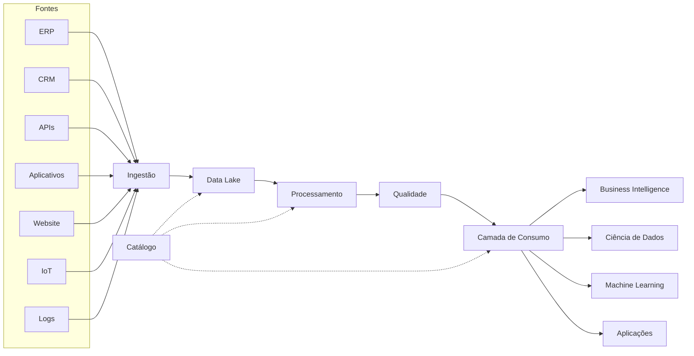
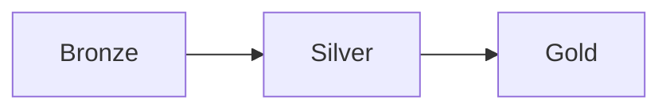
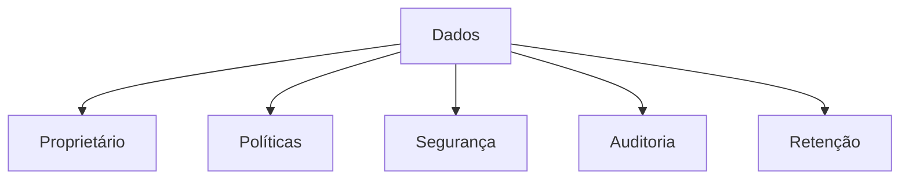
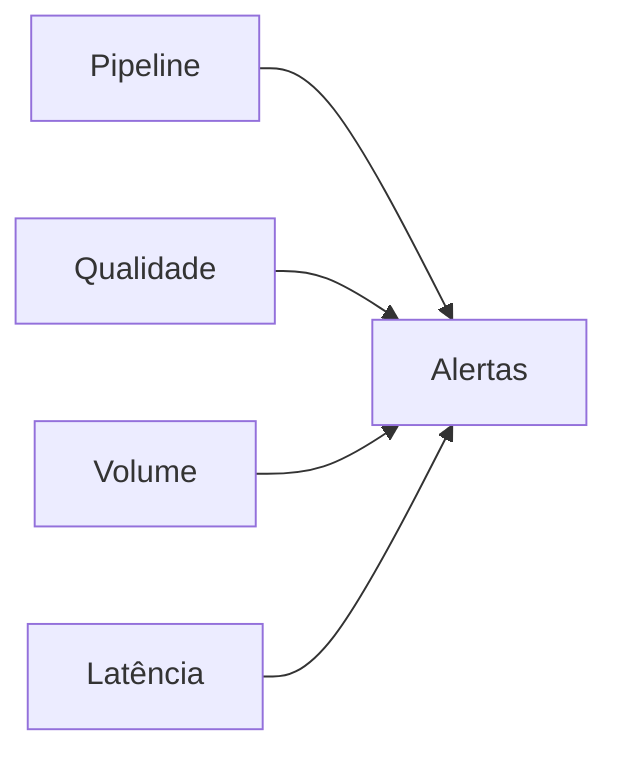
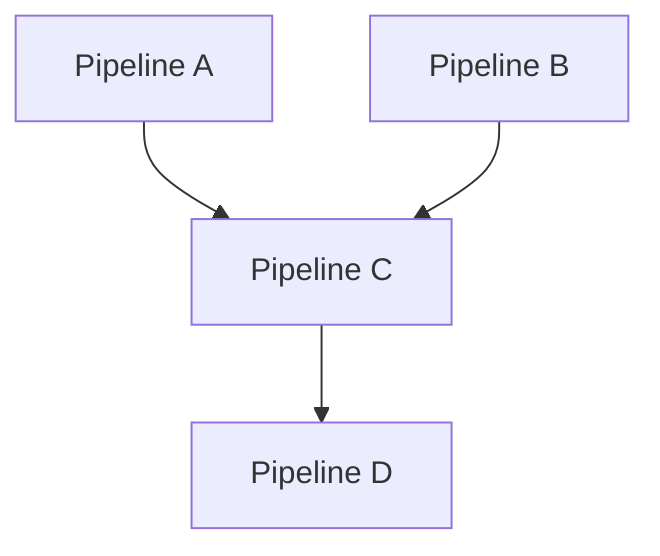
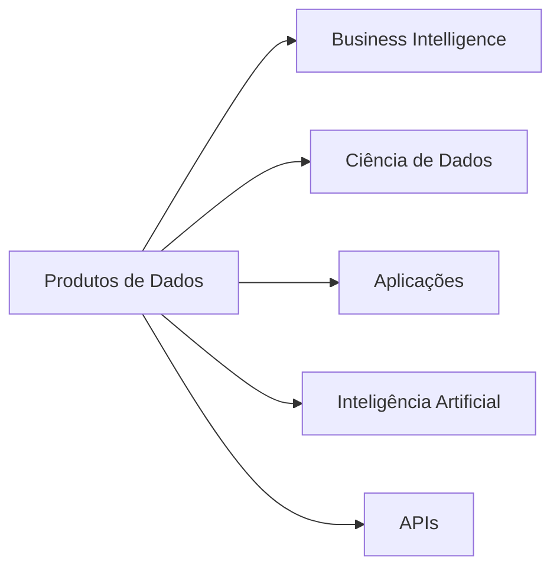
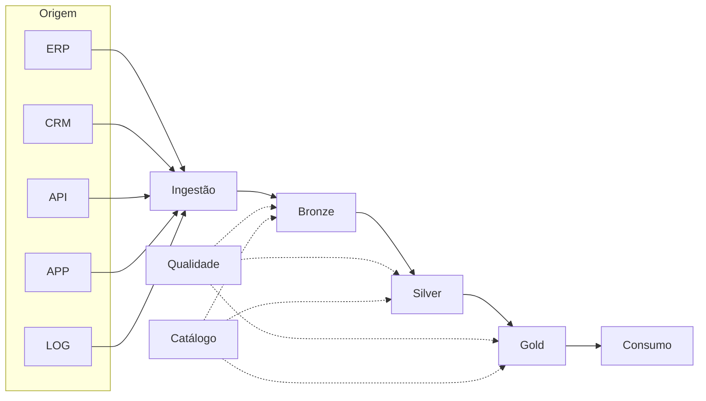
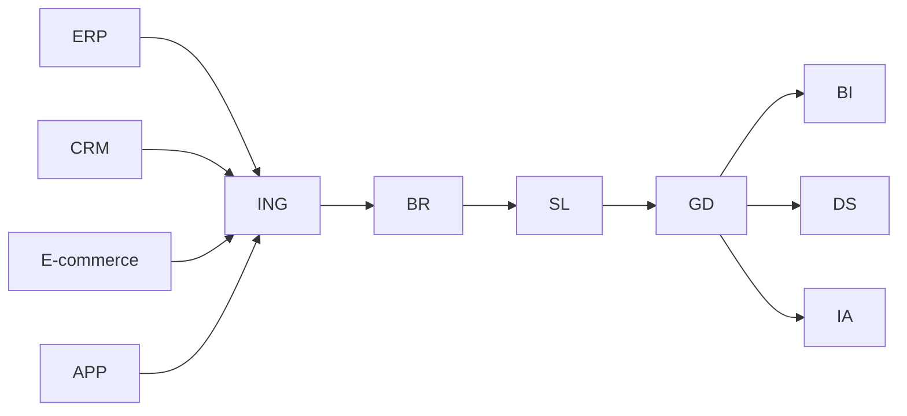

← [[06-O-Papel-do-Engenheiro-de-Dados|O Papel do Engenheiro de Dados]]

↑ [[100-Volumes/00-Introducao/01-O-que-e-Engenharia-de-Dados/README|Índice do Capítulo]]

→ [[08-Arquiteturas-Modernas|08 - Arquiteturas Modernas]]

# 07 - O Ecossistema de Dados

> [!quote]
> "Uma plataforma de dados é muito mais do que um conjunto de ferramentas. É um ecossistema onde cada componente possui uma função específica e todos trabalham de forma integrada."

---

# 📖 Visão Geral

Quando alguém começa a estudar Engenharia de Dados, normalmente aprende as tecnologias de forma isolada.

Primeiro SQL.

Depois Python.

Mais tarde Spark.

Em seguida Airflow.

Essa abordagem funciona para aprender ferramentas, mas dificulta compreender **como elas trabalham juntas**.

Neste capítulo vamos observar o ecossistema completo antes de estudar cada componente individualmente.

Ao final, você será capaz de visualizar o caminho percorrido pelos dados desde sua origem até seu consumo por aplicações, dashboards, modelos de Machine Learning e Inteligência Artificial.

---

# 🎯 Objetivos de Aprendizagem

Ao concluir este capítulo você será capaz de:

- compreender os principais componentes de uma plataforma moderna de dados;
- identificar o papel de cada camada;
- entender como diferentes tecnologias se complementam;
- visualizar o fluxo completo dos dados;
- reconhecer onde cada tecnologia estudada nos próximos volumes se encaixa.

---

# 🗺️ Mapa do Capítulo

Neste capítulo estudaremos:

1. Fontes de dados
2. Ingestão
3. Armazenamento
4. Processamento
5. Qualidade
6. Governança
7. Catálogo
8. Consumo
9. Plataforma de Dados

---

# A visão sistêmica

Antes de analisar cada componente individualmente, observe a plataforma como um todo.

Esse diagrama representa uma arquitetura simplificada, mas muito próxima da realidade encontrada em organizações modernas.

Ao longo da Academia voltaremos diversas vezes a essa figura.

---

# O ecossistema é formado por camadas

Uma plataforma de dados moderna pode ser entendida como um conjunto de camadas independentes, porém fortemente integradas.

Cada camada possui objetivos específicos.

| Camada | Objetivo |
|---------|----------|
| Fontes | Produzir dados |
| Ingestão | Coletar os dados |
| Armazenamento | Persistir os dados |
| Processamento | Transformar os dados |
| Qualidade | Validar os dados |
| Governança | Controlar os dados |
| Catálogo | Documentar os ativos |
| Consumo | Disponibilizar informações |

Essa separação facilita a evolução da plataforma.

Cada componente pode ser substituído sem exigir mudanças em toda a arquitetura.

> [!important]
> Em uma boa arquitetura, cada componente possui responsabilidades bem definidas.

---

# Camada de Fontes

Toda plataforma começa com uma origem de dados.

Essas origens podem ser extremamente variadas.

Alguns exemplos:

- ERP;
- CRM;
- Sistemas Financeiros;
- Bancos de Dados;
- APIs REST;
- Arquivos CSV;
- Planilhas Excel;
- Sensores IoT;
- Redes Sociais;
- Aplicativos Mobile;
- Sistemas Legados.

Cada fonte possui:

- formato próprio;
- frequência de atualização;
- volume diferente;
- regras específicas.

Isso explica por que a integração costuma ser uma das etapas mais complexas da Engenharia de Dados.

> [!example]
> Uma empresa pode receber diariamente arquivos CSV de fornecedores, eventos JSON de aplicações web e registros diretamente de um banco PostgreSQL. Cada fonte exige uma estratégia de ingestão diferente.

---

# Camada de Ingestão

A ingestão é responsável por trazer os dados para dentro da plataforma.

Ela deve garantir que os dados sejam recebidos de forma segura, íntegra e rastreável.

Existem diferentes estratégias.

## Batch

Processamento periódico.

Exemplos:

- diariamente;
- a cada hora;
- semanalmente.

## Streaming

Processamento contínuo.

Os eventos são processados praticamente no momento em que acontecem.

> [!success] Onde este assunto será aprofundado?
>
> As técnicas de ingestão serão estudadas detalhadamente nos volumes dedicados a **Apache Airflow**, **Streaming** e **Arquiteturas Modernas**.

---

# Camada de Armazenamento

Depois da ingestão, os dados precisam ser armazenados.

Essa camada deve equilibrar:

- custo;
- desempenho;
- escalabilidade;
- segurança;
- durabilidade.

Atualmente predominam arquiteturas baseadas em:

- [[Data-Lake|Data Lake]];
- [[Lakehouse]];
- bancos relacionais;
- armazenamento de objetos.

Os formatos mais comuns incluem:

- Parquet;
- ORC;
- Avro;
- CSV;
- JSON.

---

# Bronze, Silver e Gold

Uma organização comum dos dados é conhecida como arquitetura em camadas.

## Bronze

Armazena os dados praticamente como foram recebidos.

Objetivos:

- preservar a informação original;
- permitir reprocessamentos;
- manter histórico.

---

## Silver

Contém dados limpos, padronizados e integrados.

Nessa etapa normalmente ocorrem:

- remoção de duplicidades;
- padronização;
- enriquecimento;
- validações.

---

## Gold

Representa os dados prontos para consumo.

Normalmente são utilizados por:

- dashboards;
- indicadores;
- aplicações;
- modelos analíticos.

> [!info]
> Bronze, Silver e Gold representam uma estratégia de organização lógica. Não significam necessariamente três bancos de dados diferentes.

---

# Camada de Processamento

Depois de armazenados, os dados precisam ser transformados.

Essa camada realiza atividades como:

- limpeza;
- agregações;
- junções;
- cálculos;
- enriquecimento;
- geração de indicadores.

Ferramentas frequentemente utilizadas:

- SQL;
- [[Apache-Spark|Apache Spark]];
- dbt;
- Python.

> [!success] Onde este assunto será aprofundado?
>
> O processamento distribuído será estudado em detalhes no **Volume 07 — PySpark**.

---

# Camada de Qualidade

Uma plataforma moderna não pode assumir que todos os dados recebidos estão corretos.

É necessário validar continuamente aspectos como:

- completude;
- unicidade;
- consistência;
- validade;
- atualidade.

A qualidade deve estar presente em todas as etapas do pipeline, e não apenas no final.

---

# Camada de Governança

À medida que uma plataforma cresce, aumenta também a necessidade de controlar seus ativos.

A **Governança de Dados** estabelece políticas, processos e responsabilidades para garantir que os dados sejam utilizados de forma segura, consistente e alinhada aos objetivos da organização.

Ela responde perguntas como:

- Quem é o proprietário deste dado?
- Quem pode acessá-lo?
- Qual é sua classificação?
- Quanto tempo ele deve ser armazenado?
- Qual é sua origem?
- Quais aplicações o utilizam?

A governança não existe para burocratizar o uso dos dados.

Seu objetivo é permitir que eles sejam utilizados com confiança.

> [!tip]
> Quanto maior a organização, maior tende a ser a importância da governança.

---

# Catálogo de Dados

Imagine uma biblioteca sem catálogo.

Os livros existem.

Mas ninguém sabe onde estão.

Nem quem os escreveu.

Nem quando foram publicados.

Uma plataforma de dados sem catálogo apresenta o mesmo problema.

O **Catálogo de Dados** registra informações como:

- descrição das tabelas;
- significado das colunas;
- responsáveis;
- frequência de atualização;
- classificação;
- consumidores;
- qualidade.

Esses metadados tornam a plataforma muito mais fácil de utilizar.

> [!success] Onde este assunto será aprofundado?
>
> Catálogo e metadados serão estudados em detalhes no Volume de **Governança de Dados**.

---

# Observabilidade

Monitorar servidores não é suficiente.

Também é necessário monitorar os próprios dados.

Uma plataforma moderna observa continuamente:

- pipelines;
- volumes;
- qualidade;
- latência;
- disponibilidade;
- falhas;
- atrasos.

A observabilidade permite detectar problemas antes que eles impactem usuários ou aplicações.

---

# Orquestração

Uma plataforma normalmente possui dezenas ou centenas de pipelines.

Executá-los manualmente seria inviável.

Por isso utilizamos ferramentas de orquestração.

Elas controlam:

- agendamento;
- dependências;
- paralelismo;
- retentativas;
- alertas;
- histórico de execução.

Ferramentas como [[Apache-Airflow|Apache Airflow]] tornaram-se padrão em muitas organizações.

> [!success] Onde este assunto será aprofundado?
>
> Todo o processo de orquestração será estudado no **Volume 11 — Apache Airflow**.

---

# Camada de Consumo

Todo o esforço realizado nas etapas anteriores possui um objetivo.

Disponibilizar dados para consumo.

Os consumidores podem ser extremamente diversos.

Cada consumidor possui requisitos diferentes.

Por exemplo:

| Consumidor | Necessidade principal |
|------------|----------------------|
| Business Intelligence | Indicadores e dashboards |
| Ciência de Dados | Dados para exploração e treinamento |
| Aplicações | Baixa latência |
| APIs | Respostas rápidas |
| IA | Dados confiáveis e atualizados |

Essa diversidade influencia diretamente a arquitetura da plataforma.

---

# Produtos de Dados

Um erro comum é acreditar que uma tabela representa automaticamente um produto de dados.

Na realidade, um **Produto de Dados** possui características adicionais.

Ele apresenta:

- propósito claro;
- documentação;
- responsável;
- consumidores identificados;
- regras de qualidade;
- SLA;
- versionamento.

Os dados deixam de ser apenas armazenados.

Passam a ser gerenciados como ativos corporativos.

---

# Como tudo funciona em conjunto

Podemos resumir o ecossistema moderno da seguinte forma.

Observe que:

- qualidade acompanha todas as camadas;
- catálogo acompanha todas as camadas;
- ingestão ocorre apenas uma vez;
- consumo acontece apenas ao final.

Essa organização reduz acoplamento e facilita evolução da plataforma.

---

# 🏢 Estudo de Caso — DataRetail S.A.

A DataRetail iniciou suas operações utilizando apenas um ERP.

Com o crescimento da empresa surgiram:

- CRM;
- Marketplace;
- Aplicativo;
- Programa de Fidelidade;
- Plataforma de Logística;
- E-commerce.

Cada sistema produzia seus próprios dados.

O resultado foi um ambiente altamente fragmentado.

A equipe de Engenharia de Dados criou então uma plataforma central.

Depois da implantação:

- todos os indicadores passaram a utilizar a mesma base;
- cientistas de dados passaram a reutilizar dados padronizados;
- aplicações consumiam informações consistentes;
- novos pipelines passaram a seguir padrões corporativos.

A plataforma tornou-se um ativo estratégico.

---

# 💡 Boas Práticas

> [!tip]
> Pense sempre na plataforma como um conjunto integrado.

> [!tip]
> Mantenha responsabilidades bem definidas para cada camada.

> [!tip]
> Evite que aplicações acessem diretamente dados brutos.

> [!tip]
> Automatize validações de qualidade.

> [!tip]
> Documente todas as regras importantes.

---

# ⚠️ Erros Comuns

> [!warning]
> Misturar dados brutos e dados analíticos na mesma camada.

> [!warning]
> Não definir responsáveis pelos produtos de dados.

> [!warning]
> Tratar monitoramento apenas como disponibilidade de servidores.

> [!warning]
> Criar pipelines sem documentação.

> [!warning]
> Acoplar excessivamente ferramentas específicas à arquitetura.

---

# 🧠 Conceitos-chave

- [[Ecossistema de Dados]]
- [[Pipeline-de-Dados|Pipeline de Dados]]
- [[Data-Lake|Data Lake]]
- [[Lakehouse]]
- [[Produto de Dados]]
- [[Governança de Dados]]
- [[Catálogo de Dados]]
- [[Observabilidade de Dados]]
- [[Apache-Airflow|Apache Airflow]]
- [[Apache-Spark|Apache Spark]]

---

# 🎤 Perguntas Frequentes de Entrevista

1. O que compõe uma plataforma moderna de dados?
2. Qual a diferença entre Data Lake e Lakehouse?
3. Por que separar Bronze, Silver e Gold?
4. O que é Governança de Dados?
5. Qual a função de um Catálogo de Dados?
6. Como a observabilidade difere do monitoramento tradicional?
7. Qual o papel da orquestração?
8. O que caracteriza um Produto de Dados?

---

# 📝 Exercícios

## Exercício 1

Desenhe a arquitetura de uma plataforma contendo:

- duas fontes de dados;
- ingestão;
- Data Lake;
- processamento;
- consumo.

Explique a função de cada camada.

---

## Exercício 2

Escolha uma empresa conhecida (banco, varejo, streaming ou indústria).

Liste possíveis:

- fontes;
- consumidores;
- produtos de dados.

---

## Exercício 3

Explique por que Governança e Qualidade devem acompanhar toda a plataforma e não apenas a etapa final.

---

# 📚 Leituras Recomendadas

- *Designing Data-Intensive Applications* — Martin Kleppmann
- *Fundamentals of Data Engineering* — Joe Reis & Matt Housley
- Documentação do Apache Iceberg
- Documentação do Apache Airflow
- Documentação do Apache Spark

---

# 🔗 Veja Também

- [[Engenharia-de-Dados|Engenharia de Dados]]
- [[Pipeline-de-Dados|Pipeline de Dados]]
- [[Data-Lake|Data Lake]]
- [[Lakehouse]]
- [[Governança de Dados]]
- [[Catálogo de Dados]]
- [[Produto de Dados]]
- [[Qualidade-de-Dados|Qualidade de Dados]]
- [[Observabilidade de Dados]]
- [[Apache-Spark|Apache Spark]]
- [[Apache-Airflow|Apache Airflow]]

---

# 📖 Resumo

Uma plataforma moderna de dados é formada por componentes especializados que trabalham de maneira integrada.

As camadas de ingestão, armazenamento, processamento, qualidade, governança, catálogo e consumo possuem responsabilidades distintas, mas complementares.

Compreender esse ecossistema é fundamental para entender onde cada tecnologia estudada nos próximos volumes se encaixa.

Mais importante do que dominar uma ferramenta específica é compreender a função que ela desempenha dentro da arquitetura.

---

## Navegação

← [[06-O-Papel-do-Engenheiro-de-Dados|06 - O Papel do Engenheiro de Dados]]

↑ [[100-Volumes/00-Introducao/01-O-que-e-Engenharia-de-Dados/README]]

→ [[08-Arquiteturas-Modernas|08 - Arquiteturas Modernas]]
