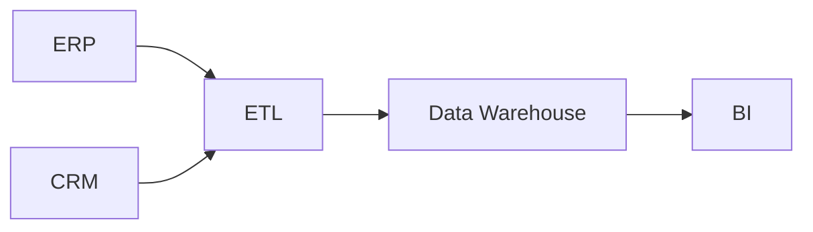
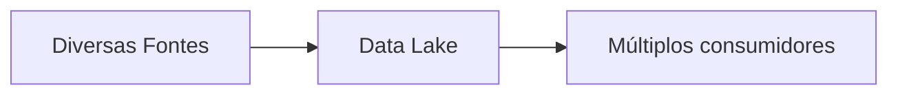
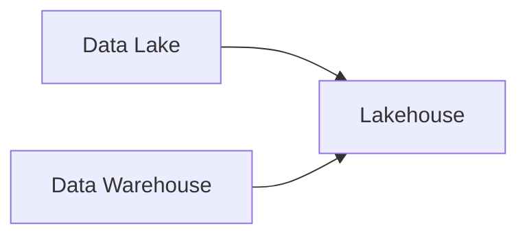
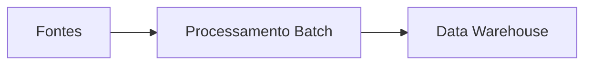
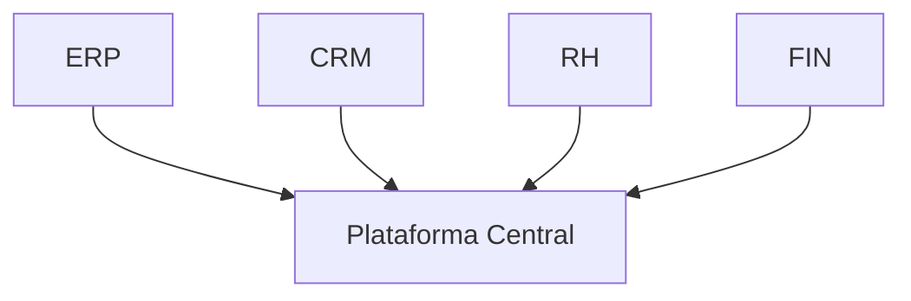
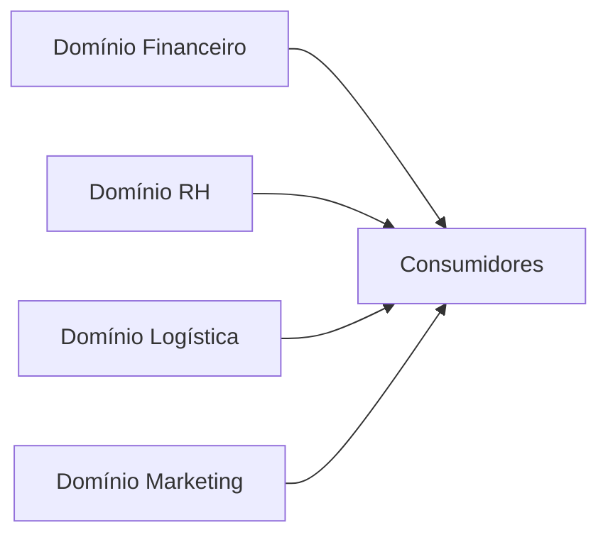
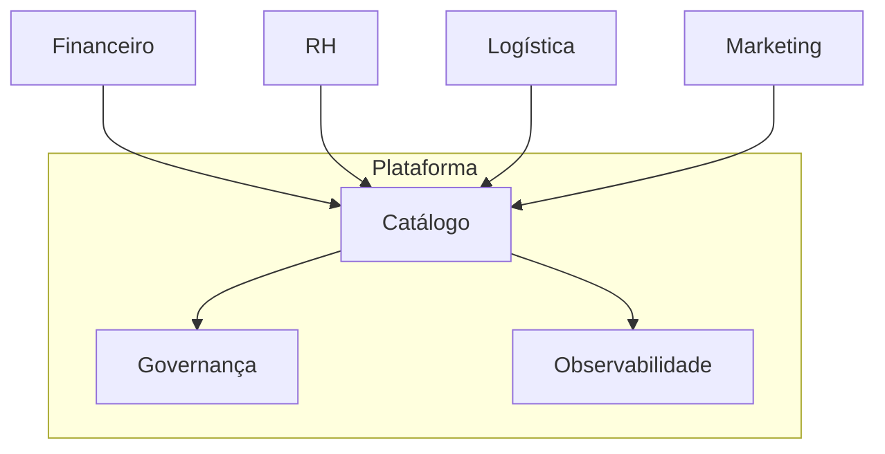

← [[07-O-Ecossistema-de-Dados|O Ecossistema de Dados]]

↑ [[100-Volumes/00-Introducao/01-O-que-e-Engenharia-de-Dados/README|Índice do Capítulo]]

→ [[09-Projeto-Integrador|09 - Projeto Integrador]]

# 08 - Arquiteturas Modernas de Dados

> [!quote]
> "Não existe arquitetura perfeita. Existe a arquitetura mais adequada para um determinado contexto."

---

# 📖 Visão Geral

Nos capítulos anteriores conhecemos os componentes que formam uma plataforma moderna de dados.

Agora responderemos uma pergunta muito importante.

**Como esses componentes são organizados?**

A resposta depende da arquitetura adotada.

Ao longo da história da computação surgiram diferentes formas de organizar plataformas de dados.

Cada uma foi criada para resolver limitações da geração anterior.

Neste capítulo estudaremos sua evolução, vantagens, limitações e quando cada abordagem faz sentido.

---

# 🎯 Objetivos

Ao concluir este capítulo você será capaz de:

- compreender a evolução das arquiteturas de dados;
- comparar Data Warehouse, Data Lake e Lakehouse;
- entender Batch e Streaming;
- reconhecer vantagens e limitações de cada arquitetura;
- desenvolver pensamento arquitetural.

---

# 🗺️ Mapa do capítulo

1. O que é Arquitetura de Dados
2. Evolução das Arquiteturas
3. Data Warehouse
4. Data Lake
5. Lakehouse
6. Batch × Streaming
7. Arquiteturas Centralizadas × Distribuídas
8. Trade-offs Arquiteturais
9. Como escolher uma arquitetura

---

# O que é uma Arquitetura de Dados?

Arquitetura de Dados é a forma como uma organização estrutura seus dados, processos e tecnologias para atender às necessidades do negócio.

Ela define, por exemplo:

- onde os dados serão armazenados;
- como serão integrados;
- como serão processados;
- quem poderá acessá-los;
- quais mecanismos garantirão qualidade, segurança e governança.

Uma boa arquitetura procura equilibrar diferentes fatores, como desempenho, custo, simplicidade, escalabilidade e facilidade de manutenção.

> [!important]
> Arquitetura não é uma coleção de ferramentas. É um conjunto de decisões técnicas tomadas para resolver problemas específicos.

---

# A evolução das arquiteturas

A evolução das plataformas de dados pode ser resumida da seguinte forma.

Cada etapa resolveu limitações da anterior.

Ao mesmo tempo, introduziu novos desafios.

É por isso que nenhuma arquitetura substitui completamente as anteriores.

---

# Comparativo Geral

| Arquitetura | Objetivo principal | Melhor cenário |
|-------------|-------------------|----------------|
| Banco Relacional | Sistemas transacionais | Operações do dia a dia |
| Data Warehouse | Analytics | BI corporativo |
| Data Lake | Armazenamento flexível | Grandes volumes |
| Lakehouse | Analytics moderno | Plataformas unificadas |
| Data Mesh | Escalabilidade organizacional | Grandes empresas |

Observe que não existe uma arquitetura "melhor".

Existe apenas a mais adequada ao problema.

---

# 🏛️ Data Warehouse

O Data Warehouse consolidou dados provenientes de diferentes sistemas em um único ambiente analítico.

Seu foco principal é:

- consistência;
- integração;
- histórico;
- indicadores.

## Vantagens

- dados altamente organizados;
- excelente desempenho para BI;
- forte governança;
- qualidade elevada.

## Limitações

- custo elevado;
- menor flexibilidade;
- ingestão mais lenta;
- dificuldade com dados não estruturados.

---

# 🌊 Data Lake

O Data Lake surgiu para armazenar grandes volumes de dados praticamente em seu formato original.

Ele aceita:

- CSV;
- JSON;
- imagens;
- vídeos;
- logs;
- documentos;
- eventos.

## Vantagens

- baixo custo;
- alta escalabilidade;
- enorme flexibilidade.

## Limitações

- governança mais complexa;
- risco de Data Swamp;
- qualidade variável.

> [!warning]
> Um Data Lake sem governança pode rapidamente tornar-se um Data Swamp.

---

# 🏛️🌊 Lakehouse

O Lakehouse procura combinar o melhor dos dois mundos.

Do Data Warehouse herda:

- confiabilidade;
- governança;
- transações.

Do Data Lake herda:

- escalabilidade;
- flexibilidade;
- baixo custo.

Tecnologias como [[Apache-Iceberg|Apache Iceberg]] tornaram essa abordagem extremamente popular.

## Vantagens

- arquitetura unificada;
- armazenamento econômico;
- consultas SQL;
- versionamento;
- time travel;
- transações ACID.

> [!success] Onde este assunto será aprofundado?
>
> O Lakehouse será estudado detalhadamente no **Volume 09**.

---

# ⚖️ Comparação

| Característica | Data Warehouse | Data Lake | Lakehouse |
|----------------|---------------|-----------|------------|
| Dados estruturados | ⭐⭐⭐⭐⭐ | ⭐⭐⭐ | ⭐⭐⭐⭐⭐ |
| Dados não estruturados | ⭐ | ⭐⭐⭐⭐⭐ | ⭐⭐⭐⭐⭐ |
| Governança | ⭐⭐⭐⭐⭐ | ⭐⭐ | ⭐⭐⭐⭐ |
| Escalabilidade | ⭐⭐⭐ | ⭐⭐⭐⭐⭐ | ⭐⭐⭐⭐⭐ |
| Flexibilidade | ⭐⭐ | ⭐⭐⭐⭐⭐ | ⭐⭐⭐⭐ |
| Custo | Alto | Baixo | Médio |

---

# 💡 Arquitetura é compromisso

Toda arquitetura envolve escolhas.

Por exemplo:

Maior desempenho pode significar maior custo.

Maior flexibilidade pode reduzir a governança.

Maior simplicidade pode limitar a escalabilidade.

Esses conflitos são conhecidos como **trade-offs**.

Um arquiteto de dados precisa compreender esses compromissos antes de decidir.

> [!tip]
> Sempre pergunte **"qual problema esta arquitetura está resolvendo?"** antes de escolher uma tecnologia.

---

---

# 📦 Processamento Batch × Streaming

Uma das decisões arquiteturais mais importantes em uma plataforma de dados é definir **quando** os dados serão processados.

Existem duas abordagens principais:

- **Batch** (processamento em lote)
- **Streaming** (processamento contínuo)

Essa decisão afeta diretamente:

- latência;
- custo;
- complexidade;
- infraestrutura;
- experiência do usuário.

---

# Processamento Batch

No processamento em lote, os dados são acumulados durante um período e processados posteriormente.

Por exemplo:

- a cada hora;
- diariamente;
- semanalmente;
- mensalmente.

## Características

- processamento programado;
- maior eficiência para grandes volumes;
- menor custo operacional;
- arquitetura mais simples.

### Exemplos

- fechamento financeiro;
- faturamento mensal;
- consolidação de vendas;
- geração de indicadores diários.

---

## Vantagens

- simplicidade;
- previsibilidade;
- menor consumo contínuo de recursos;
- fácil reprocessamento.

---

## Desvantagens

- maior latência;
- informações não ficam disponíveis imediatamente;
- inadequado para decisões em tempo real.

---

# Processamento Streaming

No streaming os dados são processados conforme chegam.

O objetivo é reduzir ao máximo o tempo entre a geração do evento e sua disponibilidade.

## Características

- baixa latência;
- processamento contínuo;
- atualização praticamente imediata.

### Exemplos

- PIX;
- monitoramento de fraude;
- IoT;
- rastreamento de veículos;
- recomendações em e-commerce.

---

## Vantagens

- informações atualizadas;
- resposta rápida;
- excelente experiência para aplicações em tempo real.

---

## Desvantagens

- arquitetura mais complexa;
- monitoramento mais sofisticado;
- maior custo operacional;
- tratamento mais difícil de falhas.

---

# Comparação

| Característica | Batch | Streaming |
|---------------|-------|-----------|
| Latência | Alta | Baixa |
| Complexidade | Menor | Maior |
| Custo | Menor | Maior |
| Reprocessamento | Simples | Mais complexo |
| Tempo Real | Não | Sim |

---

# 🏗️ Decisão de Arquitetura

## Situação

Uma rede varejista atualiza dashboards de vendas apenas uma vez por dia.

## Alternativas

- Streaming
- Batch

## Análise

Os usuários aceitam visualizar os indicadores apenas na manhã seguinte.

Não existem requisitos de tempo real.

O volume de dados é elevado.

## Decisão

Adotar processamento Batch.

## Consequências

- menor custo;
- menor complexidade;
- excelente desempenho para análises históricas.

> [!tip]
> Tempo real é uma necessidade de negócio, não um objetivo técnico. Utilize streaming apenas quando houver benefícios concretos.

---

# 🏛️ Arquiteturas Centralizadas × Distribuídas

Outra decisão importante é onde os dados serão organizados.

Historicamente surgiram dois modelos.

## Arquitetura Centralizada

Todos os dados ficam concentrados em uma plataforma única.

### Vantagens

- padronização;
- governança simplificada;
- visão única dos dados.

### Limitações

- gargalos;
- dependência de uma única equipe;
- menor autonomia das áreas.

---

## Arquitetura Distribuída

Cada domínio mantém responsabilidade sobre seus próprios dados.

Esse conceito evoluiu para o que conhecemos como **Data Mesh**.

---

# 🌐 Data Mesh

O Data Mesh propõe que cada domínio seja responsável pelos próprios produtos de dados.

A plataforma deixa de depender exclusivamente de uma equipe central.

Cada domínio publica seus dados seguindo padrões corporativos.

O objetivo não é eliminar a governança.

Pelo contrário.

Ela continua existindo, porém distribuída entre diferentes equipes.

---

# Quando Data Mesh faz sentido?

Essa arquitetura normalmente aparece em organizações que possuem:

- centenas de equipes;
- milhares de pipelines;
- dezenas de domínios de negócio;
- plataformas muito grandes.

Para pequenas empresas, frequentemente representa complexidade desnecessária.

> [!warning]
> Data Mesh não é uma tecnologia.
>
> É um modelo organizacional apoiado por princípios de arquitetura.

---

# 📊 Comparação entre arquiteturas

| Aspecto | Centralizada | Data Mesh |
|---------|--------------|-----------|
| Governança | Central | Federada |
| Autonomia | Baixa | Alta |
| Complexidade | Menor | Maior |
| Escalabilidade Organizacional | Média | Alta |
| Padronização | Alta | Depende da governança |

---

# 🏗️ Decisão de Arquitetura

## Situação

Uma empresa possui quatro áreas de negócio independentes e mais de 250 equipes de desenvolvimento.

Cada área desenvolve seus próprios produtos digitais.

## Alternativas

- Plataforma Centralizada
- Data Mesh

## Análise

A equipe central tornou-se um gargalo.

Novas demandas levam meses para serem implementadas.

## Decisão

Adotar gradualmente princípios de Data Mesh.

## Consequências

- maior autonomia;
- necessidade de forte governança;
- padronização por contratos de dados;
- maior responsabilidade dos domínios.

---

# A arquitetura evolui com o negócio

Uma arquitetura adequada hoje pode não ser suficiente daqui a cinco anos.

É comum observar empresas seguindo uma evolução semelhante.

Essa evolução não é obrigatória.

Ela depende:

- do porte da organização;
- do crescimento dos dados;
- dos objetivos do negócio;
- da maturidade da equipe.

---

# 🏢 Estudo de Caso — Evolução da DataRetail S.A.

A DataRetail iniciou suas operações utilizando um banco relacional único.

Com o crescimento do negócio adotou um Data Warehouse para consolidar indicadores.

Anos depois passou a armazenar dados de navegação, imagens e eventos em um Data Lake.

Com a necessidade de unificar governança e desempenho, migrou gradualmente para uma arquitetura Lakehouse baseada em tabelas transacionais.

À medida que novas unidades de negócio foram criadas, diferentes equipes passaram a publicar seus próprios produtos de dados seguindo princípios inspirados em Data Mesh.

Essa evolução ocorreu ao longo de vários anos.

Cada mudança foi motivada por necessidades concretas do negócio, e não pela adoção da tecnologia mais recente.

---

# 💡 Boas Práticas

> [!tip]
> Escolha arquiteturas baseadas em requisitos do negócio, não em tendências.

> [!tip]
> Mantenha a arquitetura o mais simples possível.

> [!tip]
> Revise decisões arquiteturais periodicamente.

> [!tip]
> Documente as razões que levaram às escolhas realizadas.

> [!tip]
> Considere custo operacional e facilidade de manutenção desde o início.

---

# ⚠️ Erros Comuns

> [!warning]
> Adotar streaming sem necessidade de negócio.

> [!warning]
> Escolher tecnologias antes de compreender os requisitos.

> [!warning]
> Confundir Data Mesh com uma ferramenta.

> [!warning]
> Ignorar governança em Data Lakes.

> [!warning]
> Copiar arquiteturas de grandes empresas sem considerar o contexto da organização.

---

# 🧠 Conceitos-chave

- [[Arquitetura de Dados]]
- [[Data-Warehouse|Data Warehouse]]
- [[Data-Lake|Data Lake]]
- [[Lakehouse]]
- [[Data Mesh]]
- [[Batch]]
- [[Streaming]]
- [[Trade-off]]
- [[Produto de Dados]]

---

# 🎤 Perguntas Frequentes de Entrevista

1. Quando utilizar Batch em vez de Streaming?
2. Quais problemas o Lakehouse procura resolver?
3. O que diferencia Data Mesh de uma arquitetura centralizada?
4. Quais são os principais trade-offs entre Data Warehouse e Data Lake?
5. Como decidir qual arquitetura utilizar em um novo projeto?

---

# 📝 Exercícios

## Exercício 1

Escolha uma empresa (varejo, banco, indústria ou saúde) e proponha uma arquitetura de dados adequada para ela. Justifique suas escolhas.

---

## Exercício 2

Pesquise uma empresa conhecida (Netflix, Uber, Nubank, Mercado Livre, Spotify ou outra) e identifique quais padrões arquiteturais ela utiliza.

---

## Exercício 3

Monte uma tabela comparando:

- Data Warehouse;
- Data Lake;
- Lakehouse;
- Data Mesh.

Inclua vantagens, limitações e casos de uso.

---

# 📚 Leituras Recomendadas

- *Designing Data-Intensive Applications* — Martin Kleppmann
- *Fundamentals of Data Engineering* — Joe Reis & Matt Housley
- Documentação oficial do Apache Iceberg
- Artigos sobre Data Mesh de Zhamak Dehghani

---

# 🔗 Veja Também

- [[Data-Warehouse|Data Warehouse]]
- [[Data-Lake|Data Lake]]
- [[Lakehouse]]
- [[Data Mesh]]
- [[Batch]]
- [[Streaming]]
- [[Apache-Spark|Apache Spark]]
- [[Apache-Airflow|Apache Airflow]]
- [[Arquitetura de Dados]]

---

# 📖 Resumo

As arquiteturas de dados evoluíram para acompanhar o crescimento das organizações e o aumento da complexidade dos dados.

Não existe uma arquitetura universalmente melhor. Cada abordagem apresenta vantagens, limitações e trade-offs que devem ser avaliados de acordo com os requisitos do negócio.

Um bom Engenheiro de Dados ou Arquiteto de Dados toma decisões fundamentadas, considerando não apenas tecnologia, mas também custo, escalabilidade, governança, simplicidade e valor para a organização.

---

## Navegação

← [[07-O-Ecossistema-de-Dados|07 - O Ecossistema de Dados]]

↑ [[100-Volumes/00-Introducao/01-O-que-e-Engenharia-de-Dados/README]]

→ [[09-Projeto-Integrador|09 - Projeto Integrador]]