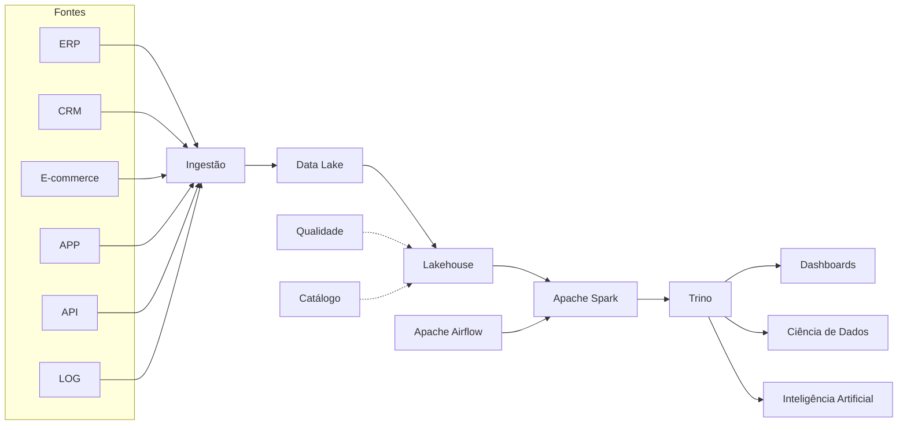

← [[08-Arquiteturas-Modernas|Arquiteturas Modernas]]

↑ [[100-Volumes/00-Introducao/01-O-que-e-Engenharia-de-Dados/README|Índice do Capítulo]]

# 09 - Projeto Integrador

> [!quote]
> "Conhecimento somente se transforma em competência quando é aplicado."

---

# 📖 Visão Geral

Durante toda a Academia construiremos uma plataforma completa de Engenharia de Dados.

Não será um conjunto de exercícios isolados.

Será um único projeto evoluindo ao longo dos volumes.

Ao concluir a Academia, você terá desenvolvido uma plataforma moderna capaz de realizar:

- ingestão;
- processamento;
- armazenamento;
- governança;
- qualidade;
- disponibilização de dados.

Essa plataforma será utilizada continuamente durante todo o curso.

---

# 🎯 Objetivos

Ao concluir a Academia você será capaz de:

- projetar arquiteturas modernas;
- implementar pipelines;
- automatizar processos;
- construir um Lakehouse;
- utilizar Spark;
- consultar dados com Trino;
- orquestrar pipelines com Airflow;
- disponibilizar dados para Analytics e IA.

---

# O cenário

Nossa empresa fictícia será novamente a **DataRetail S.A.**

Ela atua no varejo omnichannel.

Possui:

- lojas físicas;
- e-commerce;
- aplicativo móvel;
- marketplace;
- programa de fidelidade.

Diariamente produz milhões de registros.

Esses dados serão utilizados durante toda a Academia.

---

# A plataforma final

Ao final do curso teremos uma arquitetura semelhante à seguinte.



Observe que praticamente todos os componentes estudados durante a Academia estarão presentes.

---

# Como o projeto evoluirá

Cada volume adicionará novos recursos.

| Volume | Entrega |
|---------|----------|
| 00 | Planejamento da plataforma |
| 01 | Modelagem inicial |
| 02 | Linux |
| 03 | Git |
| 04 | SQL |
| 05 | Modelagem |
| 06 | Python |
| 07 | Spark |
| 08 | PostgreSQL |
| 09 | Lakehouse |
| 10 | Trino |
| 11 | Airflow |
| 12 | Qualidade |
| 13 | Observabilidade |
| 14 | Streaming |
| 15 | Cloud |
| 16 | DevOps |
| 17 | Arquitetura completa |
| 18 | Projeto Final |

Ao final teremos uma plataforma funcional.

---

# O papel do aluno

Você não será apenas um estudante.

Durante o projeto assumirá diferentes papéis.

- Engenheiro de Dados
- Desenvolvedor
- Arquiteto
- Operador
- Revisor
- Responsável pela qualidade

Essa mudança de perspectiva ajuda a compreender os desafios enfrentados por equipes reais.

---

# Organização do projeto

Toda a implementação ficará em:

```text
030-Projetos/
└── DataRetail-Platform/
```

Nos volumes seguintes criaremos automaticamente essa estrutura.

---

# O que será desenvolvido

Ao longo da Academia construiremos:

- pipelines;
- scripts SQL;
- notebooks;
- DAGs do Airflow;
- modelos de dados;
- documentação;
- testes;
- dashboards;
- APIs.

Cada entrega será incremental.

---

# 💡 Boas práticas

> [!tip]
> Nunca pule etapas do projeto.

> [!tip]
> Versione todo o código.

> [!tip]
> Documente as decisões arquiteturais.

> [!tip]
> Automatize sempre que possível.

---

# ⚠️ Erros comuns

> [!warning]
> Construir soluções sem planejamento.

> [!warning]
> Misturar experimentos com código de produção.

> [!warning]
> Não documentar decisões.

---

# 🧠 Conceitos-chave

- [[Projeto Integrador]]
- [[DataRetail Platform]]
- [[Plataforma de Dados]]
- [[Pipeline-de-Dados|Pipeline de Dados]]
- [[Lakehouse]]

---

# 🎤 Perguntas para reflexão

1. Por que desenvolver um único projeto durante toda a Academia?
2. Quais vantagens existem em evoluir uma plataforma incrementalmente?
3. Como um projeto integrador ajuda a consolidar conhecimentos?

---

# 📝 Exercício

Faça uma leitura de todos os capítulos do Volume 00.

Ao terminar, responda:

1. Qual arquitetura você pretende utilizar?
2. Quais componentes serão necessários?
3. Quais tecnologias você já conhece?
4. Quais precisará aprender?

Essas respostas serão revisitadas ao final da Academia.

---

# 📚 Próximos passos

No próximo capítulo conheceremos o ambiente da Academia e iniciaremos a preparação do laboratório que será utilizado em todo o curso.

---

## Navegação

← [[08-Arquiteturas-Modernas|08 - Arquiteturas Modernas]]

↑ [[100-Volumes/00-Introducao/01-O-que-e-Engenharia-de-Dados/README]]
