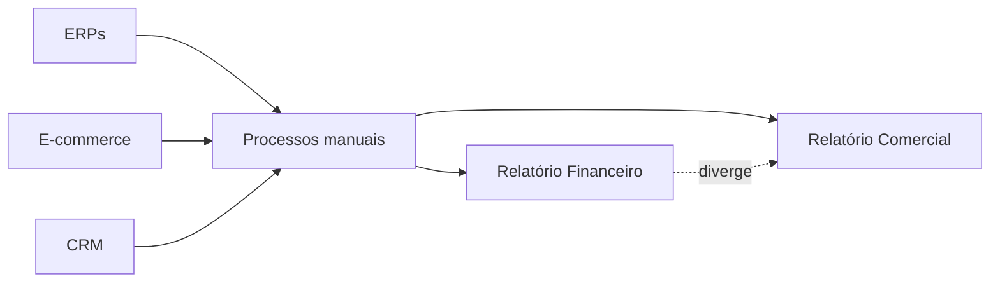

# Estudo de Caso — O Problema de Dados da DataRetail

A DataRetail cresceu por aquisições. Lojas usam versões diferentes do ERP, o e-commerce publica eventos e o CRM exporta arquivos diários. Financeiro e Comercial calculam receita com regras distintas.

O problema não é falta de dashboards. Faltam contratos, integração, histórico, qualidade, responsabilidade e uma plataforma que torne dados confiáveis disponíveis aos consumidores.

A Engenharia de Dados assume a construção do fluxo, enquanto áreas de negócio definem semântica e critérios de aceite. A primeira entrega será uma receita diária reconciliada por loja.
