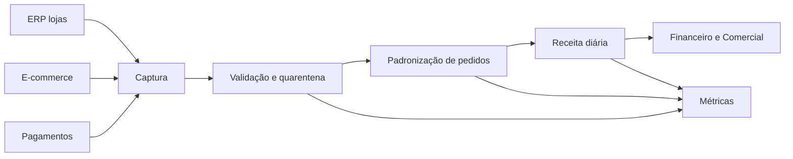

# Solução — Mapeamento de um Fluxo de Dados

| Etapa | Owner | Critério |
|---|---|---|
| Captura | Plataforma | Arquivos/eventos contabilizados |
| Validação | Engenharia de Dados | Válidos + quarentena = entrada |
| Padronização | Produto de Pedidos | Chave única e schema válido |
| Receita | Financeiro | Soma reconciliada por data/loja |

Falhas de fonte geram atraso alertado; schema desconhecido interrompe publicação; divergência monetária preserva a versão anterior.
