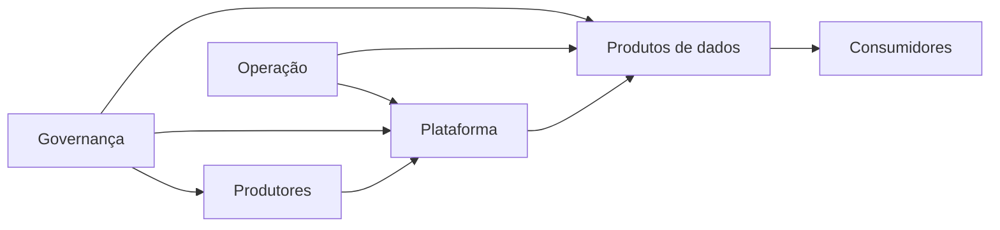

# Introdução

Dados percorrem organizações por meio de sistemas e pessoas. Uma fonte produz registros; pipelines os transportam e transformam; produtos os apresentam sob um contrato; consumidores tomam decisões ou automatizam ações.

O ecossistema inclui tecnologia, ownership, políticas, competências e incentivos. Otimizar uma parte ignorando as interfaces frequentemente apenas transfere o problema.
