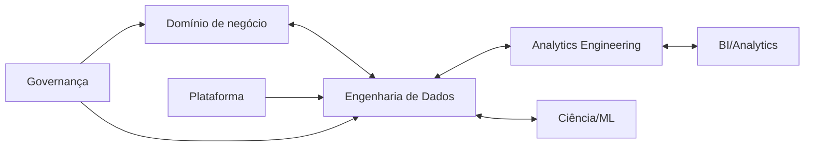

# Papéis, Equipes e Responsabilidades

Engenharia de Dados constrói fluxos e produtos; Analytics Engineering modela dados de consumo; BI desenvolve análise e visualização; Ciência de Dados experimenta e modela; ML Engineering operacionaliza modelos; plataforma oferece capacidades compartilhadas; governança estabelece políticas e apoio.

Responsabilidades variam por empresa. Uma matriz RACI pode esclarecer quem executa, aprova, consulta e é informado, mas não substitui colaboração.

Todo produto precisa de owner semântico e técnico claramente identificados.
