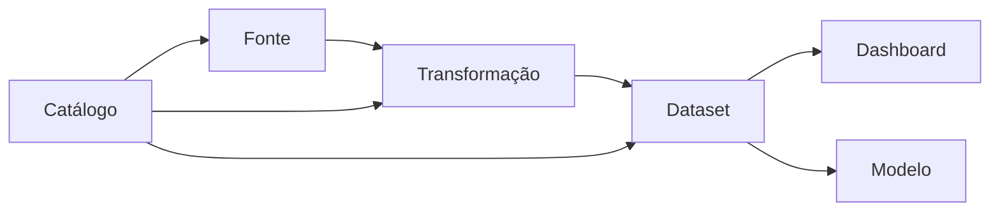

# Governança, Metadados, Lineage e Catálogo

Governança define direitos de decisão e controles para que dados sejam utilizáveis e protegidos. Metadados técnicos descrevem schema, formato e execução; metadados de negócio registram conceito, owner e finalidade; metadados operacionais incluem freshness e qualidade.

Catálogo torna ativos pesquisáveis. Lineage liga fontes, transformações e consumidores, apoiando análise de impacto e auditoria.

Coletar metadados sem processo de manutenção gera catálogo desatualizado. Automação e ownership precisam caminhar juntos.
