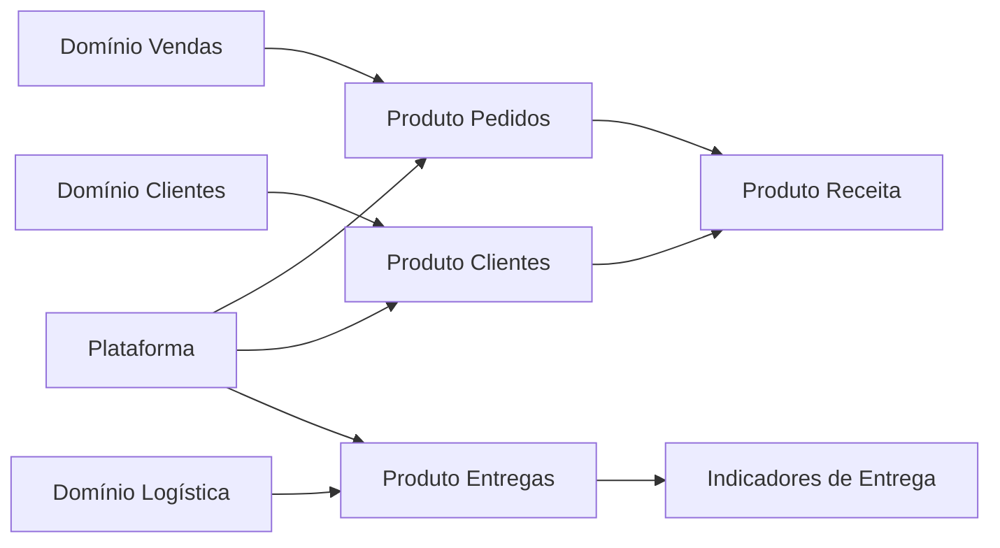

# Estudo de Caso — Ecossistema da DataRetail

A DataRetail identifica três domínios iniciais: Vendas, Clientes e Logística. Vendas é owner de pedidos; Financeiro define regras de receita; a plataforma oferece ingestão, armazenamento, catálogo e observabilidade.

Um conselho leve resolve conceitos compartilhados. SLAs e qualidade ficam no contrato de cada produto. A plataforma não assume significado que pertence aos domínios.
