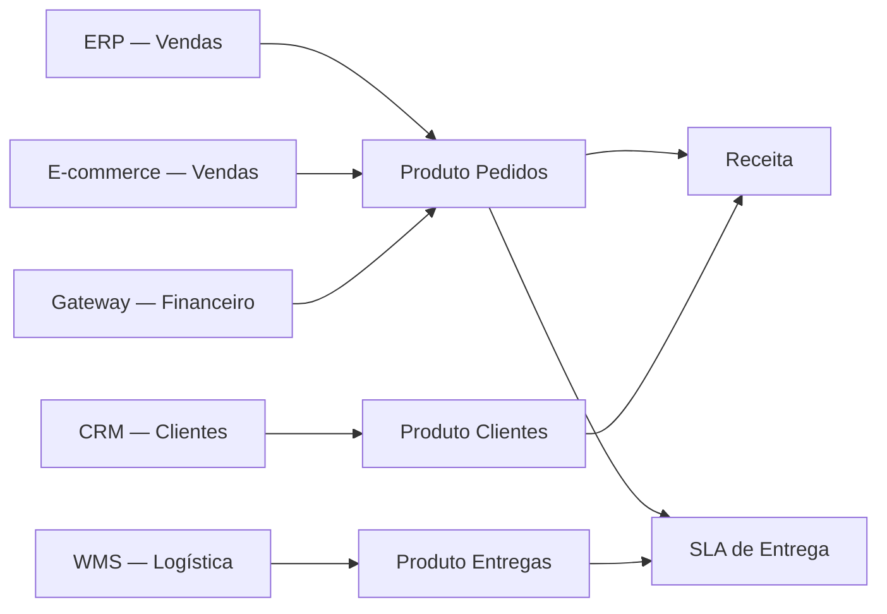

# Solução — Mapa do Ecossistema DataRetail

| Produto | Owner | Consumidor | Controle principal |
|---|---|---|---|
| Pedidos | Vendas | Financeiro/Operação | Unicidade e reconciliação |
| Clientes | CRM | Marketing/Atendimento | Privacidade e atualização |
| Entregas | Logística | Operação/Cliente | Freshness e completude |

SLIs: lead time de nova fonte, freshness por produto e tempo de recuperação após falha.
