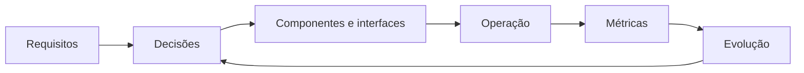

# Introdução

Arquitetura não é a lista de ferramentas em um diagrama. É o conjunto de decisões que estrutura componentes, dados, responsabilidades e evolução sob requisitos conflitantes.

Toda decisão troca alguma propriedade por outra: latência por custo, flexibilidade por controle, autonomia por padronização. A arquitetura adequada ao contexto atual pode precisar evoluir quando escala, equipe ou regulamentação mudam.
