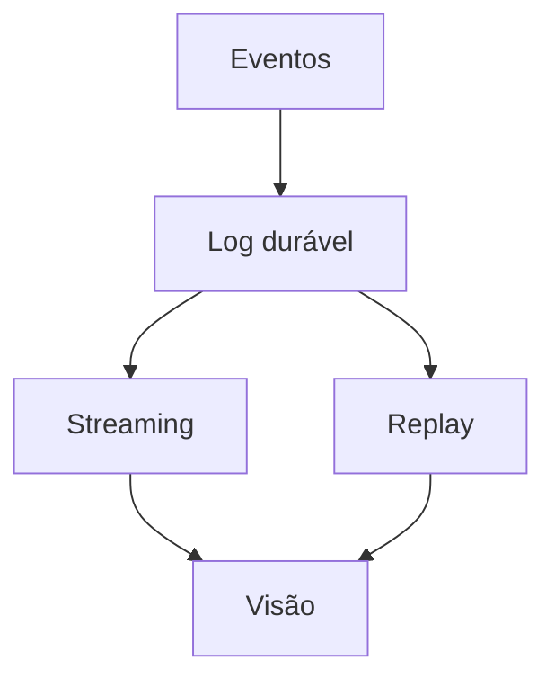

# Batch, Streaming, Lambda e Kappa

Batch processa conjuntos delimitados e favorece reexecução e eficiência. Streaming processa dados conforme chegam e requer estado, tempo de evento, atrasos e recuperação contínua.

Lambda mantém caminhos batch e speed e reconcilia resultados; oferece correção histórica e baixa latência ao custo de duas implementações. Kappa usa o log como fonte reprocessável e um caminho streaming, reduzindo duplicação, mas exige retenção e capacidade de replay.

Muitas plataformas combinam incremental batch e streaming sem aderir rigidamente a um rótulo.
