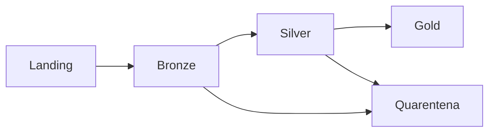

# Arquiteturas em Camadas, Medalhão e Zonas

Camadas criam fronteiras de contrato. Uma organização frequente usa Bronze para preservação, Silver para dados canônicos e Gold para produtos de consumo. Landing, quarentena, sandbox e arquivo podem complementar.

Nomes não garantem qualidade. Cada camada precisa de owner, schema, invariantes, retenção, acesso e política de publicação. Copiar todos os dados em todas as camadas aumenta custo sem necessariamente melhorar confiabilidade.

Evite transformar camadas técnicas em dependências rígidas para consumidores; produtos publicados devem possuir interfaces claras.
