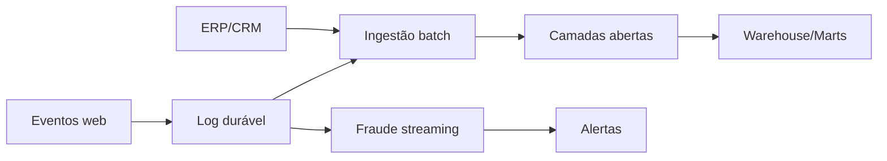

# Estudo de Caso — Arquitetura Evolutiva da DataRetail

A DataRetail inicia com batch diário, object storage e Warehouse de consumo. Eventos do e-commerce são preservados em log durável, mas só o caso de fraude exige processamento contínuo.

Essa solução evita duplicar toda lógica em batch e streaming. Contratos unem caminhos; batch reconcilia histórico. ADRs registram por que baixa latência foi limitada ao caso que a justifica.
