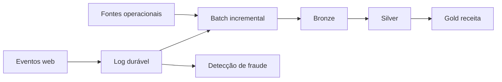

# Solução — Decisão Arquitetural da DataRetail

## Decisão

Adotar log durável para eventos web, processamento streaming apenas para fraude e batch incremental para camadas canônicas e receita. O batch reconcilia o caminho rápido.

## Consequências

- menor duplicação que Lambda completa;
- necessidade de operar log e streaming;
- receita com maior latência, porém auditável;
- replay disponível pelo log e Bronze;
- contratos compartilhados reduzem divergência.

Revisar quando a latência de novos casos justificar custo operacional adicional.
