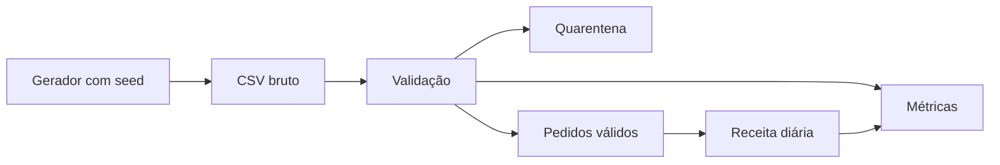

# Estudo de Caso — Primeiro Marco da DataRetail

O primeiro marco não constrói toda a plataforma. Ele gera pedidos sintéticos em CSV, valida contrato, separa quarentena e publica um resumo diário reproduzível.

Critérios: mesma semente produz mesma entrada; válidos mais quarentena igualam entrada; soma de receita usa somente pagos válidos; repetir não duplica; nenhuma informação real é utilizada.

Esse marco será reimplementado com tecnologias diferentes sem mudar a semântica.
