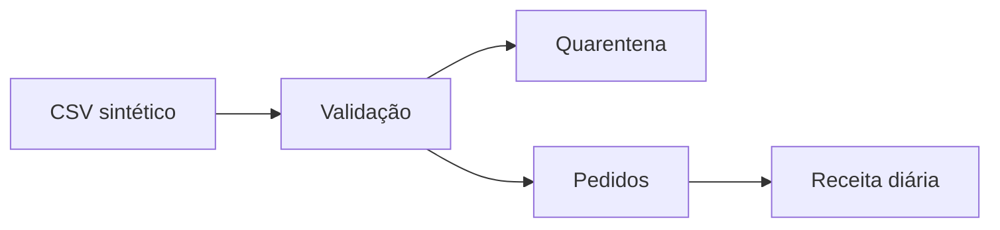

# Solução — Charter do Projeto DataRetail

## Problema

Receita divergente e pedidos sem rastreabilidade entre lojas e e-commerce.

## Objetivo

Publicar Pedidos Canônicos e Receita Diária reconciliada até 07:00, com 100% da entrada classificada.

## Primeiro marco

## Critérios

- seed e entrada versionadas;
- `entrada = válidos + quarentena`;
- chave canônica única;
- soma monetária reconciliada;
- execução repetida sem duplicar;
- testes e README aprovados.

## Riscos

Schema instável, definição de receita ambígua e inclusão de dados reais. Owners: Vendas, Financeiro e Segurança, respectivamente.
