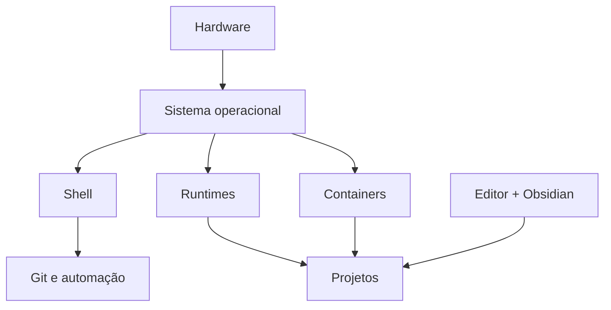

# Introdução

Um ambiente de aprendizagem deve permitir executar, modificar, testar e explicar exemplos. Instalar ferramentas sem conhecer versões, caminhos e dependências cria falhas difíceis de reproduzir.

O ambiente será incremental: comece com editor, Git e runtime básico; adicione serviços quando um laboratório exigir. A preparação prática ocorrerá no Módulo 08.
