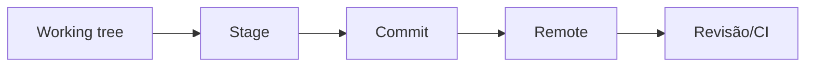

# Git, Repositórios e Ciclo de Trabalho

Git registra snapshots e permite comparar, revisar e recuperar mudanças. O repositório inclui código, documentação, contratos e configurações não sensíveis; exclui segredos, caches, ambientes, grandes dados gerados e artefatos recuperáveis.

Ciclo básico:

Antes de commit, confira `status`, diff e validações. Mensagens descrevem intenção. Branches isolam mudanças quando o fluxo exige revisão.

Git não substitui backup de tudo: histórico não enviado pode ser perdido, e arquivos ignorados precisam de outra estratégia.
