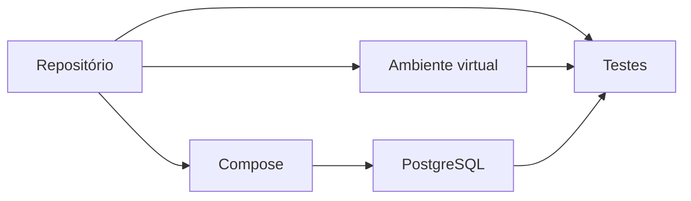

# Estudo de Caso — Ambiente Reproduzível da DataRetail

Na DataRetail, cada analista possui uma versão diferente de Python e banco. Scripts funcionam apenas na máquina do autor. A equipe define um ambiente mínimo: Git, Python isolado, editor configurado e PostgreSQL em container.

Um comando valida versões; outro inicia serviços; um smoke test confirma conexão. Segredos locais vêm de arquivo ignorado. README inclui setup e troubleshooting. O tempo de onboarding cai e falhas se tornam comparáveis.
