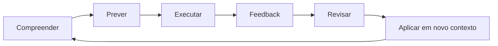

# Introdução

Reconhecer uma explicação durante a leitura não significa conseguir recuperá-la, aplicá-la ou adaptá-la. Aprendizagem técnica exige alternar compreensão, tentativa, erro, feedback e revisão.

O objetivo é construir modelos mentais e procedimentos que sobrevivam fora do exemplo original. Um bom plano respeita pré-requisitos, energia disponível e tempo para consolidar.
