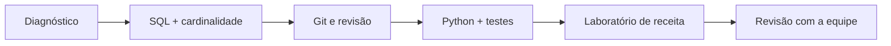

# Estudo de Caso — Plano de Aprendizagem DataRetail

Uma nova analista conhece planilhas e SQL básico. Sua meta de oito semanas é compreender e validar o pipeline de receita, sem assumir operação independente prematuramente.

Cada semana possui explicação sem consulta, exercício variado e evidência no projeto. A revisão identifica que joins, não sintaxe, são a principal lacuna; o plano é ajustado. O resultado é medido pela reconciliação e explicação do fluxo.
