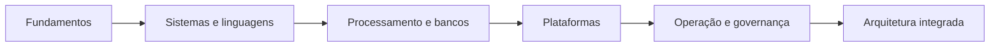

# Introdução

Roadmap é uma hipótese sobre a melhor sequência para desenvolver competências. Ele reduz lacunas, mas não substitui diagnóstico individual. A ordem da Academia parte de fundamentos e avança para sistemas integrados.

Concluir um volume significa produzir evidências, não apenas ler capítulos. O estado editorial do repositório deve ser consultado no [[ROADMAP|ROADMAP oficial]], enquanto este módulo orienta o estudante.
