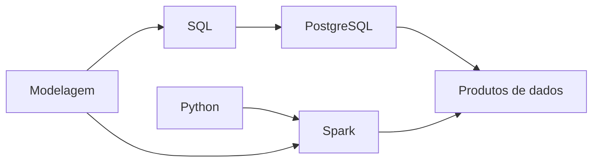

# Linguagens, Bancos, Modelagem e Processamento

Modelagem define significado, histórico e granularidade. Python automatiza integração, validação e operação. Spark distribui transformações. PostgreSQL aprofunda persistência, transações e administração relacional.

O estudante deve saber escolher processamento local, banco ou motor distribuído. “Dados grandes” precisa de volume, SLA, custo e paralelizabilidade. Evidência central: construir pipeline idempotente com contrato, testes, reconciliação e explicação do plano.
