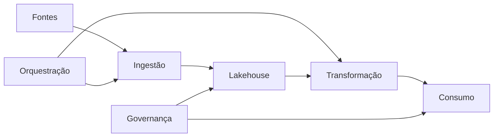

# Plataformas, Lakehouse, Orquestração e Consumo

Depois dos fundamentos, o roadmap avança para a integração dos componentes. Uma plataforma de dados combina armazenamento, processamento, catálogo, segurança, observabilidade e interfaces de consumo. O objetivo não é colecionar ferramentas, mas compreender responsabilidades e contratos.

O estudante deve praticar formatos colunares, tabelas transacionais, particionamento, agendamento, dependências, retries e backfill. O consumo inclui BI, notebooks, APIs, aplicações e modelos de Machine Learning, cada qual com requisitos próprios de latência e estabilidade.

> [!tip]
> A evidência de domínio é explicar como um dado chega ao consumidor, quais contratos atravessa e como a falha é detectada e recuperada.

Próximo: [[100-Volumes/00-Introducao/07-Roadmap/06-Qualidade-Observabilidade-Streaming-Cloud-e-DataOps|Qualidade, Observabilidade, Streaming, Cloud e DataOps]].
