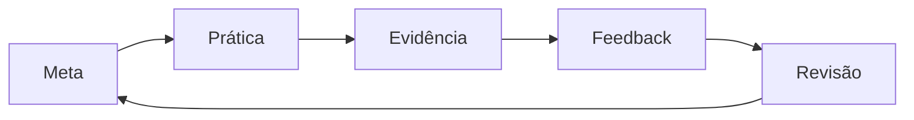

# Marcos, Evidências, Revisão e Atualização do Roadmap

Um marco representa uma capacidade observável. “Estudei SQL” é atividade; “modelei e validei uma consulta incremental com plano explicado” é evidência.

Use quatro níveis:

1. **Reconhecer:** explicar conceitos e vocabulário.
2. **Aplicar:** resolver um problema guiado.
3. **Integrar:** combinar competências em um produto.
4. **Operar:** diagnosticar, recuperar e melhorar o produto.

A cada ciclo, registre evidência, dificuldade, feedback e próximo experimento. Revise o roadmap mensalmente e quando mudar o objetivo profissional. Preserve fundamentos e substitua ferramentas apenas quando o requisito justificar.

Próximo: [[100-Volumes/00-Introducao/07-Roadmap/10-Estudo-de-Caso-DataRetail|Estudo de Caso — DataRetail]].
