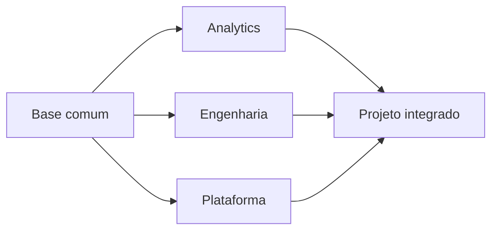

# Estudo de Caso — Roadmap da Equipe DataRetail

A DataRetail possui analistas fortes em negócio, desenvolvedores de aplicações e uma pequena equipe de infraestrutura. O plano comum começa por contratos, SQL e Git; depois cria trilhas complementares.

Analytics entrega modelo e reconciliação; Engenharia automatiza e distribui; Plataforma oferece execução e observabilidade. Revisões cruzadas impedem silos. O marco comum é receita diária reproduzível, não conclusão simultânea de todas as ferramentas.
