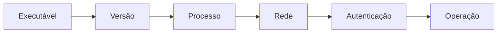

# Testes de Fumaça, Diagnóstico e Limpeza

Valide em camadas: executável, versão, processo, porta, autenticação e operação de negócio mínima. Guarde comandos e resultado esperado em um checklist versionado.

Quando houver falha, capture a mensagem completa e reproduza com o menor comando possível. Verifique uma hipótese por vez. Registre sistema, versões e alteração que resolveu o problema.

Limpeza deve ser seletiva e preservar dados ou mudanças que não pertençam ao laboratório.

Próximo: [[100-Volumes/00-Introducao/08-Preparacao-do-Ambiente/10-Estudo-de-Caso-DataRetail|Estudo de Caso]].
