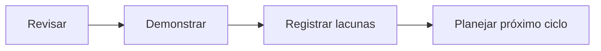

# Introdução ao Encerramento

Concluir não significa memorizar cada termo. Significa construir um modelo mental suficiente para formular perguntas, reconhecer dependências e iniciar práticas com segurança.

A revisão combina recuperação ativa, demonstração e registro. Lacunas encontradas não invalidam o progresso: tornam-se itens explícitos do roadmap.

Próximo: [[100-Volumes/00-Introducao/09-Encerramento/03-Sintese-das-Competencias-do-Volume|Síntese das Competências]].
