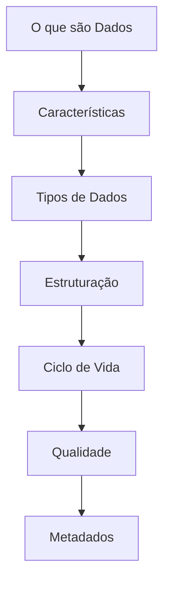

[[100-Volumes/01-Fundamentos/01-Dados/README]] | [[100-Volumes/01-Fundamentos/README]] | [[000-Atlas/MOC]]

---

# Objetivos de Aprendizagem

> [!quote]
> "Antes de iniciar qualquer jornada, é preciso saber onde se deseja chegar."

---

# Visão Geral

Este módulo apresenta o conceito mais importante da Engenharia de Dados: **os dados**.

Embora pareça um tema simples, praticamente todas as tecnologias estudadas nesta Academia existem para coletar, armazenar, transformar, proteger ou disponibilizar dados.

Antes de aprender SQL, Python, Apache Spark ou Lakehouse, é fundamental compreender a natureza dos dados, suas características e seu papel dentro das organizações.

Este módulo estabelece a base conceitual sobre a qual todo o restante da Academia será construído.

---

# Objetivo Geral

Ao concluir este módulo você compreenderá profundamente o conceito de dado e sua importância para a Engenharia de Dados, sendo capaz de identificar diferentes tipos de dados, compreender seu ciclo de vida e reconhecer os principais desafios relacionados ao seu tratamento.

---

# Objetivos Específicos

Ao final deste módulo você será capaz de:

- Definir corretamente o conceito de dado.
- Diferenciar dado, informação, conhecimento e sabedoria.
- Reconhecer diferentes tipos de dados.
- Identificar dados estruturados, semiestruturados e não estruturados.
- Explicar o ciclo de vida dos dados.
- Compreender a importância dos metadados.
- Avaliar atributos de qualidade dos dados.
- Relacionar dados com processos de negócio.
- Identificar problemas comuns encontrados em bases de dados.
- Compreender como os dados sustentam plataformas modernas de Engenharia de Dados.

---

# Competências Desenvolvidas

Este módulo contribui para o desenvolvimento das seguintes competências.

## Competências Técnicas

- Pensamento orientado a dados.
- Modelagem conceitual.
- Análise de fontes de dados.
- Comunicação técnica.
- Terminologia de Engenharia de Dados.

---

## Competências Analíticas

- Identificar problemas relacionados aos dados.
- Avaliar impacto da qualidade dos dados.
- Relacionar processos de negócio com dados produzidos.
- Interpretar diferentes estruturas de dados.

---

## Competências Arquiteturais

Ao concluir este módulo você começará a desenvolver a capacidade de responder perguntas como:

- Quais dados precisam ser armazenados?
- Quem produz esses dados?
- Quem utiliza esses dados?
- Qual o nível de qualidade esperado?
- Qual arquitetura é mais adequada?

Essas perguntas acompanharão toda a carreira de um Engenheiro de Dados.

---

# Conhecimentos Prévios

Para acompanhar este módulo recomenda-se apenas ter concluído:

- [[100-Volumes/00-Introducao/README]]

Não é necessário conhecimento prévio em programação.

---

# Tecnologias Relacionadas

Os conceitos estudados aqui serão utilizados posteriormente em praticamente todas as tecnologias da Academia.

| Tecnologia | Onde será estudada |
|------------|--------------------|
| [[100-Volumes/04-SQL/README|SQL]] | Volume 04 |
| [[100-Volumes/06-Python/README|Python]] | Volume 06 |
| [[Apache-Spark|Apache Spark]] | Volume 07 |
| [[100-Volumes/08-PostgreSQL/README|PostgreSQL]] | Volume 08 |
| [[Apache-Iceberg|Apache Iceberg]] | Volume 09 |
| [[Trino]] | Volume 10 |
| [[Apache-Airflow|Apache Airflow]] | Volume 11 |

---

# Relação com o Projeto Integrador

> [!success]
> Neste módulo iniciaremos a identificação dos dados utilizados pela **DataRetail S.A.**, construindo a base conceitual que servirá para todos os pipelines desenvolvidos ao longo da Academia.

---

# Mapa do Módulo

---

# Como Estudar Este Módulo

Para obter o melhor aproveitamento, siga a sequência abaixo.

1. Leia cada microcapítulo na ordem proposta.
2. Consulte os conceitos relacionados no [[000-Atlas/MOC|Atlas]].
3. Execute o laboratório correspondente.
4. Resolva os exercícios.
5. Revise o resumo.
6. Responda às perguntas de entrevista.
7. Atualize suas próprias anotações na pasta `070-Anotacoes`.

---

# Critérios de Conclusão

Você terá concluído este módulo quando conseguir:

- Explicar claramente o conceito de dado.
- Diferenciar dado, informação e conhecimento.
- Classificar diferentes tipos de dados.
- Identificar problemas de qualidade.
- Explicar o papel dos metadados.
- Relacionar os conceitos estudados com arquiteturas modernas de dados.

---

# Veja Também

## Volume

- [[100-Volumes/01-Fundamentos/01-Dados/README]]

## Atlas

- [[000-Atlas/MOC]]
- [[000-Atlas/Tecnologias]]
- [[000-Atlas/Arquiteturas]]

## Conceitos

- [[Engenharia-de-Dados|Engenharia de Dados]]
- [[Pipeline-de-Dados|Pipeline de Dados]]
- [[Qualidade-de-Dados|Qualidade de Dados]]
- [[100-Volumes/01-Fundamentos/01-Dados/09-Metadados|Metadados]]

---

# Próximo Microcapítulo

➡️ [[02-Introducao|02 - Introdução]]

---

> [!summary]
>
> Este capítulo apresenta os objetivos e as competências que serão desenvolvidas ao longo do módulo. Ele estabelece as expectativas de aprendizagem e fornece um roteiro para que o estudante acompanhe sua própria evolução.
