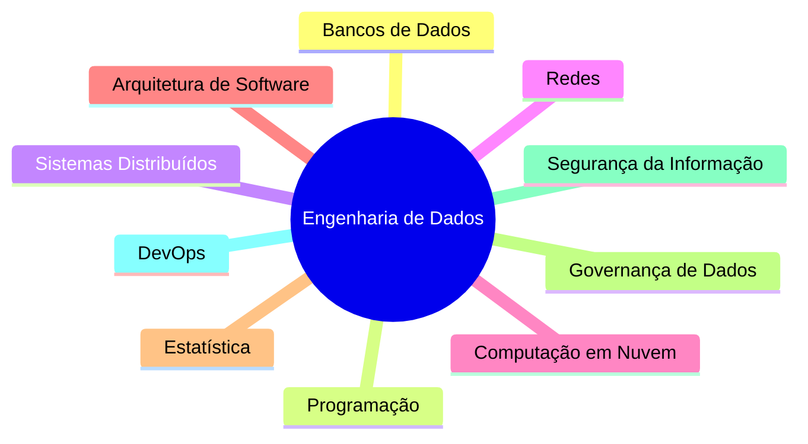

[[100-Volumes/01-Fundamentos/01-Dados/README]] | [[01-Objetivos|01 - Objetivos]] | [[03-O-que-sao-Dados|03 - O que são Dados]]

---

# Introdução

> [!quote]
> "Toda plataforma de dados começa com uma pergunta simples: quais dados precisamos compreender?"

---

# Objetivo

Este capítulo apresenta uma visão geral do módulo **Dados**, contextualizando sua importância para a Engenharia de Dados e preparando o estudante para os conceitos que serão desenvolvidos nos próximos capítulos.

Ao final desta leitura você compreenderá:

- por que os dados são o principal ativo de uma organização moderna;
- como a Engenharia de Dados surgiu para lidar com o crescimento exponencial dos dados;
- quais perguntas um Engenheiro de Dados precisa responder antes de construir qualquer solução;
- como este módulo se conecta aos demais volumes da Academia.

---

# Por que começar pelos dados?

Imagine tentar construir uma casa sem conhecer os materiais que serão utilizados.

Seria possível projetar a estrutura sem saber as propriedades do concreto, do aço ou da madeira?

Provavelmente não.

Na Engenharia de Dados acontece exatamente a mesma coisa.

Antes de aprender linguagens, bancos de dados, pipelines ou arquiteturas distribuídas, é indispensável compreender a matéria-prima com a qual trabalharemos: **os dados**.

Todas as tecnologias estudadas ao longo desta Academia existem para resolver problemas relacionados aos dados.

---

# A importância dos dados na transformação digital

Vivemos em uma sociedade orientada por dados.

Sempre que realizamos uma ação digital, novos registros são produzidos.

Exemplos:

- realizar uma compra online;
- enviar uma mensagem;
- utilizar um aplicativo de transporte;
- assistir a um vídeo;
- acessar um site;
- efetuar um pagamento por PIX;
- registrar uma consulta médica.

Cada interação gera dezenas ou até milhares de novos registros.

Esses registros, quando tratados corretamente, tornam-se um dos ativos mais valiosos de qualquer organização.

---

# O desafio moderno

Produzir dados nunca foi um problema.

O verdadeiro desafio é responder perguntas como:

- Onde esses dados estão?
- Quem os produziu?
- Eles são confiáveis?
- Como integrá-los?
- Como processá-los?
- Como disponibilizá-los para análise?

Responder a essas perguntas é justamente o papel da Engenharia de Dados.

---

# O papel do Engenheiro de Dados

Um Engenheiro de Dados não trabalha apenas com bancos de dados.

Sua responsabilidade é construir todo o ecossistema necessário para que os dados possam ser utilizados com segurança, eficiência e escala.

Isso inclui:

- coletar dados de diferentes fontes;
- integrar sistemas heterogêneos;
- desenvolver pipelines de processamento;
- garantir qualidade e governança;
- disponibilizar dados para consumo por analistas, cientistas de dados e aplicações.

---

# A Engenharia de Dados como disciplina

A Engenharia de Dados combina conhecimentos de diversas áreas.

Cada uma dessas disciplinas contribui para a construção de plataformas modernas de dados.

Ao longo da Academia estudaremos todas elas de forma integrada.

---

# Como este módulo está organizado

Este módulo foi dividido em pequenos capítulos, cada um dedicado a um conceito específico.

| Capítulo | Tema |
|-----------|------|
| 01 | Objetivos de Aprendizagem |
| 02 | Introdução |
| 03 | O que são Dados |
| 04 | Características dos Dados |
| 05 | Tipos de Dados |
| 06 | Estruturação dos Dados |
| 07 | Ciclo de Vida dos Dados |
| 08 | Qualidade dos Dados |
| 09 | Metadados |
| 10 | Estudo de Caso |
| 11 | Resumo |
| 12 | Perguntas de Entrevista |
| 13 | Exercícios |
| 14 | Laboratório |

Essa organização facilita a navegação no Obsidian, favorece revisões rápidas e mantém cada conceito isolado em uma nota específica.

---

# Conexão com a prática

Embora este módulo seja conceitual, seus conteúdos serão aplicados continuamente ao longo da Academia.

| Tecnologia | Aplicação dos conceitos |
|------------|-------------------------|
| [[PostgreSQL]] | Armazenamento de dados estruturados |
| [[Apache-Spark|Apache Spark]] | Processamento distribuído de grandes volumes de dados |
| [[Apache-Iceberg|Apache Iceberg]] | Organização de tabelas analíticas em Data Lakes |
| [[Trino]] | Consulta distribuída sobre múltiplas fontes de dados |
| [[Apache-Airflow|Apache Airflow]] | Orquestração de pipelines de dados |

Ao compreender corretamente o conceito de dados, ficará muito mais fácil entender o propósito de cada uma dessas tecnologias.

---

# Estudo de caso introdutório

Imagine uma rede nacional de supermercados.

Todos os dias ela registra:

- milhões de vendas;
- movimentações de estoque;
- acessos ao aplicativo;
- pedidos no e-commerce;
- pagamentos;
- entregas;
- cadastros de clientes.

Cada uma dessas operações gera dados.

Sem uma plataforma adequada, essas informações permanecem dispersas em diversos sistemas, dificultando análises e decisões.

Ao longo da Academia utilizaremos a empresa fictícia **DataRetail S.A.** para demonstrar como esses dados podem ser coletados, integrados, processados e disponibilizados para diferentes áreas do negócio.

---

# Boas práticas

> [!tip]
>
> Antes de pensar em ferramentas, compreenda o problema de negócio e os dados envolvidos.
>
> Uma boa arquitetura nasce do entendimento correto dos dados, e não da escolha da tecnologia.

---

# Erros comuns

> [!warning]
>
> - Focar apenas em ferramentas.
> - Ignorar o contexto de negócio.
> - Subestimar a importância da qualidade dos dados.
> - Considerar Engenharia de Dados apenas como desenvolvimento de ETL.
> - Acreditar que bancos de dados são sinônimo de Engenharia de Dados.

---

# Resumo Executivo

- Dados são o ponto de partida de toda solução de Engenharia de Dados.
- A Engenharia de Dados surgiu para lidar com o crescimento da complexidade e do volume de dados.
- O Engenheiro de Dados projeta e mantém a infraestrutura necessária para transformar dados em valor para o negócio.
- Este módulo fornece a base conceitual para todos os demais volumes da Academia.

---

# Conceitos-chave

- Dados
- Plataforma de Dados
- Engenharia de Dados
- Pipeline
- Arquitetura
- Transformação Digital

---

# Veja Também

## Próximo capítulo

➡️ [[03-O-que-sao-Dados|03 - O que são Dados]]

## Atlas

- [[Engenharia-de-Dados|Engenharia de Dados]]
- [[Pipeline-de-Dados|Pipeline de Dados]]
- [[Arquiteturas]]
- [[Tecnologias]]

## Volume

- [[100-Volumes/01-Fundamentos/01-Dados/README]]

---

> [!summary]
> Este capítulo apresenta a motivação para estudar dados e Engenharia de Dados. Ele demonstra que compreender os dados é o primeiro passo para projetar soluções escaláveis e orientadas a valor, estabelecendo a base conceitual sobre a qual todo o restante da Academia será construído.