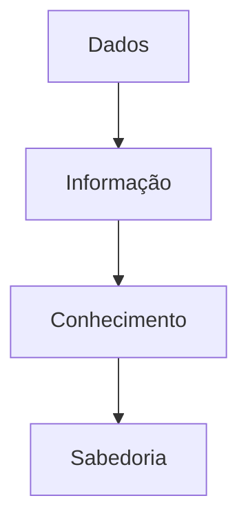

[[100-Volumes/01-Fundamentos/01-Dados/README]] | [[01-Objetivos|01 - Objetivos]] | [[03-O-que-sao-Dados|03 - O que são Dados]]

---

# O que são Dados

> [!quote]
> "Dados são a matéria-prima da informação, assim como o minério é a matéria-prima do aço."

---

# Objetivo

Ao concluir este capítulo você será capaz de:

- definir corretamente o conceito de dado;
- compreender a diferença entre dado e informação;
- reconhecer exemplos de dados em diferentes contextos;
- entender por que os dados possuem valor estratégico;
- relacionar o conceito de dados com a Engenharia de Dados.

---

# Por que estudar dados?

Toda decisão baseada em evidências começa com dados.

Independentemente do setor — financeiro, saúde, indústria, varejo, governo ou educação — os dados representam registros de eventos, fatos, observações ou medições que descrevem a realidade.

Sem dados, não existe análise.

Sem análise, não existe informação confiável.

Sem informação, as decisões tornam-se baseadas apenas em intuição.

É por isso que a Engenharia de Dados existe: garantir que os dados certos estejam disponíveis, íntegros e acessíveis no momento adequado.

---

# O que é um dado?

Um **dado** é o registro de um fato, evento ou característica, armazenado de forma que possa ser processado, consultado e utilizado posteriormente.

Por si só, um dado geralmente possui pouco significado.

Seu valor aumenta quando é combinado com outros dados, interpretado dentro de um contexto e transformado em informação.

---

## Exemplos

| Situação    | Dado               |
| ----------- | ------------------ |
| Cliente     | Marcello Felipelli |
| CPF         | 12345678901        |
| Idade       | 49                 |
| Cidade      | São Paulo          |
| Temperatura | 28°C               |
| Produto     | Notebook           |
| Valor       | R$ 5.200,00        |

Cada um desses elementos é apenas um registro.

O significado surge quando eles são analisados em conjunto.

---

# Dado × Informação

Uma das confusões mais comuns é considerar dados e informações como sinônimos.

Eles não são.

## Dado

É um registro bruto.

Exemplo:

```text
2026-07-13
```

Esse valor isolado não informa praticamente nada.

---

## Informação

Quando o dado recebe contexto, ele passa a transmitir significado.

Exemplo:

```text
Pedido entregue em 13/07/2026.
```

Agora sabemos:

- o que aconteceu;
- quando aconteceu;
- qual evento foi registrado.

O dado foi contextualizado.

---

# Da Informação ao Conhecimento

A Engenharia de Dados fornece os dados.

Outras disciplinas, como Analytics, Ciência de Dados e Inteligência Artificial, transformam essas informações em conhecimento.

Podemos representar essa evolução pela pirâmide DIKW.



## Dados

Registros brutos.

## Informação

Dados organizados e contextualizados.

## Conhecimento

Capacidade de interpretar informações e identificar padrões.

## Sabedoria

Uso do conhecimento para tomar decisões estratégicas.

---

# Exemplos do cotidiano

Imagine um supermercado.

Durante um único dia são registrados:

- vendas;
- pagamentos;
- devoluções;
- consultas de preço;
- movimentações de estoque;
- entregas.

Cada operação gera dezenas de dados.

Esses registros isolados têm pouco significado.

Quando analisados em conjunto, permitem responder perguntas como:

- Qual produto vende mais?
- Qual horário possui maior movimento?
- Quais clientes retornam com maior frequência?
- Qual fornecedor apresenta mais atrasos?

É exatamente esse tipo de transformação que sustenta a tomada de decisão.

---

# Dados no mundo real

Hoje praticamente todas as atividades humanas geram dados.

Exemplos:

- compras online;
- uso de aplicativos;
- sensores industriais;
- dispositivos IoT;
- redes sociais;
- sistemas bancários;
- GPS;
- hospitais;
- escolas;
- câmeras inteligentes.

Cada interação pode produzir milhares de novos registros.

---

# O crescimento dos dados

A quantidade de dados produzida pela humanidade cresce continuamente.

Alguns fatores responsáveis por esse crescimento são:

- digitalização de processos;
- computação em nuvem;
- internet das coisas;
- dispositivos móveis;
- inteligência artificial;
- automação industrial.

Esse crescimento tornou inviável o processamento utilizando apenas bancos de dados tradicionais, impulsionando o desenvolvimento de novas arquiteturas como Data Lake, Lakehouse e processamento distribuído.

---

# O papel da Engenharia de Dados

A Engenharia de Dados existe para garantir que os dados possam ser utilizados de maneira eficiente.

Entre suas responsabilidades estão:

- coletar dados;
- integrar diferentes fontes;
- transformar registros;
- armazenar grandes volumes;
- garantir qualidade;
- disponibilizar informações para consumo.

Em outras palavras, o Engenheiro de Dados cria a infraestrutura necessária para que outras áreas consigam extrair valor dos dados.

---

# Estudo de Caso — DataRetail S.A.

A DataRetail possui:

- 350 lojas físicas;
- e-commerce;
- aplicativo móvel;
- programa de fidelidade;
- marketplace.

Todos os dias são gerados milhões de registros, como:

| Origem | Dados gerados |
|---------|---------------|
| Caixa | Vendas |
| Site | Cliques |
| Aplicativo | Navegação |
| Estoque | Movimentações |
| CRM | Cadastro de clientes |
| Financeiro | Pagamentos |

O desafio da Engenharia de Dados é integrar essas informações em uma plataforma única, garantindo consistência, qualidade e disponibilidade.

Ao longo da Academia utilizaremos esse cenário para aplicar os conceitos estudados.

---

# Boas práticas

> [!tip]
>
> Sempre identifique:
>
> - quem produz o dado;
> - onde ele é armazenado;
> - quem o consome;
> - qual seu propósito;
> - quais regras de qualidade se aplicam.

Essas perguntas orientam o desenho de qualquer solução de Engenharia de Dados.

---

# Erros comuns

> [!warning]
>
> - Confundir dado com informação.
> - Presumir que todo dado possui valor.
> - Ignorar o contexto em que o dado foi produzido.
> - Armazenar dados sem documentação.
> - Desconsiderar a qualidade dos registros.

---

# Resumo Executivo

- Dados são registros de fatos, eventos ou características.
- Dados isolados possuem pouco significado.
- A informação surge quando os dados recebem contexto.
- O conhecimento é construído a partir da interpretação das informações.
- A Engenharia de Dados é responsável por disponibilizar dados confiáveis para toda a organização.

---

# Conceitos-chave

- Dado
- Informação
- Conhecimento
- Sabedoria
- Contexto
- Registro
- Engenharia de Dados

---

# Veja Também

## Próximo capítulo

➡️ [[04-Caracteristicas-dos-Dados|04 - Características dos Dados]]

## Atlas

- [[Engenharia-de-Dados|Engenharia de Dados]]
- [[Pipeline-de-Dados|Pipeline de Dados]]
- [[Qualidade-de-Dados|Qualidade de Dados]]

## Volume

- [[100-Volumes/01-Fundamentos/01-Dados/README]]

---

> [!summary]
> Dados são registros de fatos ou eventos. Seu valor não está apenas no conteúdo, mas na capacidade de serem organizados, contextualizados e transformados em informação para apoiar decisões. Toda a Engenharia de Dados existe para tornar esse processo possível de forma escalável, confiável e eficiente.

